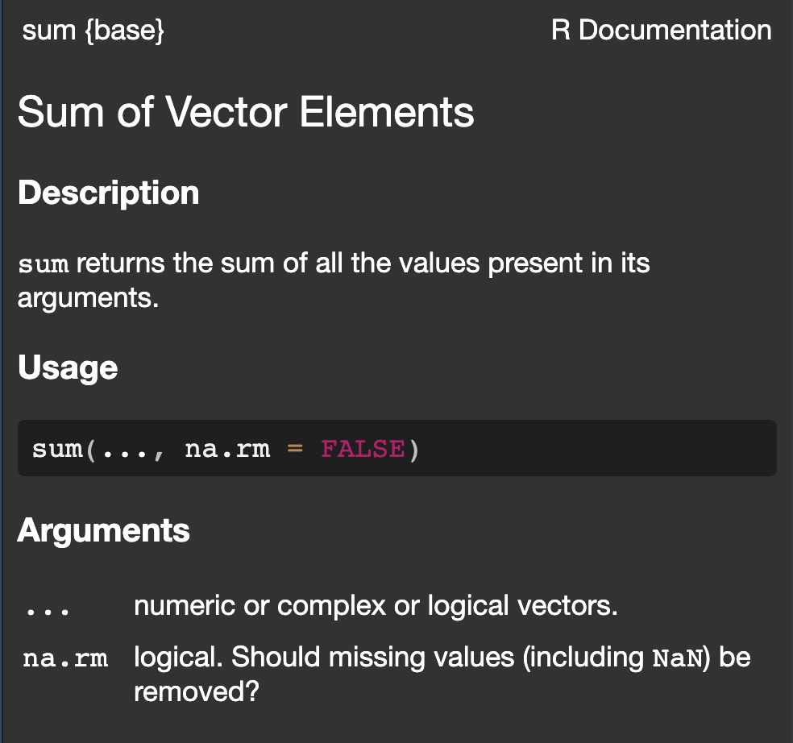

## Objetivo:

Conocer funciones y conjuntos de datos precargados en el lenguaje R.

### Material de Apoyo:

Enlace "cheat sheet" R Base <https://raw.githubusercontent.com/rstudio/cheatsheets/main/translations/spanish/base-r_es.pdf>

## Funciones

Son llamados que hacemos a procesos que se encarga de ejecutar el lenguaje de programación con el que trabajamos, en este caso `R`.

Pueden retornar uno más valores. Igualmente, pueden usarse para ejecutar otros subprocesos, es decir, para llamar a otras funciones.

Las funciones generalmente reciben una entrada de datos que se denominan argumentos, no obstante, pueden existir casos en que son llamadas sin ningún argumento. Esto se explicará con más claridad a lo largo del curso.

## Ejemplos

No olvide ejecutar {style="margin: auto;" width="100"}

```{webr}
# Estas son algunas de las funciones revisadas en clase,
# las cuales se encuentran precargadas en R

print("Hello World!") # imprimir un mensaje en consola

# Los comentarios pueden ser indicados posterior a 
# la escritura del código con un numeral ➡️ #

sum(8, 9, 100)

# la función invocada anteriormente ejecuta la suma.

# Los números que se encuentran entre paréntesis () son los 
# argumentos que estamos le pasando
```

## Vectores {.small}

En R, la principal estructura de datos que existe son los vectores `c()` .

Para indicar que estamos trabajando con un vector usamos la función `c()`. Es importante recordar que los elementos de un vector les corresponde un orden determinado. No es el mismo vector `c (3,5,7)` que el vector `c(7,5,3)` ya que distintos elementos (primero y tercero) no coinciden en ambos vectores.

No olvide ejecutar {style="margin: auto;" width="100"}

```{webr}
# vector con números
c (1, 5, 7)

# vector con carácteres o strings
c ('A', 'c', 'De')

# vector con datos mixtos que R convierte a strings
c (1, 5, 'letras')
```

## Operaciones con Vectores {.small}

Sobre todo el contenido de un vector se puede realizar una operación, por ejemplo de obtener el promedio, o sumar un valor.

No olvide ejecutar {style="margin: auto;" width="100"}

```{webr}
# promedio sobre elementos de un vector
mean( c(5,7,23) )

# sumar un número a cada elemento de un vector
c(5,7,23) + 2

```

Fíjese como en la operación de adición, `R` sobre cada elemento del vector `c(5,7,23)` realizó una suma de 2 unidades, arrojando como resultado otro nuevo vector con tres elementos que son `c(7,9,25)` . Esta propiedad de aplicar sobre cada elemento una misma operación se llama [vectorización]{style="color:red"}, pero de esto se hablará es a mitad de curso.

## Vectores {.small}

::: callout-important
Investigar con un modelo de lenguaje los tipos de vectores que existen en R y pedirle ejemplos. Intente copiar los ejemplos en el área de abajo y ejecute los códigos para ver los resultados
:::

```{webr}
# Ejecute acá los códigos con "Run Code"


#
```

## Funciones Cont. {.small}

### Argumentos Posicionales

Los argumentos que le damos la función se le pueden suministrar posicionalmente y no es necesario indicar el nombre del argumento.

Ejemplo: (ejecute {style="margin: auto;"}):

```{webr}
seq(2,15,3)

```

Se creó una secuencia numérica que va desde el 2 al 15 ( o hasta donde alcance según lo indicado), con brincos de 3 unidades, correspondiendo el primer argumento al `from` (desde =2), el segundo al `to` (hasta= 15) y el tercero a `by` (incremento= 2).

Cuando se indican los argumentos, según la posición que tengan, `R` asume que el primero corresponde al `from`, el segundo al `to` y el tercero al `by` y por eso se dice que son "argumentos posicionales".

## Funciones Cont. 2 {.small}

### Argumentos Nombrados

También se pueden nombrar los argumentos seguido del operador de igualdad (=), con lo cual estamos pasamos el valor o dato y le estamos especificando cuál es especificamente el argumento que le pasamos, sin que importe el orden en que se lo suministramos.

Ejemplo:

```{webr}
seq(from= 2, to= 15, by= 3)

# o también pudiera ser de esta forma
seq(by= 3,to= 15,from= 2)

# ambos llamados a la función seq arrojan el mismo resultado
```

## Documentación de Funciones {.small}

::::: columns
::: {.column width="50%"}
Generalmente es recomendable consultar la documentación sobre los usos y argumentos asociados a determinada función y para eso disponemos del operador `?` el cual por ejemplo se usa de la siguiente forma: `?sum`, para conocer cómo se usa la función que ejecuta la adición de los elementos de un vector.

Al ejecutar el código indicado podremos ver qué hace determinada función, cuáles argumentos la deben acompañar y algunos casos de uso.

No obstante, esto será revisado en mayor detalle cuando empecemos a trabajar con {style="margin: auto;" width="85"}.
:::

::: {.column width="50%"}
`?sum` ⬇️


:::
:::::

## Algunas Formalidades en los términos que usamos {.small}

-   La ["sintáxis"]{style="color: orange"} se denomina la forma en que escribimos nuestros códigos, que deben cumplir una serie de reglas, como la de pasar los argumentos entre los símbolos paréntesis.

-   ["Ejecutar"]{style="color: orange"}significa que el computador, el código que hemos escrito lo interprete, lo procese y nos de los resultados que queríamos obtener.

-   ["Llamar"]{style="color: orange"}, puede significar ejecutar una función o pedir al computador que nos muestre una variable que creamos, aunque en realidad todavía no hemos hablado de "crear variables" así que esperemos un poco.

-   ["Iterar"]{style="color: orange"}: ejecutar un proceso de varios pasos en ciclo, modificando algún paso minimamente o algún parámetro o resultado obtenido.

## Ejemplos de Secuencias de Números: {.small}

Ejecute {style="margin: auto;" width="100"} , evalúe los procesos y resultados obtenidos. Cada línea de código esta comentada con un numeral para que pueda ver caso a caso el resultado obtenido, es decir, vaya descomentando (quitando el numeral) línea a línea donde aparace código (no descomente los textos explicativos)

```{webr}
# secuencias con el operador dos puntos ":"
1:23

# seq(23) # lo mismo que 1:23

# Secuencia de números pares hasta el 80
# seq(from=2, 80, 2)

# Secuencia de números impares hasta el 80
# seq(from=1, 80, 2)


```

## Ejemplos Secuencias de Números-cont.:

```{webr}
# secuencia con intervalos de 0.2
seq(2,5,by=.2)

# es importante recordar que en R el separador de décimales el 
# el punto el separador de miles, que es la coma, no es necesario 
# usarloal indicar un número

# secuencia usando el valor del número "pi"
seq(1, 9, by = pi) 
```

## Otras Funciones Precargadas: {.small}

No olvide ejecutar {style="margin: auto;" width="100"} e ir descomentando los códigos

```{webr}
# obtener promedio de elementos contenidos en un vector
mean( c(6 , 1 ,16 ,28 ,25 ))

mean( c(500:100 ) )

# repetir el vector una cantidad "times" de veces
# rep(1:2, times=3) 

# repetir cada elemento de un vector una cantidad "each de veces"
# rep(1:2, each=3) 

# funciones anidadas, una función tiene de argumento el llamado a
# otra función, en este caso primero se ejecuta la función seq, 
# y su resultado lo toma la función rep para ejecutar el proceso
# que le corresponde

# rep( seq( from=3, to= 9, by=3), times=4 )

# rep( seq( from=3, to= 9, by=3), each=4 )
```

## Función `sample` {.small}

Permite crear una muestra aleatoria o una permutación de un tamaño determinado tomando elementos de un vector determiniado.

```{webr}
# muestra de 10 elementos sin remplazo de un vector que va 
# del número 1 al 20
sample(x =1:20, size= 10, replace= FALSE)
# el argumento "replace" es de tipo lógico, y en este caso 
# se asigna como FALSE para que no existan remplazos

# sample (x= 1:20, size= 21, replace= FALSE)
# este caso debe generar un "Error" ya que la muestra que
# se quiere generar deberá tener 21 elementos, mientras
# que el vector de donde se generará la muestra sólo
# tiene 20 elementos

# sample (x=1:20, size= 30, replace= TRUE)
# en este caso sí se genera la muestra aleatoria,
# y existen elementos que aparecen más de una vez
# al existir remplazo
```

## Ejercicios {.small}

A continuación hay una serie de ejercicios que puede ir ejecutando para entrenar sus habilidades. Como esta es una presentación que permite ejecutar códigos en su navegador web, para ir adelantando conceptos básicos de programación en `R` , así como para conocer algunas funciones precargadas, una vez que cierre la presentación perderá todo el trabajo hecho. Si lo desea, puede hacer capturas de pantalla de los códigos que vaya ejecutando para luego tenerlos de ayuda al tener instalado {style="margin: auto;" width="34"} y {style="margin: auto;" width="85"} en su computadora.

## Ejercicios Completar o Corregir

```{webr}
# Los siguientes casos pueden necesitar que nombre los 
# argumentos o los use de forma posicional, ya que no 
# funcionaran como les fueron suministrados van a surgir 
# conflictos, quizás lógicos para la ejecución.

# crear secuencia del 1 al 8 con incrementos de 0.3
seq(8,1,.3) 

# crear secuencia de -1 al -5 con brincos de 1/2
# seq(1/2,-5,-1)

# Modificar para crear el vector con los números 5,7,13 
# c(5,'7' 13)

# obtener promedio de los valores 5,7,13
# mean(5,7,13) 
```

## Ejercicios **Función `seq()`:** {.small}

Utiliza la función `seq()` para crear:

-   Crea una secuencia de números pares del 10 al 30.

-   Crea una secuencia de números impares del 5 al 25.

-   Genera una secuencia que comience en 1, termine en 20 y tenga un incremento de 2.5.

-   Una secuencia del 3 al 18 con incrementos de 3.

-   Crea una secuencia del 50 al 100 con incrementos de 5.

```{webr}
#


#
```

## Ejercicios **Operador Dos Puntos (`:`):**

-   Genera una secuencia del 1 al 15.

-   Crea una secuencia del 20 al 1 (en orden descendente) usando el operador.

```{webr}
# argumentos posicionales


#
```

## Ejercicios **Función `mean()`:**

-   Calcula el promedio de los siguientes números: 12, 18, 25, 30, 35.

-   Calcula el promedio de los números del 1 al 100.

```{webr}
#


#
```

## Ejercicios **Función `rep()`:**

-   Repite el vector `c(1, 2, 3)` 4 veces.

-   Repite cada elemento del vector `c(4, 5, 6)` 3 veces.

```{webr}
#


#
```

## Ejercicios **Funciones Anidadas:**

-   Crea una secuencia del 2 al 10 con incrementos de 2, y luego repite esa secuencia 3 veces.

-   Crea una secuencia del 1 al 5 y repite cada elemento 2 veces. Luego, calcula el promedio de todos los números resultantes.

```{webr}
#


#
```

## Lámina Adicional

En caso de querer crear otros códigos, dispone de esta lámina

```{webr}
#


#
```

## Lecturas complementarias

-   <https://github.com/UCVeconomia2024-2/scripts/blob/main/soporte_clases/clase_04/clase_04.R>

-   <https://ucveconomia-r4ds-2024-2.netlify.app/practicas/clase3_apoyo>
