## IDE's

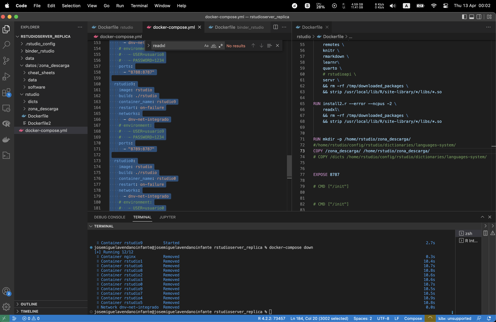{fig-align="center" width="500"}

::: notes
consola R, entornos de programación, no todo es visual-acciones, hablar sobre la programación, no son out of the box
:::

## RStudio:

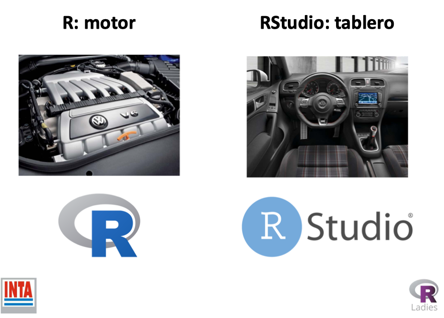{fig-align="center" width="500"}

## RStudio:

RStudio es un entorno de desarrollo integrado (IDE) que proporciona una interfaz al agregar muchas funciones y herramientas convenientes.

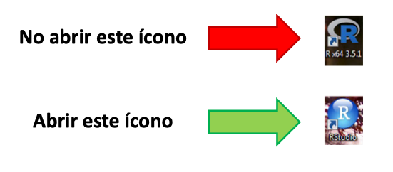{fig-align="center" width="400"}

::: notes
software libre, colaboradores, cambio de presentacion
:::

## IDE RStudio

Uno de los *entornos* más cómodos para utilizar el *lenguaje* **R** es el *programa* **R studio**.

-   Rstudio es una fundación que produce productos asociados al lenguaje R, como el programa sobre el que corremos los comandos, y extensiones del lenguaje (librerías).

-   El programa es *gratuito* y se puede bajar de la [página oficial](https://posit.co/download/rstudio-desktop/)

## Se puede ejecutar desde:

1.  [Nube](https://posit.cloud/)
2.  local: su propio computador
3.  LAN: red local

## Partes - Componentes, pestañas

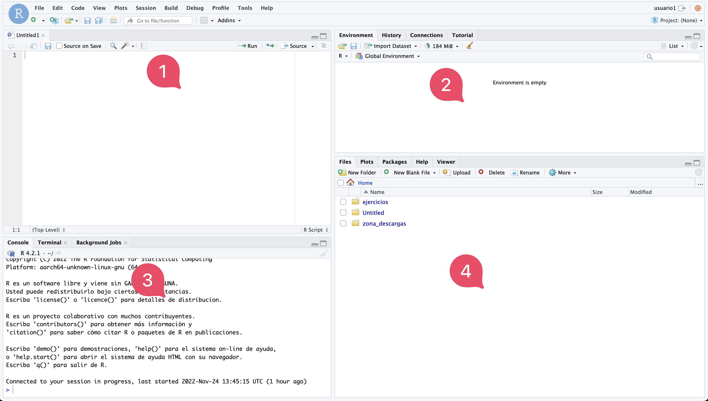{width="705"}

4 paneles y c/u con distintas pestañas y funcionalidades\

## abrir archivos

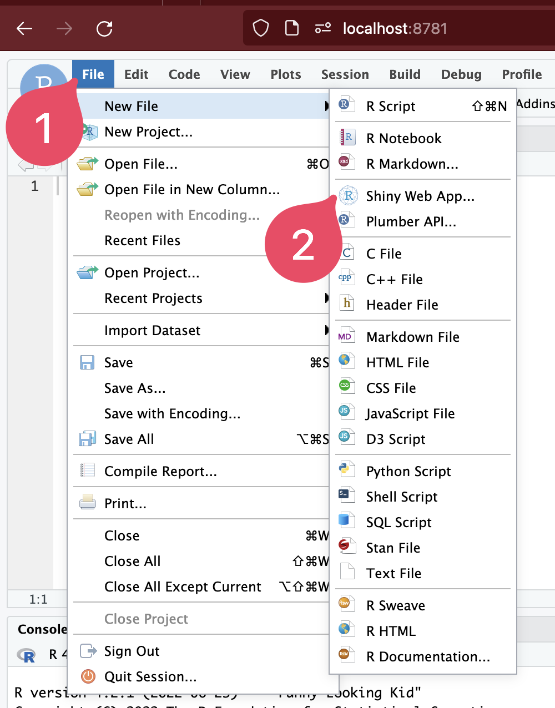{width="313"}

Son distintos los tipos de archivos que se pueden abrir

## panel Editor de Código

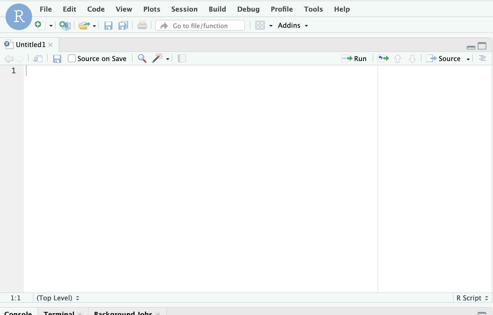{width="625"}

editor de código. se introducen códigos (scripts)

Se ejecutan con "run" el el área superior derecha

## panel Environment y Files

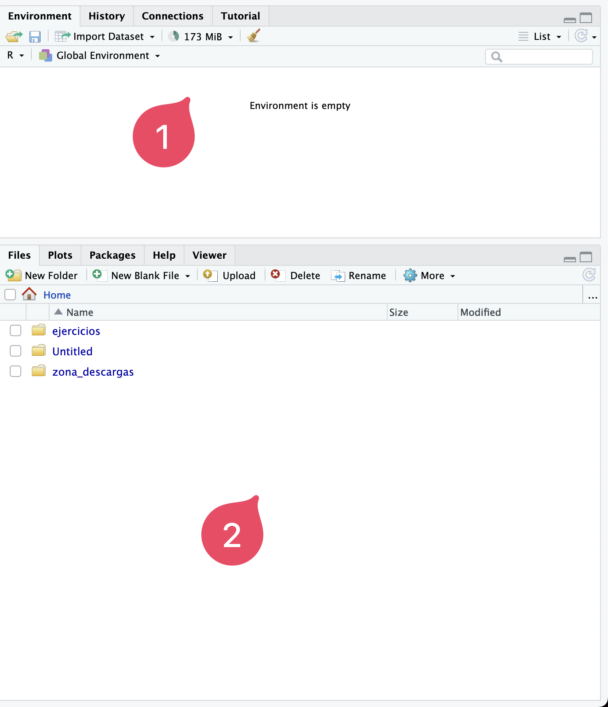{width="344"}

## panel cónsola

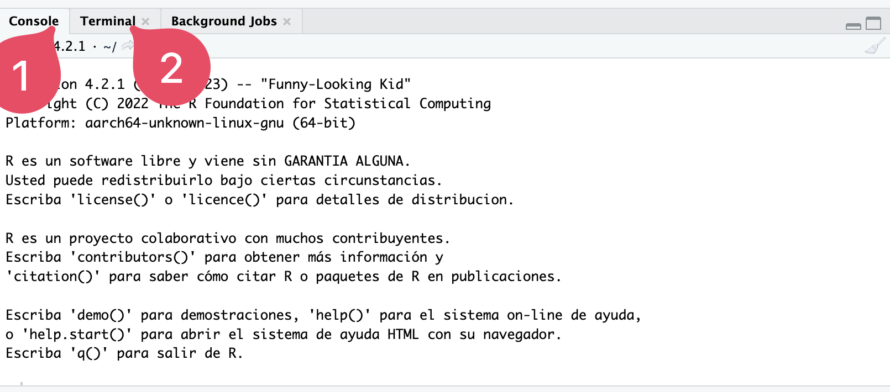{width="907"}

importante diferenciar: **consola** estamos dentro de R, en **terminal** acceso al SO del computador

## panel files

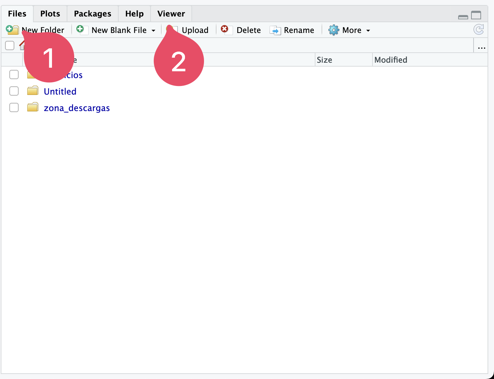{width="520"}

navegador de archivos y visor.

# Uso del IDE RStudio

## Working Directory:

es donde tenemos la ruta (path) a los archivos con los cuales trabajamos en un determinado proyecto: Absoluta

a.  en panel "files" 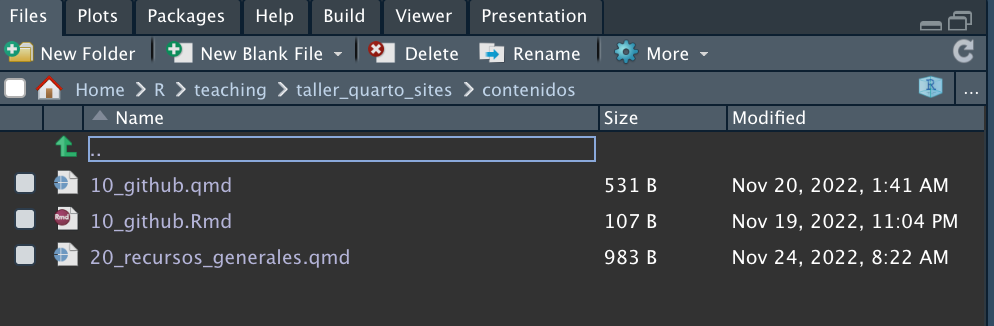{width="700"}
b.  en terminal con el comando pwd 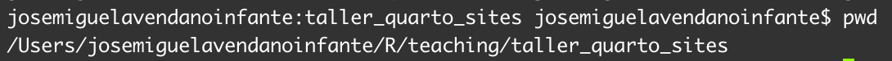{width="800"}
c.  en la consola con la función getwd() 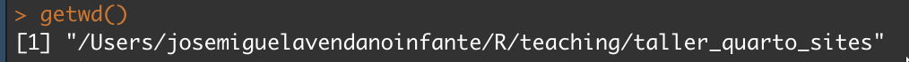{width="800"}

## Working Directory:

relativa

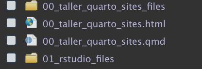{width="400"}

## Configurar "working directory"

crear carpeta donde se van a guardar los proyectos, p ejemp, dentro de "Documentos" - paso 1

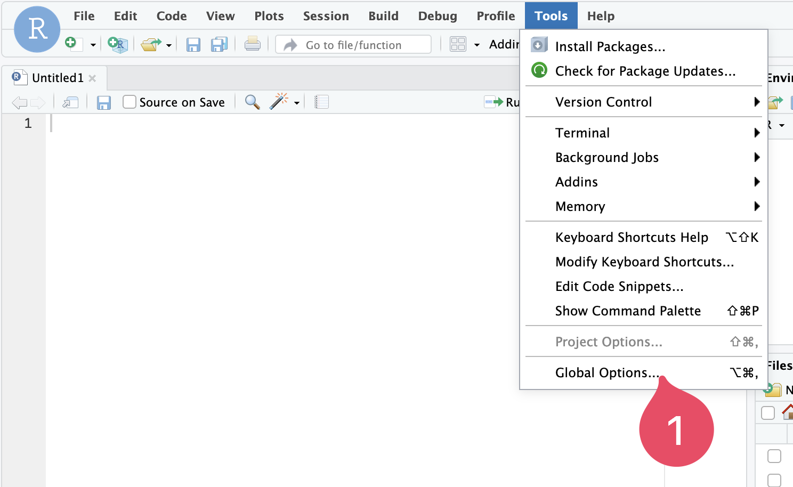

## Configurar "working directory" (cont.)

paso 2

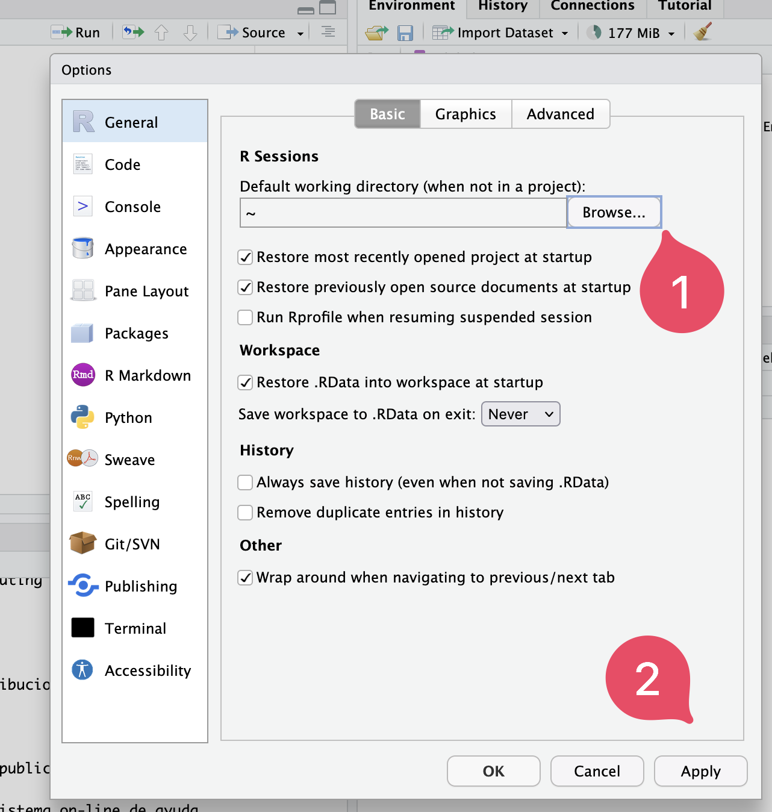{width="500"}

## Proyecto:

conjunto de archivos ("files" ) que conforman un determinado análisis, página web, presentación, libro, etc.

Al crearse hay algunos archivos que se definen automáticamente como por ejemplo el .`Rproj`

Con la **función** 💡 (función 🤔????) `list.files()` se pueden listar todos los archivos que se encuentran en el directorio

## Primera Práctica:

Instalar un paquete de R de manera online

## Video Creación Proyecto



## Playlist Economía R4DS

[Playlist videos del curso](https://www.youtube.com/playlist?list=PLliutFhUtupLHCkX5dWyTrTMNQod1Uedy)
