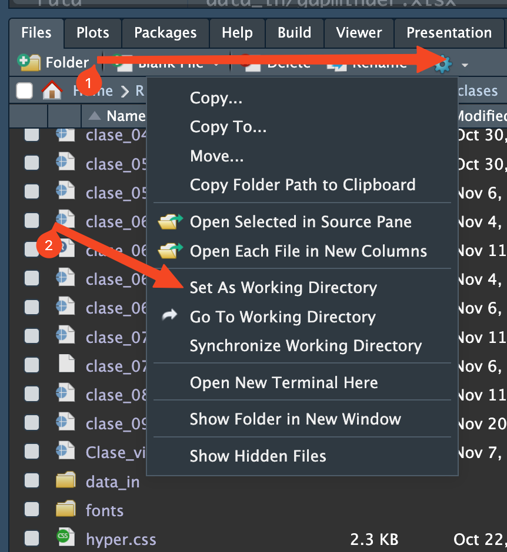

## Objetivo:

Conocer las "paths" o rutas para ubicar directorios o archivos con los cuales se trabajará. Se asume que existe un archivo que se llama "archivo.txt" que está ubicado dentro de la carpeta "Documentos". La carpeta "Documentos" en Windows se puede llamar "Mis Documentos".

## 1. Rutas Absolutas

Una ruta absoluta es la ruta completa desde la raíz del sistema hasta el archivo o directorio específico.

-   Windows : Comienza con una letra seguida de dos puntos (por ejemplo, C:) y luego las carpetas separadas por barras invertidas ().

```{r}
# Ejemplo en Windows
path_absoluto <- "C:\\Users\\NombreUsuario\\Documentos\cursor\archivo.txt"
```

## 1. Rutas Absolutas/cont.

-   macOS/Linux : Comienza desde la raíz del sistema (por ejemplo, /) y luego las carpetas separadas por barras (/).

```{r}
# Ejemplo en macOS/Linux
path_absoluto <- "/Users/NombreUsuario/Documentos/cursor/archivo.txt"
```

## 2. Rutas Relativas

Una ruta relativa es la ruta desde el directorio de trabajo actual hasta el archivo o directorio específico.

-   Windows : Las rutas relativas también usan barras invertidas (\\\\).

```{r}
# Ejemplo en Windows
path_relativo <- "carpeta_creada\archivo.txt"
```

-   macOS/Linux : Las rutas relativas usan barras (/).

```{r}
# Ejemplo en macOS/Linux
path_relativo <- "carpeta_creada/archivo.txt"
```

## 3. Directorio de Trabajo

El directorio de trabajo es el lugar donde R busca archivos por defecto.

Verificar el Directorio de Trabajo :

```{r}
getwd()
```

## 3. Directorio de Trabajo/ cont.

-   Cambiar el Directorio de Trabajo :

    -   Usando la interfaz gráfica de RStudio: `⚙️ -Set As Working Directory...`. Ver sección inferior derecha:

        {width="200"}

## 3. Directorio de Trabajo/ cont.

-   Usando código para windows:

    ```{r}
    #| eval: false
    # Para Windows
    setwd("C:\\Users\\NombreUsuario\\Documentos\cursor")

    ```

-   Usando código para MacOS

    ```{r}
    #| eval: false
    # Para macOS/Linux
    setwd("/Users/NombreUsuario/Documentos/cursor")
    ```

## 4. Leer Archivos

-   Lectura de un archivo en Windows :

    ```{r}
    # Ruta relativa
    datos <- read.csv("archivo.csv")  

    # Ruta absoluta en Windows
    datos <- read.csv("C:\\Users\\NombreUsuario\\Documentos\\cursor\archivo.csv")  
    ```

-   Lectura de un archivo en MacOS:

    ```{r}
    # Ruta relativa
    datos <- read.csv("archivo.csv")  
    # Ruta absoluta en macOS/Linux
    datos <- read.csv("/Users/NombreUsuario/Documentos/cursor/archivo.csv") 
    ```

## 5 Escribir Archivos

-   Escritura de un archivo en Windows:

    ```{r}
    # Ruta relativa
    write.csv(datos, "nuevo_archivo.csv")  
    # Ruta absoluta en Windows
    write.csv(datos, "C:\\Users\\NombreUsuario\\Documentos\\cursor\nuevo_archivo.csv")  
    ```

-   Escritura de un archivo en MacOS

    ```{r}
    # Ruta relativa
    write.csv(datos, "nuevo_archivo.csv")  
    # Ruta absoluta en macOS/Linux
    write.csv(datos, "/Users/NombreUsuario/Documentos/cursor/nuevo_archivo.csv")  
    ```

## 6. Consideraciones para Usuarios de Diferentes Sistemas Operativos

-   Función `file.path` : Esta función ayuda a construir rutas que sean compatibles con el sistema operativo que está usando.

    ```{r}
    ruta_archivo <- file.path("Directorio1", "Subdirectorio2", "archivo.txt")
    ruta_archivo
    ```

## Resumen

-   **Rutas Absolutas:** Comienzan desde la raíz del sistema y usan barras invertidas en Windows () o barras (/) en macOS/Linux.

-   **Rutas Relativas:** Son rutas desde el directorio de trabajo actual, usando barras invertidas en Windows () o barras (/) en macOS/Linux.

## Resumen/cont.

-   **Directorio de Trabajo:** Se puede verificar y cambiar usando getwd() y setwd().

-   **Leer/Escribir Archivos:** Usar rutas relativas o absolutas según sea necesario, considerando el sistema operativo.
