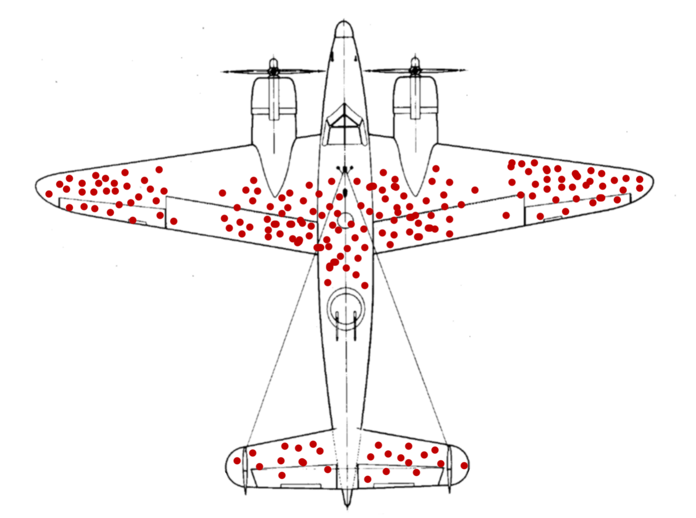
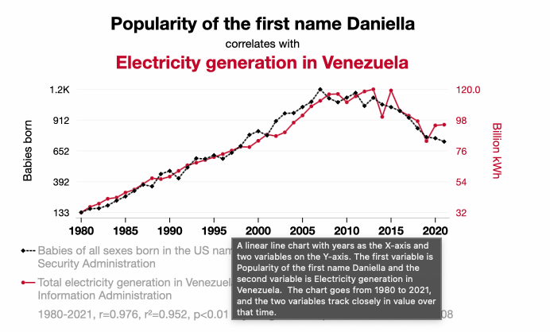
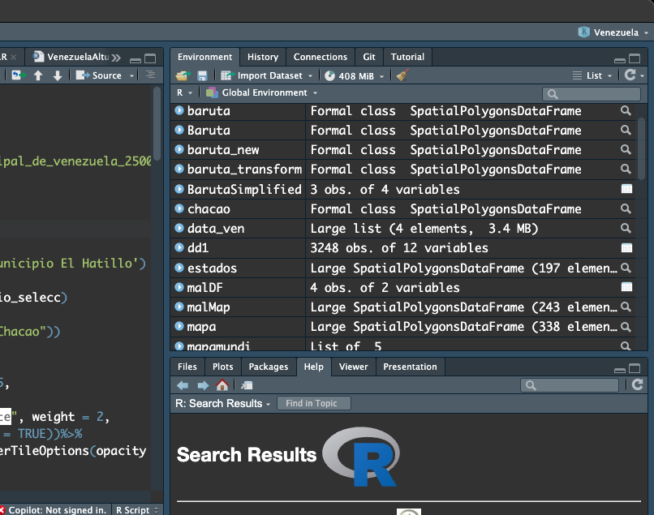

## Científicos de Datos 👨‍🔬 👩‍🔬

[{width="600"}](https://es.wikipedia.org/wiki/Sesgo_del_superviviente)

## Correlaciones Espúreas

[](https://www.tylervigen.com/spurious/correlation/24508_popularity-of-the-first-name-daniella_correlates-with_electricity-generation-in-venezuela)

## Puntos Varios:

-   

-   

```         
```

::: notes
:::

## Archivos:

-   .R: script de R

-   .qmd perteneciente al sistema de publicación quarto

-   .rds : información comprimida de datos

-   RDATA: ///

## Ambiente de Trabajo

`Environment`



::: notes
archivo Vs environment
:::

## Nombres Variables

Material complementario disponible en [variables](https://ucveconomiar4ds.netlify.app/clases/clase_05_complemento_variables)

## Vectores

-   Se declaran con la función `c ()` que permite combinar elementos

-   Elementos de la misma `mode`

    -   `mode (3)`

    -   `mode ('palabras declaradas')`

-   Elementos ordenados

    -   Vector `c (1,3,4,7)`

        != a vector `c (1,4,3,7)`

## Tipos de Vectores{width="646"}

## Estructuras de Datos {.small}

+---------------------------------------------------------------+-------------------------------------------------------+--------------------------------------+
| Objeto                                                        | R                                                     | Ejemplo                              |
+:=============================================================:+:=====================================================:+:====================================:+
| {width="80"}                  | vector atómico                                        | `c(7)`                               |
+---------------------------------------------------------------+-------------------------------------------------------+--------------------------------------+
| {width="80" height="120"} ️ | vector                                                | `c('a', 'x', 'd')`                   |
+---------------------------------------------------------------+-------------------------------------------------------+--------------------------------------+
| {width="80"}              | matriz                                                | `matrix(1:8,`                        |
|                                                               |                                                       |                                      |
|                                                               |                                                       | `nrow=2,`                            |
|                                                               |                                                       |                                      |
|                                                               |                                                       | `ncol=4)`                            |
+---------------------------------------------------------------+-------------------------------------------------------+--------------------------------------+

## Estructuras de Datos 2 {.small}

+--------------------------------------------------+--------------------+-----------------------------------------+
| Objeto                                           | R                  | Ejemplo                                 |
+:================================================:+:==================:+:=======================================:+
| {width="140"} | lista              | ejem_lista\<-list(el1=                  |
|                                                  |                    |                                         |
|                                                  |                    | c('a','x'),                             |
|                                                  |                    |                                         |
|                                                  |                    | el2=c(1))                               |
+--------------------------------------------------+--------------------+-----------------------------------------+
| {width="94"}     | data frame         | `mtcars`                                |
+--------------------------------------------------+--------------------+-----------------------------------------+
| {width="76"}  | tibble             | `as_tibble(mtcars)`                     |
+--------------------------------------------------+--------------------+-----------------------------------------+

## Tipos de de Objetos en R

`mode` : la forma en la que R almacena un objeto

`class` : la clase del objeto que estamos trabajando

## Variables / Objetos

-   Definición

-   Creación

-   Environment

::: notes
-   limpiar ambiente de trabajo
:::

## Remover Objetos

-   `rm(nombre_objeto)`

-   `rm(list=ls())`

## Recursos Ayuda Paquetes:

-   Vignettes:

    -   ?? nombre paquete

    -   Cran

-   Cheat Sheets:

    -   Discord, canal "Recursos disponibles"

        [Cheat Sheet RStudio](/Users/josemiguelavendanoinfante/R/UCV_ECONOMIA_R4DS/r4dsucv2024/clases/images/rstudio-ide.pdf)
