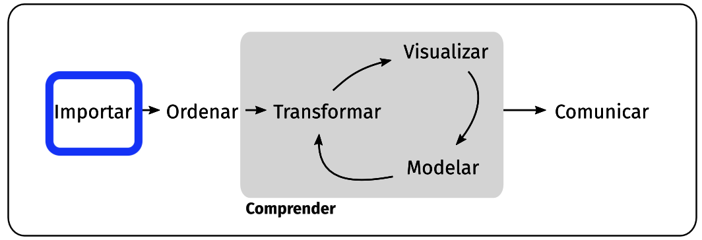

## Objetivo

-   Inspeccionar valores, rangos y estructura de una DF

-   Presentar operadores lógicos y trabajar con ellos

-   Acceder a elementos de vectores y DF's según condiciones lógicas

-   🧐 Hacernos preguntas sobre el conjunto de datos

## Ciclo

{width="700"}

## Importar Datos

```{r}
#| echo: false
gap_2007 <- read.csv('https://raw.githubusercontent.com/javendaXgh/ucveconomiaestadistica1/refs/heads/main/apps/datos/gap_2007.csv')[,-1]
# aca mquite la primera columna
```

```{webr-r}
gap_2007 <- read.csv('https://raw.githubusercontent.com/javendaXgh/ucveconomiaestadistica1/refs/heads/main/apps/datos/gap_2007.csv')[,-1]

```

## Inspección Data Frame

Número de filas

```{webr-r}
nrow(gap_2007)
```

<br> Número de columnas

```{webr-r}
ncol(gap_2007)
```

## Inspección Data Frame -cont

Dimensiones

```{webr-r}
dim(gap_2007)
```

<br> Nombres de las columnas

```{webr-r}
colnames(gap_2007)
```

## Inspección Data Frame -cont2

<br> Nombres de las filas

```{webr-r}
rownames(gap_2007)
```

## Inspeccionar Datos/ Primeras Filas {.small}

```{webr-r}
head(gap_2007)
```

## Inspeccionar Datos/ Últimas Filas {.small}

```{webr-r}
tail(gap_2007, n=4)
```

## Estructura de un Objeto

```{webr-r}
str(gap_2007)
```

## Funciones Valores Extremos

Mínimo en vector

```{webr-r}
min(gap_2007$lifeExp)
```

<br> Máximo en vector

```{webr-r}
max(gap_2007$lifeExp)
```

## Datos Resumen {.small}

Representar los valores mínimo y máximo, primer y tercer cuartil, media, promedio de un vector o data frame.

```{webr-r}
summary(gap_2007)
```

## Datos Resumen- Variable {.small}

```{webr-r}
summary(gap_2007$lifeExp)
```

## Valores Únicos en un Vector/Columna

```{webr-r}
unique(gap_2007$continent)
```

## Tabla de Contingencia para Una Variable Categórica

Datos

```{webr-r}
gap_2007$continent[1:12]
```

Conteo de frecuencia de un dato categórico

```{webr-r}

table(gap_2007$continent)
```

## Tabla de Contingencia Cruzada

Múltiples categorías

|       |                                     |
|:------|:------------------------------------|
| `cyl` | Number of cylinders                 |
| `vs`  | Engine (0 = V-shaped, 1 = straight) |

```{webr-r}
table(mtcars$cyl)
#table(mtcars$vs)
#table(mtcars$cyl, mtcars$vs)
```

## Operadores Lógicos

-   `>` (mayor a)
-   `>=` (mayor o igual a)
-   `<` (menor a)
-   `<=` (menor o igual a)
-   `==` (igual a)
-   `!=` (distinto a)
-   `&` (y)
-   `|` (o)

## Playground {.small}

Reforzar con lectura propuesta "[Tabla de Verdad](https://es.wikipedia.org/wiki/Tabla_de_verdad)" ([conjunción](https://es.wikipedia.org/wiki/Tabla_de_verdad#Conjunción) y [disyunción](https://es.wikipedia.org/wiki/Tabla_de_verdad#Disyunción)).

```{webr-r}
##### conjunción (y) /ir descomentando línea a línea
TRUE & TRUE
#TRUE & FALSE
#FALSE & TRUE
#FALSE & FALSE

#### disyunción (o) /ir descomentando línea a línea
#TRUE | TRUE
#TRUE | FALSE
#FALSE | TRUE
#FALSE | FALSE

```

## Uso de Operadores Lógicos en un Vector

Vector seleccionado "expectativa de vida" lifeExp

```{webr-r}
gap_2007$lifeExp
```

## Vector Lógico con valores que Cumplen una Condición

Mayor que un valor dado, en este caso 76.41 que representa el Q3

```{webr-r}
gap_2007$lifeExp[1:15]>76.41
```

::: callout-note
Se seleccionan 15 valores `[1:15]` para representación en la lámina
:::

## Vector Lógico con valores que Cumplen una Condición -cont.

<br> Mayor que el valor que retorna una función

```{webr-r}
gap_2007$lifeExp>mean(gap_2007$lifeExp)
```

## Asignación valores a DF {.small}

-   variable con promedio `mean(gap_2007$lifeExp)`

-   variable con `valor_3ercuartil`

-   creación `df_asignar`

```{webr-r}
promedio_lifeExp <- mean(gap_2007$lifeExp)
valor_3ercuartil <- 76.41

df_asignar <- data.frame(pais= gap_2007$country,
                         lifeExp= gap_2007$lifeExp,
                         may_mean= gap_2007$lifeExp>promedio_lifeExp,
                         men_3cuar= gap_2007$lifeExp<valor_3ercuartil )
```

## Inspección DF que Cumple Condiciones

Ejercicio: conjunción y disyunción

```{webr-r}
head(df_asignar,10 )
```

## Forma Vectorizada: {.small}

Se aplica el condicional lógico sobre el elemento *i* del vector analizado teniendo de resultado un vector del mismo `length` del vector de entrada.

Por ejemplo, si *i* vale 3, se compara si `r gap_2007$lifeExp[3]` es mayor que el promedio de expectativa de vida (`r mean(gap_2007$lifeExp)`**) y** si es menor que valor_3ercuartil (76,41).

```{webr-r}
gap_2007$lifeExp>promedio_lifeExp & gap_2007$lifeExp<valor_3ercuartil
```

## Múltiples Condiciones `&`

Operador lógico `&` (y)

```{webr-r}
gap_2007$country[gap_2007$lifeExp>promedio_lifeExp & gap_2007$lifeExp<valor_3ercuartil ]
```

## Múltiples Condiciones `|`

Operador lógico `|` (o)

```{webr-r}
mtcars[mtcars$cyl==6 | mtcars$cyl==4, ]
```

## Múltiples Condiciones `|` /cont.

```{webr-r}
gap_2007$country[gap_2007$lifeExp<promedio_lifeExp | gap_2007$lifeExp>valor_3ercuartil ]
```

## Operador `==` igual a

Operador `==` doble igualdad

```{webr-r}
gap_2007[ gap_2007$country=='Colombia', ]
```

::: callout-important
`==` 👀 es distinto a asignación `=`
:::

## Operador `!=` diferente

```{webr-r}
mtcars[mtcars$mpg!=8, ]
```

## Función `which`

`which` indica el índice de los elementos que cumplen una condición lógica

```{webr-r}
which (gap_2007$country== 'Venezuela' )
```

Con el índice obtenemos

```{webr-r}
gap_2007[137, ]
```

Usando las funciones de forma anidada

```{webr-r}

gap_2007[which(gap_2007$country=='Venezuela'), 'pop']
```

## Usando el Operador `%in%`

Cuando se tiene más de un elemento a comparar se usa el operador `%in%`

```{webr-r}
gap_2007[gap_2007$country %in% c('Colombia','Venezuela'),]
```

## Negación del Operador `%in%`

precediendo la expresión que se evalúa, se coloca el operador `!` como se muestra a continuación

`!gap_2007$country %in% c('Colombia', 'Venezuela')`

```{webr-r}
gap_2007[!gap_2007$country %in% c('Colombia','Venezuela'),]
```
