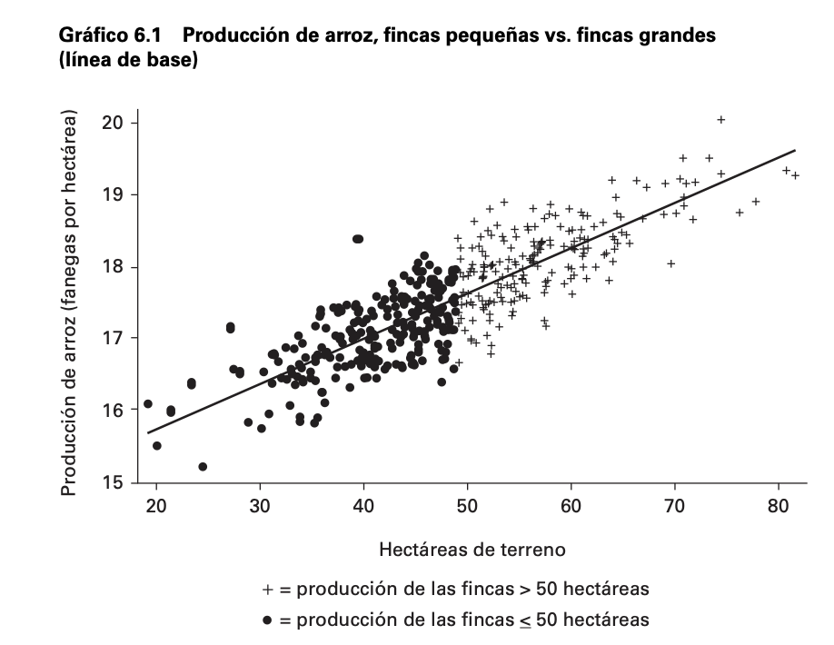
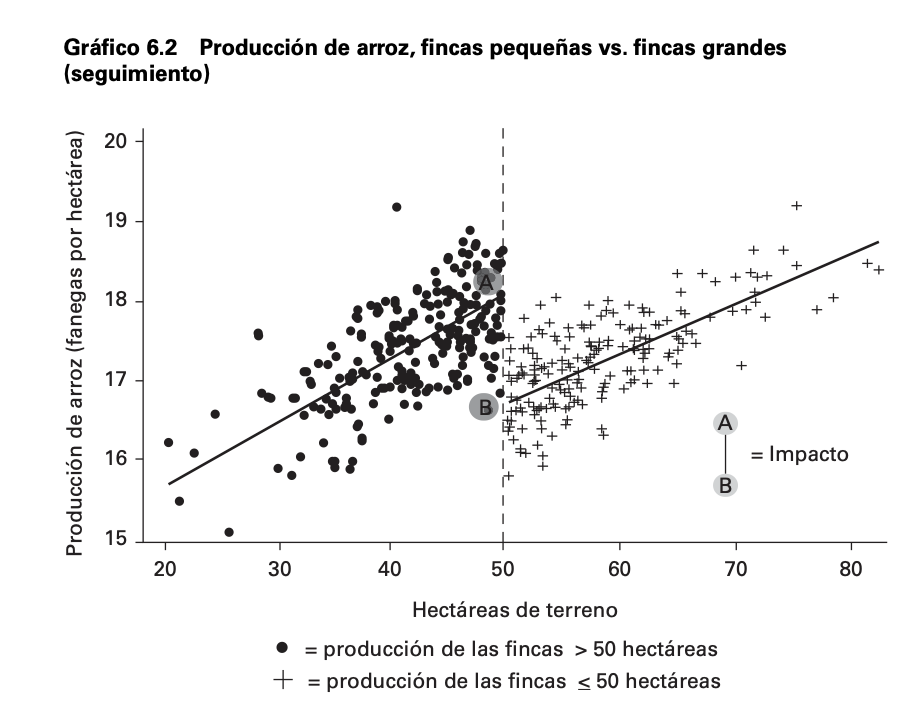
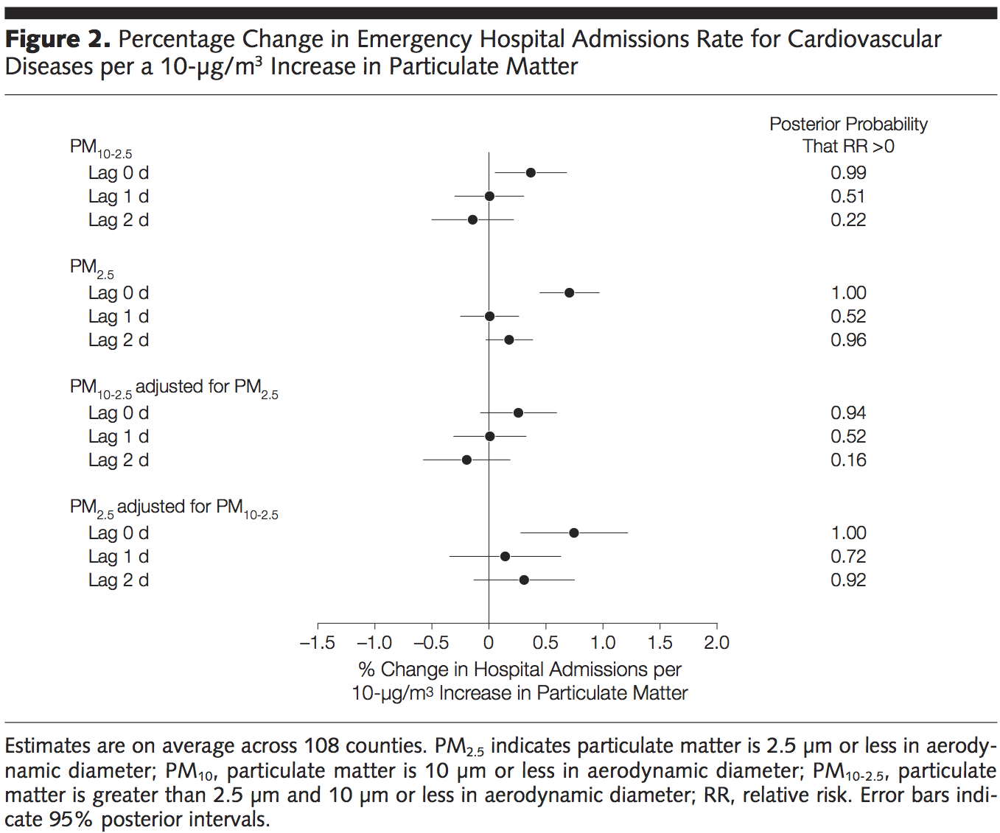

```{r}
#| echo: false
#| warning: false

library(tidyverse)
library(gapminder)

gapminder_2007 <- gapminder%>%
  filter(year==2007)

gapminder_anno <- gapminder%>%
  group_by(year)

gapminder_2007_afeu <- gapminder_2007%>%
  filter(continent %in% c('Africa','Europe'))%>%
  mutate(continent= as.character(continent))


gapminder_afeu <- gapminder%>%
  filter(continent %in% c('Africa','Europe'))%>%
  mutate(continent= as.character(continent))

```

## Nota

Esta presentación es una traducción de "*Principles of Analytic Graphics*" de Roger D. Peng, quien es "*Associate Professor of Biostatistics*" en la "Johns Hopkins Bloomberg School of Public Health" y se encuentra contenida en el curso "*Exploratory Data Analysis*" de la especialización en "*Data Science*" impartida en la plataforma educacional *Coursera*.\
Los textos han sido traducidos sin consentimiento del autor ni revisión del mismo.

Los gráficos que se muestran no son los incluidos en la presentación original.

## Principios de Gráficos Analíticos -1

-   Principio 1: Mostrar comparaciones

    -   La evidencia para una hipótesis es siempre *relativa* a otra hipótesis compitiendo.

    -   Siempre pregunta "¿En comparación con qué?"

------------------------------------------------------------------------

## Mostrar Comparaciones -1

```{r,echo=FALSE,fig.width=6,fig.height=6.5}
#| fig-align: center
boxplot(gapminder_2007$lifeExp, 
        # data = gapminder_2007,
        col = "#fb8b24",
        # xlab='Continente',
        ylab='Expectativa de Vida')


```

------------------------------------------------------------------------

## Mostrar Comparaciones -2

```{r,echo=FALSE,fig.width=6,fig.height=6.5}
#| fig-align: center
boxplot(lifeExp ~ continent, 
        data = gapminder_2007_afeu,
        col = "#fb8b24",
        xlab='Continente',
        ylab='Expectativa de Vida')

# setwd("~/projects/PREACH")
# source("regmodel.R")
# with(subset(dd, group == 1),
#      boxplot(diffsymfree, xaxt = "n", 
#              ylab = "Cambio en días sin síntomas"))
# axis(1, 1, "Limpiador de aire")
# abline(h = 0, lty = 3, lwd = 1.5)
```

## Mostrar Comparaciones -3

```{r}
#| fig-align: center
#| echo: false
boxplot(lifeExp ~ continent, 
        data = gapminder_2007,
        col = "#fb8b24",
        xlab='Continente',
        ylab='Expectativa de Vida')


```

------------------------------------------------------------------------

## Mostrar Comparaciones -4

```{r}
#| fig-align: center
#| echo: false
boxplot(lifeExp ~ year, 
        data = gapminder_anno,
        col = "#fb8b24",
        xlab='Período',
        ylab='Expectativa de Vida')
```

## Principios de Gráficos Analíticos -2

-   Principio 2: Mostrar causalidad, mecanismos, explicaciones, estructura sistemática:
    -   Cuál es el marco conceptual-teórico para sustentar la causalidad que quieres analizar

## Estimación Impacto

{fig-align="center" width="646"}

## Estimación Impacto 2

{fig-align="center" width="637"}

Tomado de La Evaluación de Impacto en la Práctica, Banco Mundial [enlace](https://openknowledge.worldbank.org/server/api/core/bitstreams/6f2eebf7-1a3c-5f67-a9c3-c39f68299ed9/content)

## Principios de Gráficos Analíticos -3

-   Principio 3: Mostrar datos multivariable:
    -   multivariable =\> más de dos variables
    -   El mundo real es multivariable
    -   Hay que escapar de la "tierra plana"

## Multivariable 1:

```{r}
#| fig-align: center
#| echo: false
ggplot(data= gapminder_afeu,
       mapping =aes(lifeExp, gdpPercap))+
  geom_point(color =c("#9d0208"))+
  geom_smooth()+
  facet_wrap(~year)
```

## Multivariable 2:

```{r}
#| fig-align: center
#| echo: false
ggplot(data= gapminder_afeu,
       mapping =aes(lifeExp, gdpPercap))+
  geom_point(color =c("#9d0208"))+
  geom_smooth()+
  facet_wrap(~year~continent)
```

## Principios de Gráficos Analíticos -4

-   Principio 4: Integrar múltiples modos de evidencia
    -   Integre completamente palabras, números, imágenes, diagramas
    -   Los gráficos de datos deben hacer uso de muchos modos de presentación de datos
    -   No permita que la herramienta dirija el análisisx

------------------------------------------------------------------------

## Integrar Distintas Formas de Evidencia

{fig-align="center"}

------------------------------------------------------------------------

## Principios de Gráficos Analíticos -5

-   Principio 5: Describa y documente la evidencia con etiquetas, escalas, fuentes, etc., apropiadas.

    -   Un gráfico de datos debe contar una historia completa y creíble.

------------------------------------------------------------------------

## Principios de Gráficos Analíticos -6

-   Principio 6: El contenido es rey

    -   Las presentaciones analíticas finalmente prosperan o fracasan dependiendo de la calidad, relevancia e integridad de su contenido.

------------------------------------------------------------------------

## Resumen

-   Principio 1: Mostrar comparaciones
-   Principio 2: Mostrar causalidad, mecanismo, explicación
-   Principio 3: Mostrar datos multivariables
-   Principio 4: Integrar múltiples modos de evidencia
-   Principio 5: Describir y documentar la evidencia
-   Principio 6: El contenido es rey

------------------------------------------------------------------------

## Referencias

Edward Tufte (2006). *Beautiful Evidence*, Graphics Press LLC. [www.edwardtufte.com](http://www.edwardtufte.com)
