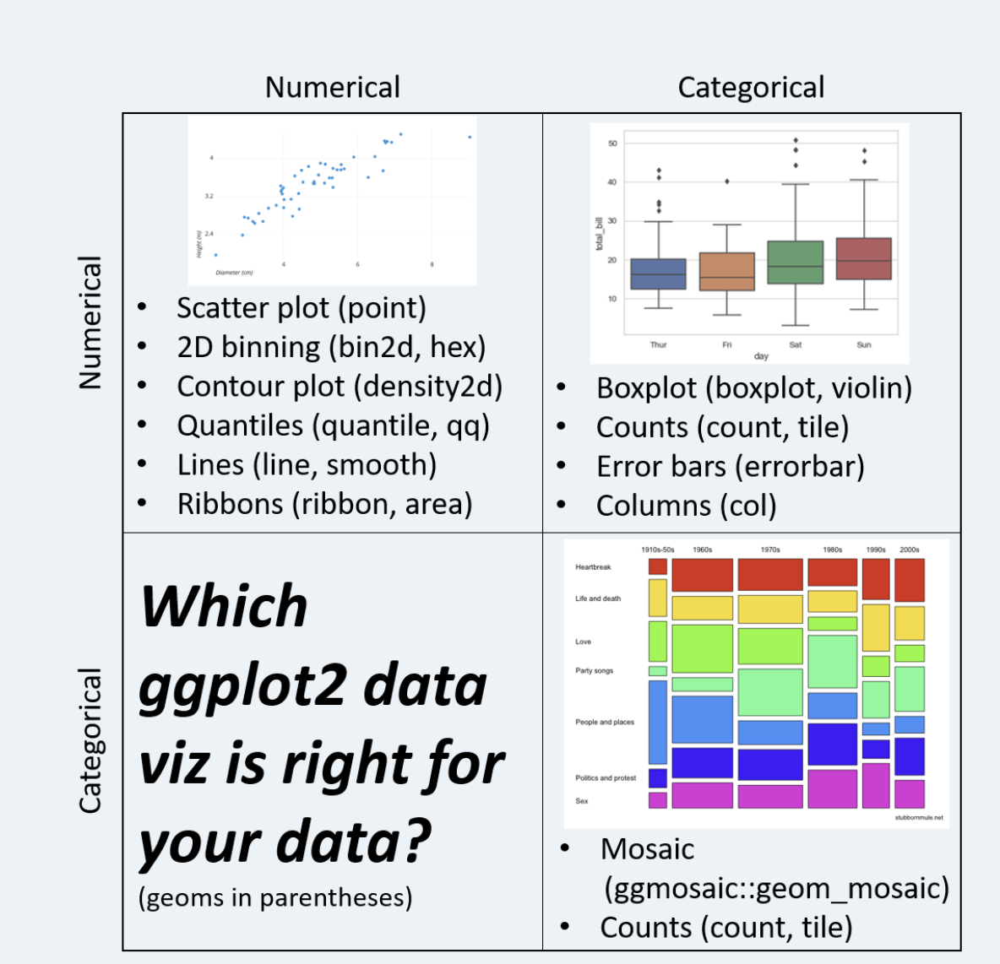

```{css, echo = FALSE}

.reveal pre code {
  width: 450px;
}

/* fuente c'odigos en contenido lamina qwebr*/
.reveal code {
  font-size:  16px !important;
  color: #0096c7 !important;
  background-color: #ced4da !important;
}
.large_code pre code {
  width: 1000px!important;
  font-size:  24px !important;
}

.small img {
  max-width: 70% !important;
}
```

```{r}
#| echo: false
#| warning: false

# library(ggplot2)
# library(dplyr)
library(tidyverse)
library(ggalt)
library(gapminder)
library(gt)
library(bbplot)
library(viridis)
library(pdfetch)
library(xts)


gap_2007 <- gapminder%>%
  filter(year==2007)%>%
  arrange(country)

gapminder_2007 <- gapminder%>%
  filter(year==2007)%>%
  arrange(country)

gapminder_anno <- gapminder%>%
  group_by(year)

gapminder_2007_afeu <- gapminder_2007%>%
  filter(continent %in% c('Africa','Europe'))%>%
  mutate(continent= as.character(continent))%>%
  arrange(country)

gapminder_afeu <- gapminder%>%
  filter(continent %in% c('Africa','Europe'))%>%
  mutate(continent= as.character(continent))

df_continente_2007 <- gapminder_2007%>%
  group_by(continent)%>%
  count(sort = TRUE, name='Total')

df_gapminder_2007_america <- gapminder_2007%>%
  filter(continent=='Americas')

gapminder_af_am <- gapminder%>%
  filter(continent %in% c('Americas','Europe'))

# df_valores_acciones <- readRDS('data_in/valores_acciones.rds')

df_funcion_ggplot <- data.frame(Componente=  c('Datos','Estética', 'Geometrías','Estadísticas',
                                    'Escalas','Sistema de Coordenadas','Facetas','Temas Visuales'),
                                Funcion= c('`ggplot(data)`','`aes()`','`geom_*`','`stat_*`',
                                           '`scale_*`','`coord_*`','`facet_*`','`theme()` o `theme_*`'),
                                Descripción= c('los datos que se van a visualizar',
                                               'el mapeo estético que hace entre las variables y la representación visual',
                                               'las formas geométricas usadas para representar los datos',
                                               'las transformaciones estadísticas aplicadas a los datos como binning, cuantiles, alisado',
                                               'mapeos entre los datos y las representaciones en los ejes (dimensiones). ejemplo: hombre = rojo, mujer = azul)',
                                               'mapeos de los datos dentro del plano ',
                                               'los arreglos de los datos dentro de una grilla rectangular de gráficos',
                                               'la representación visual general del gráfico (fondo, tipo de letras, etc.)'),
                                C= c('✅' ,'✅' ,'✅' ,'⛔️' ,'⛔️', '⛔️','✅' ,'✅')
                                  )
######################################################################
# Obtener valores acciones con pdfetch_YAHOO                          
######################################################################
valor_apple <- pdfetch_YAHOO(c("AAPL"))

valor_apple <- valor_apple%>%
  as_data_frame()%>%
  mutate(accion= 'Apple',
         codigo= 'AAPL')%>%
  bind_cols( fecha= index(valor_apple))

names(valor_apple) <- c('open','high','low',
                        'close','adjclose', 'volume',
                        'accion','codigo','fecha')

# descarga valores en formato zoo
valor_bitcoin <- pdfetch_YAHOO('BTC-USD')
# procesamiento de datos descargados
valor_bitcoin <- valor_bitcoin%>%
  as_data_frame()%>%
  mutate(accion= 'Bitcoin',
         codigo= 'BTC-USD')%>%
  bind_cols( fecha= index(valor_bitcoin))

names(valor_bitcoin) <- c('open','high','low',
                          'close','adjclose', 'volume',
                          'accion','codigo','fecha')

# descarga valores en formato zoo
valor_nvidia <- pdfetch_YAHOO('NVDA')
# procesamiento de datos descargados
valor_nvidia <- valor_nvidia%>%
  as_data_frame()%>%
  mutate(accion= 'Nvidia',
         codigo= 'NVDA')%>%
  bind_cols( fecha= index(valor_nvidia))

names(valor_nvidia) <- c('open','high','low',
                         'close','adjclose', 'volume',
                         'accion','codigo','fecha')

# descarga valores en formato zoo
valor_google <- pdfetch_YAHOO('GOOG')
# procesamiento de datos descargados
valor_google <- valor_google%>%
  as_data_frame()%>%
  mutate(accion= 'Google',
         codigo= 'GOOG')%>%
  bind_cols( fecha= index(valor_google))

names(valor_google) <- c('open','high','low',
                         'close','adjclose', 'volume',
                         'accion','codigo','fecha')

# descarga valores en formato zoo
valor_oracle <- pdfetch_YAHOO('ORCL')
# procesamiento de datos descargados
valor_oracle <- valor_oracle%>%
  as_data_frame()%>%
  mutate(accion= 'Oracle',
         codigo= 'ORCL')%>%
  bind_cols( fecha= index(valor_oracle))

names(valor_oracle) <- c('open','high','low',
                         'close','adjclose', 'volume',
                         'accion','codigo','fecha')


# unificar en una data frame valores de las acciones descargados
df_valores_acciones <- bind_rows(valor_apple,
                              valor_bitcoin,
                              valor_nvidia,
                              valor_google,
                              valor_oracle)%>%
  select(9,1:7)%>%
  pivot_longer(cols = c('open','high','low',
                        'close','adjclose'),
               names_to = "tipo_valor",
               values_to = "valor")
```

## Objetivo

Conocer el sistema de graficación en R llamado `ggplot2` , con énfasis en los mapeos estéticos, y los principales geoms que se pueden usar para realizar la visualización de datos.

## Previo a Generar un Gráfico

1.  Identificar el tipo de gráfico que queremos usar
2.  Implementar la GG
3.  Iterar con múltiples opciones de visualización
4.  Seleccionar la representación que codifique de mejor la información que queremos representar
5.  Incorporar elementos al tema como colores, paletas, fuentes

## *ggplot2*

Sistema para crear gráficos **declarativamente** basado en la "gramática de los gráficos" (Wilkinson, 2005).

Usted proporciona los datos, le dice a ggplot2 cómo asignar variables a la estética, qué primitivas gráficas utilizar, y él se encarga de los detalles.

## La Gramática de ggplot

```{r}
#| echo: false
df_funcion_ggplot%>%
  gt()%>%
  tab_options(column_labels.background.color = "#2c7da0")%>%
  fmt_markdown(columns = everything())%>%
  tab_style(
    style = list(
      cell_fill(color = "#d8f3dc")
    ),
    locations = cells_body(
      rows = 1:3)
  )%>%
  tab_footnote(
  footnote='tabla inspirada en trabajo de Cédric Scherer // rstudio::conf // julio 2022',
  placement = c( "left")
)
   

```

## Ejemplo Básico {auto-animate="true"}

::::: columns
::: {.column width="50%"}
```{r}
#| echo: true
#| eval: false
ggplot(data = gapminder_2007)

```
:::

::: {.column width="50%"}
```{r}
#| echo: false
#| eval: true
ggplot(data = gapminder_2007)

```
:::
:::::

## Ejemplo Básico {auto-animate="true"}

<br>

::::: columns
::: {.column width="50%"}
```{r}
#| echo: true
#| eval: false
#| code-line-numbers: "2,3"
ggplot(data = gapminder_2007,
       mapping = aes(x = gdpPercap, 
                     y = lifeExp))


```
:::

::: {.column width="50%"}
```{r}
#| echo: false
#| eval: true
ggplot(data = gapminder_2007,
       mapping = aes(x = gdpPercap, 
                     y = lifeExp))

```
:::
:::::

## Ejemplo Básico {auto-animate="true"}

<br>

::::: columns
::: {.column width="50%"}
```{r}
#| echo: true
#| eval: false
#| code-line-numbers: "4"
ggplot(data = gapminder_2007,
       mapping = aes(x = gdpPercap, 
                     y = lifeExp))+
  geom_point(color= "#9d0208")


```
:::

::: {.column width="50%"}
```{r}
#| echo: false
#| eval: true
ggplot(data = gapminder_2007,
       mapping = aes(x = gdpPercap, 
                     y = lifeExp))+
  geom_point(color= "#9d0208")

```
:::
:::::

## Mapeos de Variables {auto-animate="true"}

Usar los datos como variables que permiten codificar las siguientes representaciones en la visualización de datos:

-   Posición (x,y)

-   Colores (color, fill)

-   Formas (shape, linetype)

-   Tamaño (size)

-   Transparencia (alpha)

-   Agrupamientos(group)

## Geoms: Representaciones geométricas

-   barra: `geom_bar`

-   columna: `geom_col`

-   puntos: `geom_point`

-   líneas: `geom_line`

-   polígonos: `geom_polygon` (no se aborda en clase)

# Geoms para una sola Variable

## geom_bar

Hace que la altura de la barra sea proporcional al número de casos de cada grupo (cuenta los casos)

-   Requiere la estética `x` dentro de `aes()`

-   Puede cambiar la apariencia de las barras con argumentos  `color`, `fill`, `alpha`

::::: columns
::: {.column width="50%"}
```{r}
#| echo: true
#| eval: false
#| code-line-numbers: "3"

ggplot(data = gapminder_2007,
       aes(x=continent)) +
  geom_bar()

```
:::

::: {.column width="50%"}
```{r}
#| echo: false
#| eval: true
ggplot(data = gapminder_2007,
       aes(x=continent)) +
  geom_bar()

```
:::
:::::

## geom_bar -relleno

<br>

::::: columns
::: {.column width="50%"}
```{r}
#| echo: true
#| eval: false
#| code-line-numbers: "3"
ggplot(data = gapminder_2007,
       aes(x=continent)) +
  geom_bar(fill= "#ffbe0b")

```
:::

::: {.column width="50%"}
```{r}
#| echo: false
#| eval: true
ggplot(data = gapminder_2007) +
  geom_bar(aes(x=continent), 
           fill= "#ffbe0b")

```
:::
:::::

## geom-bar: reordenamiento {auto-animate="true"}

<br>

::::: columns
::: {.column width="50%"}
-   data frame se pasa por \`%\>%'

-   uso de la función `reorder` , barras valores descendentes

-   `identity`: los datos no son alterados

```{r}
#| echo: true
#| eval: false
#| code-line-numbers: "4,5,6,7,8"

gapminder_2007%>%
  group_by(continent)%>%
  count(sort = TRUE, name='Total')%>%
  ggplot() +
  geom_bar(aes(x=reorder(continent,-Total), 
               y=Total ),
           stat='identity',
           fill= "#ffbe0b")


```
:::

::: {.column width="50%"}
<br><br><br>

```{r}
#| echo: false
#| eval: true

gapminder_2007%>%
  group_by(continent)%>%
  count(sort = TRUE, name='Total')%>%
  ggplot() +
  geom_bar(aes(x=reorder(continent,-Total), 
               y=Total ),
           stat='identity',
           fill= "#ffbe0b")


```
:::
:::::

# Estadísticos

## Geoms Estadísticos: Transformaciones Estadísticas

-   Gráfico de distribución de frecuencia: `geom_histogram`

-   Gráfico de densidad: `geom_density`

-   Diagrama de caja: `geom_boxplot`

-   Otros: `geom_freqpoly`, `geom_dotplot`, `geom_rug`

-   Medias suavizadas: `geom_smooth`

## geom_histogram

<br>

-   Requiere en `aes()` la variable sobre la cual se representará la distribución

-   Puede cambiar la apariencia de las barras con argumentos  `color`, `fill`, `alpha`

::::: columns
::: {.column width="50%"}
```{r}
#| echo: true
#| eval: false
#| code-line-numbers: "2"
ggplot(data = gapminder_2007) +
  geom_histogram(aes(x= gdpPercap))


```
:::

::: {.column width="50%"}
```{r}
#| echo: false
#| eval: true
ggplot(data = gapminder_2007) +
  geom_histogram(aes(x= gdpPercap))


```
:::
:::::

## geom_histogram: color relleno

<br>

::::: columns
::: {.column width="50%"}
```{r}
#| echo: true
#| eval: false
#| code-line-numbers: "3"
ggplot(data = gapminder_2007,
       aes(x= gdpPercap)) +
  geom_histogram(fill='red')

```
:::

::: {.column width="50%"}
```{r}
#| echo: false
#| eval: true

ggplot(data = gapminder_2007,
       aes(x= gdpPercap)) +
  geom_histogram(fill='red')
```
:::
:::::

## geom_histogram: cdad. barras distinta

<br>

::::: columns
::: {.column width="50%"}
```{r}
#| echo: true
#| eval: false
#| code-line-numbers: "4"
ggplot(data = gapminder_2007,
       aes(gdpPercap)) +
  geom_histogram(bins=20,
                 fill='#0a9396')

```
:::

::: {.column width="50%"}
```{r}
#| echo: false
#| eval: true
ggplot(data = gapminder_2007,
       aes(gdpPercap)) +
  geom_histogram(bins=20,
                 fill='#0a9396')

```
:::
:::::

## geom_histogram: cdad. barras distinta

<br>

::::: columns
::: {.column width="50%"}
```{r}
#| echo: true
#| eval: false
#| code-line-numbers: "4"
ggplot(data = gapminder_2007,
       aes(gdpPercap)) +
  geom_histogram(bins=4,
                 fill='#0a9396')

```
:::

::: {.column width="50%"}
```{r}
#| echo: false
#| eval: true
ggplot(data = gapminder_2007,
       aes(gdpPercap)) +
  geom_histogram(bins=4,
                 fill='#0a9396')

```
:::
:::::

## geom_histogram: mapeo estético color borde

<br>

::::: columns
::: {.column width="50%"}
```{r}
#| echo: true
#| eval: false
#| code-line-numbers: "3"
ggplot(data = gapminder_2007,
       aes(gdpPercap, 
           color=continent)) +
  geom_histogram()


```
:::

::: {.column width="50%"}
```{r}
#| echo: false
#| eval: true
ggplot(data = gapminder_2007,
       aes(gdpPercap, 
           color=continent)) +
  geom_histogram()


```
:::
:::::

## geom_histogram- mapeo estético: color relleno, bins

<br>

::::: columns
::: {.column width="50%"}
```{r}
#| echo: true
#| eval: false
#| code-line-numbers: "3,4"
ggplot(data = gapminder_2007,
       aes(gdpPercap,
           fill=continent)) +
  geom_histogram(bins=20)

```
:::

::: {.column width="50%"}
```{r}
#| echo: false
#| eval: true
ggplot(data = gapminder_2007,
       aes(gdpPercap,
           fill=continent)) +
  geom_histogram(bins=20)
```
:::
:::::

## geom_density

-   Requiere la `x` aesthetic dentro de  `aes()`

-   Modifica el suavizador del núcleo en uso con el parámetro `kernel` 

-   Cambia el ancho de banda con el parámetro `adjust` 

-   Se pueden modificar la apariencia de las barras con los argumentos `color`, `fill`, `alpha`

::::: columns
::: {.column width="50%"}
```{r}
#| echo: true
#| eval: false
#| code-line-numbers: "3"
ggplot(data=gapminder_2007,
         aes(x=lifeExp))+
  geom_density()


```
:::

::: {.column width="50%"}
```{r}
#| echo: false
#| eval: true
ggplot(data=gapminder_2007,
         aes(x=lifeExp))+
  geom_density()


```
:::
:::::

## geom_density: color y relleno, local

<br>

::::: columns
::: {.column width="50%"}
```{r}
#| echo: true
#| eval: false
#| code-line-numbers: "4"
ggplot(data=gapminder_2007,
       aes(x=lifeExp,
           color=continent))+
  geom_density(aes(fill=continent))

```
:::

::: {.column width="50%"}
```{r}
#| echo: false
#| eval: true
ggplot(data=gapminder_2007,
       aes(x=lifeExp,
           color=continent))+
  geom_density(aes(fill=continent))

```
:::
:::::

## geom_density: alpha, local

<br>

::::: columns
::: {.column width="50%"}
```{r}
#| echo: true
#| eval: false
#| code-line-numbers: "4,5"
ggplot(data=gapminder_2007,
       aes(x=lifeExp,
           color=continent))+
  geom_density(aes(fill=continent),
               alpha = 0.5)


```
:::

::: {.column width="50%"}
```{r}
#| echo: false
#| eval: true

ggplot(data=gapminder_2007,
       aes(x=lifeExp,
           color=continent))+
  geom_density(aes(fill=continent),
               alpha = 0.5)

```
:::
:::::

## geom_boxplot

<br>

-   Requiere la estética `x` dentro de `aes()`

-   Puede cambiar la apariencia de las barras con argumentos  `color`, `fill`, `alpha`

::::: columns
::: {.column width="50%"}
```{r}
#| echo: true
#| eval: false
#| code-line-numbers: "3"
ggplot(data = gapminder_2007,
       aes(y=lifeExp)) +
  geom_boxplot(fill= "#fb8b24")

```
:::

::: {.column width="50%"}
```{r}
#| echo: false
#| eval: true
ggplot(data = gapminder_2007,
       aes(y=lifeExp)) +
  geom_boxplot(fill= "#fb8b24")
```
:::
:::::

## geom_boxplot: por variable categórica/relleno/borde

<br>

::::: columns
::: {.column width="50%"}
```{r}
#| echo: true
#| eval: false
#| code-line-numbers: "3,4,5"

ggplot(data = gapminder_2007,
       mapping = aes(x=continent, 
                     y= gdpPercap)) +
  geom_boxplot(fill= "#fb8b24",
               color='#00a6fb')
```
:::

::: {.column width="50%"}
```{r}
#| echo: false
#| eval: true
ggplot(data = gapminder_2007,
       mapping = aes(x=continent, 
                     y= gdpPercap)) +
  geom_boxplot(fill= "#fb8b24",
               color='#00a6fb')

```
:::
:::::

## geom_boxplot: representación diferenciada valores atípicos

<br>

::::: columns
::: {.column width="50%"}
```{r}
#| echo: true
#| eval: false
#| code-line-numbers: "4,5,6"

ggplot(data = gapminder_2007,
       mapping = aes(x=continent, 
                     y= gdpPercap)) +
  geom_boxplot(fill= "#fb8b24",
               outlier.colour = 'red',
               color='#00a6fb')

```
:::

::: {.column width="50%"}
```{r}
#| echo: false
#| eval: true

ggplot(data = gapminder_2007,
       mapping = aes(x=continent, 
                     y= gdpPercap)) +
  geom_boxplot(fill= "#fb8b24",
               outlier.colour = 'red',
               color='#00a6fb')

```
:::
:::::

## geom_boxplot- composición: línea y puntos

::::: columns
::: {.column width="50%"}
```{r}
#| echo: true
#| eval: false
#| code-line-numbers: "4,6,7,8"
ggplot(data = gapminder_2007,
       mapping = aes(x=continent, 
                     y= gdpPercap)) +
  geom_point()+
  geom_boxplot(fill= "#fb8b24")+
  geom_hline(yintercept = mean(gapminder_2007$gdpPercap), 
             size = 1, 
             colour="#c1121f")

```
:::

::: {.column width="50%"}
```{r}
#| echo: false
#| eval: true
ggplot(data = gapminder_2007,
       mapping = aes(x=continent, 
                     y= gdpPercap)) +
  geom_point()+
  geom_boxplot(fill= "#fb8b24")+
  geom_hline(yintercept = mean(gapminder_2007$gdpPercap), 
             size = 1, 
             colour="#c1121f")

```
:::
:::::

## geom_boxplot: composición: puntos (orden)

<br>

::::: columns
::: {.column width="50%"}
```{r}
#| echo: true
#| eval: false
#| code-line-numbers: "5"
ggplot(data = gapminder_2007,
       mapping = aes(x=continent, 
                     y= gdpPercap)) +
  geom_boxplot(fill= "#fb8b24")+
  geom_point()

```
:::

::: {.column width="50%"}
```{r}
#| echo: false
#| eval: true
ggplot(data = gapminder_2007,
       mapping = aes(x=continent, 
                     y= gdpPercap)) +
  geom_boxplot(fill= "#fb8b24")+
  geom_point()

```
:::
:::::

## geom_boxplot: rotar ejes

<br>

::::: columns
::: {.column width="50%"}
```{r}
#| echo: true
#| eval: false
#| code-line-numbers: "5"
ggplot(data = gapminder_2007,
       mapping = aes(x=continent, 
                     y= gdpPercap)) +
  geom_boxplot(fill= "#fb8b24")+
  coord_flip()

```
:::

::: {.column width="50%"}
```{r}
#| echo: false
#| eval: true

ggplot(data = gapminder_2007,
       mapping = aes(x=continent, 
                     y= gdpPercap)) +
  geom_boxplot(fill= "#fb8b24")+
  coord_flip()
```
:::
:::::

## geom_freqpoly

<br>

Se comporta igual que `geom_histogram` pero con líneas conectadas en lugar de barras  

::::: columns
::: {.column width="50%"}
```{r}
#| echo: true
#| eval: false
#| code-line-numbers: "3"
ggplot(data=gapminder_2007,
       aes(x=lifeExp))+
  geom_freqpoly()

```
:::

::: {.column width="50%"}
```{r}
#| echo: false
#| eval: true
ggplot(data=gapminder_2007,
       aes(x=lifeExp))+
  geom_freqpoly()

```
:::
:::::

## geom_dotplot:

<br>

Muestra los valores en intervalos como puntos individuales

::::: columns
::: {.column width="50%"}
```{r}
#| echo: true
#| eval: false
#| code-line-numbers: "3"

ggplot(data=gapminder_2007,
       aes(x=lifeExp))+
  geom_dotplot()

```
:::

::: {.column width="50%"}
```{r}
#| echo: false
#| eval: true
ggplot(data=gapminder_2007,
       aes(x=lifeExp))+
  geom_dotplot()


```
:::
:::::

## geom_rug

<br>

Coloca líneas a lo largo de un eje para cada observación

::::: columns
::: {.column width="50%"}
```{r}
#| echo: true
#| eval: false
#| code-line-numbers: "4"
ggplot(data=gapminder_2007,
       aes(x=lifeExp))+
  geom_histogram()+
  geom_rug()

```
:::

::: {.column width="50%"}
```{r}
#| echo: false
#| eval: true
ggplot(data=gapminder_2007,
       aes(x=lifeExp))+
  geom_histogram()+
  geom_rug()

```
:::
:::::

## geom_smooth

<br>

-   Requiere la estética  `x, y` dentro de `aes()`

-   Puede cambiar la apariencia de las barras con argumentos  `color`, `fill`, `alpha`

::::: columns
::: {.column width="50%"}
```{r}
#| echo: true
#| eval: false
#| code-line-numbers: "2,3,4"
ggplot(data = gapminder,
       mapping = aes(x = lifeExp, 
                     y = gdpPercap)) +
  geom_smooth()

```
:::

::: {.column width="50%"}
```{r}
#| echo: false
#| eval: true
ggplot(data = gapminder,
       mapping = aes(x = lifeExp, 
                     y = gdpPercap)) +
  geom_smooth()
```
:::
:::::

## geom_smooth - compuesto: puntos

<br>

::::: columns
::: {.column width="50%"}
```{r}
#| echo: true
#| eval: false
#| code-line-numbers: "4,5"
ggplot(data = gapminder,
       mapping = aes(x = lifeExp, 
                     y = gdpPercap)) +
  geom_point( alpha = 1/5)+
  geom_smooth()


```
:::

::: {.column width="50%"}
```{r}
#| echo: false
#| eval: true

ggplot(data = gapminder,
       mapping = aes(x = lifeExp, 
                     y = gdpPercap)) +
  geom_point( alpha = 1/5)+
  geom_smooth()

```
:::
:::::

## geom_smooth - local Vs. global encoding

<br>

Global Encoding

::::: columns
::: {.column width="50%"}
```{r}
#| echo: true
#| eval: false
#| code-line-numbers: "2,3,4"
ggplot(data = gapminder,
       mapping = aes(x = lifeExp, 
                     y = gdpPercap,
                     color= continent)) +
  geom_point()+
  geom_smooth()

```
:::

::: {.column width="50%"}
```{r}
#| echo: false
#| eval: true
ggplot(data = gapminder,
       mapping = aes(x = lifeExp, 
                     y = gdpPercap,
                     color= continent)) +
  geom_point()+
  geom_smooth()

```
:::
:::::

## geom_smooth - local Vs. global encoding

<br>

Local Encoding

::::: columns
::: {.column width="50%"}
```{r}
#| echo: true
#| eval: false
#| code-line-numbers: "4"
ggplot(data = gapminder,
       mapping = aes(x = lifeExp, 
                     y = gdpPercap)) +
  geom_point(aes(color=continent))+
  geom_smooth()

```
:::

::: {.column width="50%"}
```{r}
#| echo: false
#| eval: true
ggplot(data = gapminder,
       mapping = aes(x = lifeExp, 
                     y = gdpPercap)) +
  geom_point(aes(color=continent))+
  geom_smooth()

```
:::
:::::

## geom_smooth - local encoding, lm, factor

<br>

::::: columns
::: {.column width="50%"}
```{r}
#| echo: true
#| eval: false
#| code-line-numbers: "6,7,8"

ggplot(data = gapminder,
       mapping = aes(x = lifeExp, 
                     y = gdpPercap,
                     color= continent)) +
  geom_point()+
  geom_smooth(aes(group=year,
                  color=factor(year)), # factor
              method='lm')
```
:::

::: {.column width="50%"}
```{r}
#| echo: false
#| eval: true
ggplot(data = gapminder,
       mapping = aes(x = lifeExp, 
                     y = gdpPercap,
                     color= continent)) +
  geom_point()+
  geom_smooth(aes(group=year,
                  color=factor(year)),
              method='lm')

```
:::
:::::

## geom_smooth - local encoding, linetype, color smooth

<br>

::::: columns
::: {.column width="50%"}
```{r}
#| echo: true
#| eval: false
#| code-line-numbers: "2,3,4,5"
ggplot(data = gapminder) +
  geom_smooth( mapping = aes(x = lifeExp, 
                             y = gdpPercap,
                             linetype= continent, 
                             color=continent))

```
:::

::: {.column width="50%"}
```{r}
#| echo: false
#| eval: true
ggplot(data = gapminder) +
  geom_smooth( mapping = aes(x = lifeExp, 
                             y = gdpPercap,
                             linetype= continent, 
                             color=continent))

```
:::
:::::

## geom_smooth - local encoding, agrupar, color smooth

<br>

::::: columns
::: {.column width="50%"}
```{r}
#| echo: true
#| eval: false
#| code-line-numbers: "2,3,4,5"
ggplot(data = gapminder) +
  geom_smooth( mapping = aes(x = lifeExp, 
                             y = gdpPercap,
                             group = continent, 
                             color=continent))


```
:::

::: {.column width="50%"}
```{r}
#| echo: false
#| eval: true
ggplot(data = gapminder) +
  geom_smooth( mapping = aes(x = lifeExp, 
                             y = gdpPercap,
                             group = continent, 
                             color=continent))

```
:::
:::::

## geom_smooth - tamaño línea,

<br>

::::: columns
::: {.column width="50%"}
```{r}
#| echo: true
#| eval: false
#| code-line-numbers: "7"
ggplot(data = gapminder) +
  geom_smooth( mapping = aes(x = lifeExp, 
                             y = gdpPercap,
                             group = continent, 
                             color=continent),
               method = "lm",
               size = 2)

```
:::

::: {.column width="50%"}
```{r}
#| echo: false
#| eval: true
ggplot(data = gapminder) +
  geom_smooth( mapping = aes(x = lifeExp, 
                             y = gdpPercap,
                             group = continent, 
                             color=continent),
               method = "lm",
               size = 2)

```
:::
:::::

# Geoms para más de una Variable

## geom_col

<br>

La altura de la barra representan valores en los datos

-   Requiere la estética  `x, y` dentro de `aes()`

-   Puede cambiar la apariencia de las barras con argumentos  `color`, `fill`, `alpha`

## geom_col: ejemplo básico

<br>

::::: columns
::: {.column width="50%"}
-   detalle mapeo estético en `x` e `y`

```{r}
#| echo: true
#| eval: false
#| code-line-numbers: "4"


ggplot(data=df_gapminder_2007_america,
       aes(x= pop,
           y= country))+
  geom_col()

```
:::

::: {.column width="50%"}
-   Orden alfabético

```{r}
#| echo: false
#| eval: true


ggplot(data=df_gapminder_2007_america,
       aes(x= pop,
           y= country))+
  geom_col()

```
:::
:::::

## Creación DF Gapminder Conteo por Continente

<br>

```{r}
#| echo: true

df_continente_2007 <- gapminder_2007%>%
  group_by(continent)%>%
  count(sort = TRUE, name='Total')

df_continente_2007
```

## geom_col: ejemplo 2

<br>

::::: columns
::: {.column width="50%"}
```{r}
#| echo: true
#| eval: false
#| code-line-numbers: "4"
ggplot(data=df_continente_2007,
       aes(x= continent,
           y= Total))+
  geom_col()

```
:::

::: {.column width="50%"}
```{r}
#| echo: false
#| eval: true
ggplot(data=df_continente_2007,
       aes(x= continent,
           y= Total))+
  geom_col()

```
:::
:::::

## geom_col: relleno

<br>

::::: columns
::: {.column width="50%"}
```{r}
#| echo: true
#| eval: false
#| code-line-numbers: "4"
ggplot(data=df_continente_2007,
       aes(x= continent,
           y= Total))+
  geom_col(fill= "#ffbe0b")

```
:::

::: {.column width="50%"}
```{r}
#| echo: false
#| eval: true
ggplot(data=df_continente_2007,
       aes(x= continent,
           y= Total))+
  geom_col(fill= "#ffbe0b")

```
:::
:::::

## geom_col: reorder

<br>

::::: columns
::: {.column width="50%"}
```{r}
#| echo: true
#| eval: false
#| code-line-numbers: "2,3"
ggplot(data=df_continente_2007,
       aes(x=reorder(continent,-Total), 
            y= Total))+
  geom_col(fill= "#ffbe0b")

```
:::

::: {.column width="50%"}
```{r}
#| echo: false
#| eval: true
ggplot(data=df_continente_2007,
       aes(x=reorder(continent,-Total), 
            y= Total))+
  geom_col(fill= "#ffbe0b")

```
:::
:::::

## geom_col: asignar a una variable

<br>

```{r}
#| echo: true
#| eval: true
#| fig-align: center

graf_gap_2007 <- ggplot(data=df_continente_2007,
                        aes(x= continent,
                            y= Total,
                            fill=continent))+
  geom_col(fill= "#ffbe0b")

graf_gap_2007
```

## geom_col: temas (themes) {.small}

Los temas son aplicables a cualquier geom ya que cambian aspectos generales del área del gráfico

::: panel-tabset
## bw

```{r}
#| echo: true
#| eval: true
#| code-line-numbers: "2"

graf_gap_2007+
  theme_bw()

```

## minimal

```{r}
#| echo: true
#| eval: true
#| code-line-numbers: "2"

graf_gap_2007+
  theme_minimal()

```

## grey

```{r}
#| echo: true
#| eval: true
#| code-line-numbers: "2"

graf_gap_2007+
  theme_grey()


```

## linedraw

```{r}
#| echo: true
#| eval: true
#| code-line-numbers: "2"

graf_gap_2007+
  theme_linedraw()

```

## dark

```{r}
#| echo: true
#| eval: true
#| code-line-numbers: "2"

graf_gap_2007+
  theme_dark()

```

## light

```{r}
#| echo: true
#| eval: true
#| code-line-numbers: "2"

graf_gap_2007+
  theme_light()
```
:::

## geom_col: personalizar tema

<br>

::::: columns
::: {.column width="50%"}
```{r}
#| echo: true
#| eval: false
#| code-line-numbers: "3,4,14"
graf_gap_2007+
  theme_dark()+
  theme(text = element_text(family = "serif", 
                            size = 30))


graf_gap_2007+
  guides (fill ='none')
```
:::

::: {.column width="50%"}
```{r}
#| echo: false
#| eval: true
graf_gap_2007+
  theme_dark()+
  theme(text = element_text(family = "serif", 
                            size = 20))

graf_gap_2007+
  guides (fill ='none')
```
:::
:::::

## geom_col: ajuste valores en eje y, colores relleno, etiquetas

<br>

```{r}
#| echo: true
#| eval: true
#| code-line-numbers: "6,7,8,9,10,11,12,13"
#| fig-align: center
ggplot(data=df_continente_2007,
                        aes(x= continent,
                            y= Total,
                            fill=continent))+
  geom_col()+
  scale_y_continuous (name = NULL,
                     breaks = seq(0, 60, by = 5))+
  
  labs(x = NULL,
       title = "Gapminder año 2007: \nCdad. Países por Continente")+
  scale_fill_manual(values =  
                      c('#fb8500','#ffb703','#023047',
                        '#219ebc','#8ecae6' ))

```

## geom_col: modificación etiquetas x- problema

<br>

```{r}
#| echo: true
#| eval: true
#| fig-align: center
ggplot(data=df_gapminder_2007_america, 
       aes(x=country, y= gdpPercap))+
  geom_col()+
  scale_y_continuous (name = NULL,
                      breaks = seq(0, 45000, by = 5000),
                      labels = scales::label_dollar())+
  labs(x = NULL, 
       title = "Gapminder año 2007: ",
       subtitle = "PIB Per Cápita por País América")
```

## geom_col: modificación etiquetas x- solución

<br>

```{r}
#| echo: true
#| eval: true
#| fig-align: center
#| code-line-numbers: "10"
ggplot(data=df_gapminder_2007_america, 
       aes(x=country, y= gdpPercap))+
  geom_col()+
  scale_y_continuous (name = NULL,
                      breaks = seq(0, 45000, by = 5000),
                      labels = scales::label_dollar())+
  labs(x = NULL, 
       title = "Gapminder año 2007: ",
       subtitle = "PIB Per Cápita por País América")+
  theme(axis.text.x = element_text(angle = 45, hjust = 1))
```

## geom_col: top PIB per cápita

<br>

¿Qué estamos representando? ¿Qué queremos transmitir?

::::: columns
::: {.column width="50%"}
```{r}
#| echo: true
#| eval: false
#| code-line-numbers: "3,5,7,8,9,10,11,12,14,15,16,17,18,19"
library(viridis)
ggplot(data=df_gapminder_2007_america, 
       aes(x=reorder(country, -gdpPercap), 
           y= gdpPercap,
           fill= country))+
  geom_col()+
  scale_y_continuous (breaks = seq(0, 45000, by = 5000),
                      labels = scales::label_dollar())+
  labs(x = NULL,
       y="PIB Per Cápita en USD",
       title = "TOP PIB Per Cápita por País América",
       subtitle = "Datos Gapminder año 2007")+
  theme_light()+
  theme(axis.text.x = element_text(angle = 45, 
                                   hjust = 1,
                                   family = "serif", 
                                   size = 8),
        legend.position = 'none')+
  scale_fill_viridis (discrete=TRUE)

```
:::

::: {.column width="50%"}
```{r}
#| echo: false
#| eval: true

ggplot(data=df_gapminder_2007_america, 
       aes(x=reorder(country, -gdpPercap), 
           y= gdpPercap,
           fill= factor(country)))+
  geom_col()+
  scale_y_continuous (breaks = seq(0, 45000, by = 5000),
                      labels = scales::label_dollar())+
  labs(x = NULL,
       y="PIB Per Cápita en USD",
       title = "Gapminder año 2007: ",
       subtitle = "PIB Per Cápita por País América")+
  theme_light()+
  theme(axis.text.x = element_text(angle = 45, 
                                   hjust = 1,
                                   family = "serif", 
                                   size = 8),
        legend.position = 'none')+
  scale_fill_viridis (discrete=TRUE)
```
:::
:::::

## geom_point

-   Requiere los valores de `x, y` *aesthetics* dentro de `aes()`

-   Se puede modificar la apariciencia de los puntos con los argumentos `color`, `shape`, `alpha` ,`size`

::::: columns
::: {.column width="50%"}
```{r}
#| echo: true
#| eval: false
#| code-line-numbers: "2,3"

ggplot(data = gapminder_2007,
       mapping = aes(x = lifeExp, 
                           y = gdpPercap)) +
  geom_point()
```
:::

::: {.column width="50%"}
```{r}
#| echo: false
#| eval: true

ggplot(data = gapminder_2007,
       mapping = aes(x = lifeExp, 
                           y = gdpPercap)) +
  geom_point()
```
:::
:::::

::: notes
hacernos una pregunta. hipótesis

cómo es la relación entre la expectativa de vida y el pibpercap

comportamiento lineal, exponencia?
:::

## geom_point: color

<br>

::::: columns
::: {.column width="50%"}
```{r}
#| echo: true
#| eval: false
#| code-line-numbers: "4"
ggplot(data = gapminder_2007,
       mapping = aes(x = lifeExp, 
                     y = gdpPercap)) +
  geom_point(color= "#9d0208")

```
:::

::: {.column width="50%"}
```{r}
#| echo: false
#| eval: true
ggplot(data = gapminder_2007,
       mapping = aes(x = lifeExp, 
                     y = gdpPercap)) +
  geom_point(color= "#9d0208")

```
:::
:::::

## geom_point: ajuste color vs. mapeo

::::: columns
::: {.column width="50%"}
```{r}
#| echo: true
#| eval: true
#| code-line-numbers: "4,5"
ggplot(data = gapminder_2007,
       mapping = aes(x = lifeExp, 
                     y = gdpPercap)) +
  geom_point(
    color= "#9d0208")

```
:::

::: {.column width="50%"}
```{r}
#| echo: true
#| eval: true
#| code-line-numbers: "4"

ggplot(data = gapminder_2007,
       mapping = aes(x = lifeExp, 
                     y = gdpPercap,
                     color=continent)) +
  geom_point()

```
:::
:::::

## geom_point: mapeo de una expresión

<br>

`lifeExp>mean(gapminder_2007$lifeExp)`

::::: columns
::: {.column width="50%"}
```{r}
#| echo: true
#| eval: false
#| code-line-numbers: "4"
ggplot(data = gapminder_2007) +
  geom_point(mapping = aes(x = lifeExp, 
                           y = gdpPercap,
                           color= lifeExp>mean(gapminder_2007$lifeExp)
                           )
             )

```
:::

::: {.column width="50%"}
```{r}
#| echo: false
#| eval: true

t <- ggplot(data = gapminder_2007) +
  geom_point(mapping = aes(x = lifeExp, 
                           y = gdpPercap,
                           color= lifeExp>mean(gapminder_2007$lifeExp)
                           )
             )
t
```
:::
:::::

## geom_point: mapeo de una expresión 2, local

<br>

::::: columns
::: {.column width="50%"}
```{r}
#| echo: true
#| eval: false
#| code-line-numbers: "4"
ggplot(data = gapminder_2007) +
  geom_point(mapping = aes(x = lifeExp, 
                           y = gdpPercap,
                           color= continent=='Americas'))

```
:::

::: {.column width="50%"}
```{r}
#| echo: false
#| eval: true
ggplot(data = gapminder_2007) +
  geom_point(mapping = aes(x = lifeExp, 
                           y = gdpPercap,
                           color= continent=='Americas'))

```
:::
:::::

## geom_point: mapeo local, tamaño, alpha

<br>

::::: columns
::: {.column width="50%"}
```{r}
#| echo: true
#| eval: false
#| code-line-numbers: "2,3,4,5,6"
ggplot(data = gapminder_2007) +
  geom_point(mapping = aes(x = lifeExp, 
                           y = gdpPercap,
                           color= continent=='Americas',
                           size=gdpPercap),
             alpha=.8)

```
:::

::: {.column width="50%"}
```{r}
#| echo: false
#| eval: true
ggplot(data = gapminder_2007) +
  geom_point(mapping = aes(x = lifeExp, 
                           y = gdpPercap,
                           color= continent=='Americas',
                           size=gdpPercap),
             alpha=.8)

```
:::
:::::

## geom_point: mapeo local tamaño y forma, tema

<br>

::::: columns
::: {.column width="50%"}
```{r}
#| echo: true
#| eval: false
#| code-line-numbers: "4,5,9"
ggplot(data = gapminder_2007) +
  geom_point(mapping = aes(x = lifeExp, 
                           y = gdpPercap,
                           size=pop,
                           shape= continent,
                           ),
             color= '#386641',
             alpha=.8)+
  theme_bw()


```
:::

::: {.column width="50%"}
```{r}
#| echo: false
#| eval: true
ggplot(data = gapminder_2007) +
  geom_point(mapping = aes(x = lifeExp, 
                           y = gdpPercap,
                           size=pop,
                           shape= continent,
                           ),
             color= '#386641',
             alpha=.8)+
  theme_bw()


```
:::
:::::

## geom_point: color por variable ordinal

<br>

::::: columns
::: {.column width="50%"}
```{r}
#| echo: true
#| eval: false
#| code-line-numbers: "5"
ggplot(data = gapminder%>%
         filter(continent=='Europe')) +
  geom_point(mapping = aes(x = lifeExp, 
                           y = gdpPercap,
                           color= year))

```
:::

::: {.column width="50%"}
```{r}
#| echo: false
#| eval: true
ggplot(data = gapminder%>%
         filter(continent=='Europe')) +
  geom_point(mapping = aes(x = lifeExp, 
                           y = gdpPercap,
                           color= year))

```
:::
:::::

## geom_point: posición leyenda y tema

<br>

::::: columns
::: {.column width="50%"}
```{r}
#| echo: true
#| eval: false
#| code-line-numbers: "6,7"
ggplot(data = gapminder_2007%>%
         filter(continent=='Americas')) +
  geom_point(mapping = aes(x = lifeExp, 
                           y = gdpPercap,
                           color= country))+
  theme_dark()+
  theme(legend.position = "bottom")


```
:::

::: {.column width="50%"}
```{r}
#| echo: false
#| eval: true
ggplot(data = gapminder_2007%>%
         filter(continent=='Americas')) +
  geom_point(mapping = aes(x = lifeExp, 
                           y = gdpPercap,
                           color= country))+
  theme_dark()+
  theme(legend.position = "bottom")


```
:::
:::::

## geom_line

-   Requiere los valores de `x, y` *aesthetics* dentro de `aes()`

-   Se puede modificar la apariciencia de las líneas con los argumentos `color`, `linetype`, `alpha`  

-   El `aes` `group` dibuja líneas de acuerdo a la variable de agrupamiento

## Inspeccionar Datos a Trabajar

```{r}
#| echo: true
#| eval: true


df_valores_acciones%>%
  sample_n(10)

```

código para obtención y procesamiento de datos disponible en [enlace](https://github.com/UCVeconomia2024-2/scripts/blob/main/soporte_clases/clase_21/paquete_pdfetch.R)

## geom_line: 1 línea con color

<br>

::::: columns
::: {.column width="50%"}
```{r}
#| echo: true
#| eval: false
#| code-line-numbers: "6"
df_valores_acciones%>%
  filter(accion=='Nvidia'& 
           tipo_valor=='close')%>%
  ggplot(aes(x=fecha,
             y=valor))+
  geom_line(color= '#06d6a0')
#acción Nvidia

```
:::

::: {.column width="50%"}
```{r}
#| echo: false
#| eval: true
df_valores_acciones%>%
  filter(accion=='Nvidia'& 
           tipo_valor=='close')%>%
  ggplot(aes(x=fecha,
             y=valor))+
  geom_line(color= '#06d6a0')

```
:::
:::::

## geom_line: etiquetas eje y, colores personalizados

<br>

::::: columns
::: {.column width="50%"}
```{r}
#| echo: true
#| eval: false
#| code-line-numbers: "5,7,8,9,10"
df_valores_acciones%>%
  filter(accion!='Bitcoin'& tipo_valor=='close')%>%
  ggplot(aes(x=fecha,
             y=valor,
             color=accion))+
  geom_line()+
  scale_y_continuous(labels = scales::label_dollar())+
  scale_color_manual(values =  
                       c('#fb8500','#ffb703',
                         '#023047','#219ebc'))

```
:::

::: {.column width="50%"}
```{r}
#| echo: false
#| eval: true
df_valores_acciones%>%
  filter(accion!='Bitcoin'& tipo_valor=='close')%>%
  ggplot(aes(x=fecha,
             y=valor,
             color=accion))+
  geom_line()+
  scale_y_continuous(labels = scales::label_dollar())+
  scale_color_manual(values =  c('#fb8500','#ffb703','#023047','#219ebc'))

```
:::
:::::

## geom_line: tipo de línea por variable categórica, color línea

<br>

::::: columns
::: {.column width="50%"}
```{r}
#| echo: true
#| eval: false
#| code-line-numbers: "7,8"
df_valores_acciones%>%
  filter(accion=='Apple'& 
           tipo_valor %in% c('high','low') &
           fecha>'2024/01/01')%>%
  ggplot(aes(x=fecha,
             y=valor,
             linetype = tipo_valor,
             color=tipo_valor))+
  geom_line()+
  scale_y_continuous(labels = scales::label_dollar())+
  scale_color_manual(values =  c('#fb8500','#023047'))

```
:::

::: {.column width="50%"}
```{r}
#| echo: false
#| eval: true
df_valores_acciones%>%
  filter(accion=='Apple'& 
           tipo_valor %in% c('high','low') &
           fecha>'2024/01/01')%>%
  ggplot(aes(x=fecha,
             y=valor,
             linetype = tipo_valor,
             color=tipo_valor))+
  geom_line()+
  scale_y_continuous(labels = scales::label_dollar())+
  scale_color_manual(values =  c('#fb8500','#023047'))

```
:::
:::::

## geom_line: modificación representación fechas, tema

<br>

::::: columns
::: {.column width="50%"}
```{r}
#| echo: true
#| eval: false
#| code-line-numbers: "10,13,14,15,16,17,18"
library(scales)
df_valores_acciones%>%
  filter(accion=='Apple'& 
           tipo_valor %in% c('high','low') &
           fecha>'2024/01/01')%>%
  ggplot(aes(x=fecha,
             y=valor,
             linetype = tipo_valor,
             color=tipo_valor))+
  geom_line()+
  scale_y_continuous(labels = scales::label_dollar())+
  scale_color_manual(values =  c('#fb8500','#023047'))+
  scale_x_date(date_labels = "%m/%Y", date_breaks = "month")+
  theme(axis.text.x = element_text(angle = 45, 
                                   hjust = 1,
                                   family = "serif", 
                                   size = 8),
        legend.position = 'none')

```
:::

::: {.column width="50%"}
```{r}
#| echo: false
#| eval: true
library(scales)
df_valores_acciones%>%
  filter(accion=='Apple'& 
           tipo_valor %in% c('high','low') &
           fecha>'2024/01/01')%>%
  ggplot(aes(x=fecha,
             y=valor,
             linetype = tipo_valor,
             color=tipo_valor))+
  geom_line()+
  scale_y_continuous(labels = scales::label_dollar())+
  scale_color_manual(values =  c('#fb8500','#023047'))+
  scale_x_date(date_labels = "%m/%Y", date_breaks = "month")+
  theme(axis.text.x = element_text(angle = 45, 
                                   hjust = 1,
                                   family = "serif", 
                                   size = 8),
        legend.position = 'none')

```
:::
:::::

## geom_line: fechas - locales

<br>

::::: columns
::: {.column width="50%"}
```{r}
#| echo: true
#| eval: false
#| code-line-numbers: "1"

Sys.setlocale("LC_TIME", "es_ES.UTF-8")

df_valores_acciones%>%
  filter(accion=='Apple'& 
           tipo_valor %in% c('high','low') &
           fecha>'2024/01/01')%>%
  ggplot(aes(x=fecha,
             y=valor,
             linetype = tipo_valor,
             color=tipo_valor))+
  geom_line()+
  scale_y_continuous(labels = scales::label_dollar())+
  scale_color_manual(values =  c('#fb8500','#023047'))+
  theme(axis.text.x = element_text(angle = 45,
                                   hjust = 1,
                                   family = "serif",
                                   size = 8),
        legend.position = 'none')
```
:::

::: {.column width="50%"}
```{r}
#| echo: false
#| eval: true

Sys.setlocale("LC_TIME", "es_ES.UTF-8")

df_valores_acciones%>%
  filter(accion=='Apple'& 
           tipo_valor %in% c('high','low') &
           fecha>'2024/01/01')%>%
  ggplot(aes(x=fecha,
             y=valor,
             linetype = tipo_valor,
             color=tipo_valor))+
  geom_line()+
  scale_y_continuous(labels = scales::label_dollar())+
  scale_color_manual(values =  c('#fb8500','#023047'))+
  theme(axis.text.x = element_text(angle = 45,
                                   hjust = 1,
                                   family = "serif",
                                   size = 8),
        legend.position = 'none')

```
:::
:::::

## Facetas

<br>

Generación de un tipo de gráfico con una o dos variables continuas que va iterando sobre una o más variable categórica.

-   Requiere los valores una o más variables en *aesthetics* dentro de `aes()` con el símbolo `~` por cada variable sobre la que se iterará.

-   En *aesthetics* dentro de `aes()` , se puede indicar `nrow` o `ncol` para definir el número de filas y columnas que se generarán.

::::: columns
::: {.column width="50%"}
```{r}
#| echo: true
#| eval: false
#| code-line-numbers: "5"
ggplot(data = gapminder,
       mapping = aes(x = lifeExp, 
                     y = gdpPercap)) +
  geom_smooth(color='#c9184a')+
  facet_wrap(~continent, nrow=2)+
  theme_dark()

```
:::

::: {.column width="50%"}
```{r}
#| echo: false
#| eval: true
ggplot(data = gapminder,
       mapping = aes(x = lifeExp, 
                     y = gdpPercap)) +
  geom_smooth(color='#c9184a')+
  facet_wrap(~continent, nrow=1)+
  theme_dark()

```
:::
:::::

## Facetas boxplot por una variable categórica

<br>

::::: columns
::: {.column width="50%"}
```{r}
#| echo: true
#| eval: false
#| code-line-numbers: "4"
ggplot(data = gapminder_2007) +
  geom_boxplot(aes(y=lifeExp,
                   color= continent))+
  facet_wrap(~continent)

```
:::

::: {.column width="50%"}
```{r}
#| echo: false
#| eval: true
ggplot(data = gapminder_2007) +
  geom_boxplot(aes(y=lifeExp,
                   color= continent))+
  facet_wrap(~continent)

```
:::
:::::

## Facetas histograma por una variable categórica

<br>

::::: columns
::: {.column width="50%"}
```{r}
#| echo: true
#| eval: false
#| code-line-numbers: "4"
ggplot(data = gapminder) +
  geom_histogram(aes(gdpPercap,
                     color=continent))+
  facet_wrap(~continent)

```
:::

::: {.column width="50%"}
```{r}
#| echo: false
#| eval: true
ggplot(data = gapminder) +
  geom_histogram(aes(gdpPercap,
                     color=continent))+
  facet_wrap(~continent)

```
:::
:::::

## Facetas: 2 variables, tema, smooth

<br>

::::: columns
::: {.column width="50%"}
```{r}
#| echo: true
#| eval: false
#| code-line-numbers: "2,3,4,6"
ggplot(data = gapminder,
       mapping = aes(x = lifeExp, 
                     y = gdpPercap)) +
  geom_smooth(color='#ca6702')+
  facet_wrap(~year)+
  theme_grey()

```
:::

::: {.column width="50%"}
```{r}
#| echo: false
#| eval: true
ggplot(data = gapminder,
       mapping = aes(x = lifeExp, 
                     y = gdpPercap)) +
  geom_smooth(color='#ca6702')+
  facet_wrap(~year)+
  theme_grey()

```
:::
:::::

## Facetas con dos columnas

<br>

::::: columns
::: {.column width="50%"}
```{r}
#| echo: true
#| eval: false
#| code-line-numbers: "5"
ggplot(data = gapminder) +
  geom_point(mapping = aes(x = lifeExp, 
                           y = gdpPercap, 
                           colour= pop))+
  facet_wrap(~ continent, nrow = 2)

```
:::

::: {.column width="50%"}
```{r}
#| echo: false
#| eval: true
ggplot(data = gapminder) +
  geom_point(mapping = aes(x = lifeExp, 
                           y = gdpPercap, 
                           colour= pop))+
  facet_wrap(~ continent, nrow = 2)

```
:::
:::::

## Facetas con dos variables categóricas

<br>

::::: columns
::: {.column width="50%"}
```{r}
#| echo: true
#| eval: false
#| code-line-numbers: "5"

ggplot(data = gapminder_af_am) +
  geom_point(mapping = aes(x = lifeExp, 
                           y = gdpPercap, 
                           colour= pop))+
  facet_wrap(country ~ continent)
```
:::

::: {.column width="50%"}
```{r}
#| echo: false
#| eval: true

ggplot(data = gapminder_af_am) +
  geom_point(mapping = aes(x = lifeExp, 
                           y = gdpPercap, 
                           colour= pop))+
  facet_wrap(country ~ continent)
```
:::
:::::

## Facetas por variable categórica y color escala contínua

<br>

::::: columns
::: {.column width="50%"}
```{r}
#| echo: true
#| eval: false
#| code-line-numbers: "4,5"
ggplot(data = gapminder_af_am) +
  geom_point(mapping = aes(x = lifeExp, 
                           y = gdpPercap, 
                           colour= pop))+
  facet_wrap(. ~ country)

```
:::

::: {.column width="50%"}
```{r}
#| echo: false
#| eval: true
ggplot(data = gapminder_af_am) +
  geom_point(mapping = aes(x = lifeExp, 
                           y = gdpPercap, 
                           colour= pop))+
  facet_wrap(. ~ country)

```
:::
:::::

## Otros Gráficos - 2 Variables Categóricas

::::: columns
::: {.column width="50%"}
```{r}
#| echo: true
#| eval: false

gapminder%>%
  filter(continent=='Americas')%>%
  ggplot(aes(x=year,
             y=reorder(country,lifeExp),
             fill=lifeExp))+
  geom_tile(color='grey40')+ 
  scale_fill_gradient(low = "white",
                      high = "#147df5")


```
:::

::: {.column width="50%"}
```{r}
#| echo: false
#| eval: true


gapminder%>%
  filter(continent=='Americas')%>%
  ggplot(aes(x=year,
             y=reorder(country,lifeExp),
             fill=lifeExp))+
  geom_tile(color='grey40')+ 
  scale_fill_gradient(low = "white", high = "#147df5")

```
:::
:::::

# Estilos Modernos

## Preparar los Datos

<br>

```{r}
#| echo: true
#| eval: true

library("tidyr")

mancuerna_df <- gapminder %>%
  filter(year == 1967 | year == 2007) %>%
  select(country, year, lifeExp) %>%
  pivot_wider(names_from= year, values_from=lifeExp) %>%
  mutate(gap = `2007` - `1967`) %>%
  arrange(desc(gap)) %>%
  head(10)

mancuerna_df
```

## Gráfico de Mancuerna

```{r}
#| echo: true
#| eval: true
#| fig-align: center
library(ggalt)
library(bbplot)

ggplot(mancuerna_df, 
       aes(x = `1967`, 
           xend = `2007`, 
           y = reorder(country, gap),
           group = country)) + 
  geom_dumbbell(colour = "#dddddd",
                size = 3,
                colour_x = "#FAAB18",
                colour_xend = "#1380A1") +
  bbc_style() +
  labs(title="Vivimos más Tiempo",
       subtitle="Mayor crecimiento en la expectativa de vida, 1967-2007",
       x=NULL,
       y=NULL)
```

## Gráficos Interactivos

<br>

Preparar el gráfico

::::: columns
::: {.column width="50%"}
```{r}
#| echo: true
#| eval: false

gap_2007_amer_le_gp <- ggplot(data = gapminder_2007%>%
                                filter(continent=='Americas')) +
  geom_point(mapping = aes(x = lifeExp, 
                           y = gdpPercap, 
                           size = pop,
                           colour = country))+
  theme_light()+
  theme(legend.position = "bottom")+
  labs(title = "Gapminder 2007 Américas: lifeExp ~  gdpPercap",
       x = "Expectativa de Vida",
       y = "PIB Percápita",
       caption='conjunto de datos: Gapminder por Hans Roslig',
       tag='Fig. 1') 
```
:::

::: {.column width="50%"}
```{r}
#| echo: false
#| eval: true
gap_2007_amer_le_gp <- ggplot(data = gapminder_2007%>%
                                filter(continent=='Americas')) +
  geom_point(mapping = aes(x = lifeExp, 
                           y = gdpPercap, 
                           size = pop,
                           colour = country))+
  theme_light()+
  theme(legend.position = "bottom")+
  labs(title = "Gapminder 2007 Américas: lifeExp ~  gdpPercap",
       x = "Expectativa de Vida",
       y = "PIB Percápita",
       caption='conjunto de datos: Gapminder por Hans Roslig',
       tag='Fig. 1') 
gap_2007_amer_le_gp
```
:::
:::::

## Añadir Interactividad

```{r}
#| echo: true
#| eval: true
#| fig-height: 6
library(plotly)
gap_2007_amer_le_gp%>%
  ggplotly()
```

## Guardar Gráficos

```{r}
#| eval: false
#| echo: true

ggsave(graf_gap_2007,
       filename= 'graf_gap_2007.png')

ggsave(graf_gap_2007,
       width= 8,
       height = 5,
       dpi=2400,
       filename='graf_gap_2007.png')
```

## Elección del Mapeo (Mapping)

{fig-align="center" width="600"}

Imagen de Garrett Grolemund's 2019 JSM, tidyverse tutorial .

## Elección Tipo Gráfico

{fig-align="center" width="500"}

tomado de la presentación "a `ggplot2` Crash Course" de Samantha Tyner.

## Láminas repaso

-   `ggplot2` es una potente biblioteca para el diseño gráfico reproducible

-   los componentes siguen una sintaxis consistente

-   cada ggplot necesita al menos datos, algo de estética y una capa

-   establecemos propiedades constantes fuera de aes()

-   ... y mapeamos las propiedades relacionadas con los datos dentro de aes()

-   los ajustes y mapeos locales anulan las propiedades globales

-   la agrupación permite aplicar capas a subconjuntos

-   podemos almacenar un objeto ggplot y extenderlo hacia el exterior

-   podemos cambiar la apariencia de todos los gráficos con theme_set() y theme_update()

*basadas en presentación de Cédric Scherer*

## Recursos

<https://ggplot2-book.org/>

<https://bbc.github.io/rcookbook/>

<https://r-charts.com/es/ggplot2/>

<https://ggplot2.tidyverse.org/>
