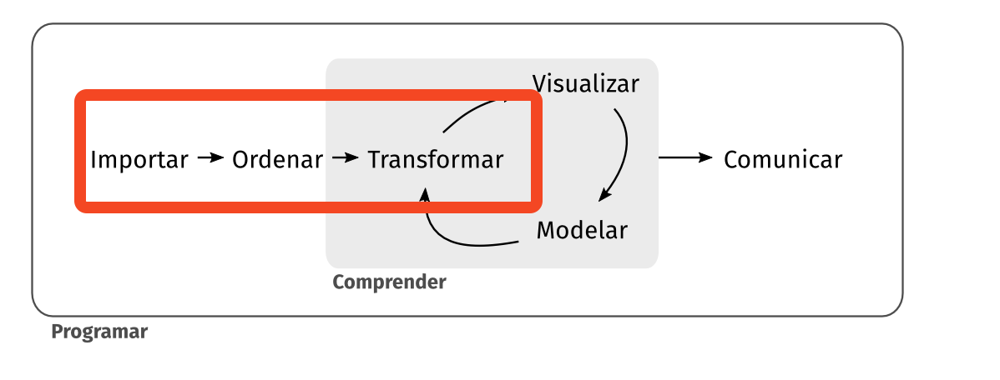

```{r}
#| echo: false

# instalar paquete gapminder sino se tiene instalado, descomentar línea
# install.packages('gapmider')

# cargar librerías
library(tidyverse)
library(gapminder)

# la df de gapminder viene precargada en el paquete gapminder. Por eso no la vamos a importar con read_xlsx
df_gapminder <- gapminder

```

## Objetivo

Realizar manipulaciones a los datos contenidos en una DF según diversos criterios, en particular en operaciones que afectan a las columnas o atributos.



## Operaciones en Columnas

A diferencia de las operaciones que revisamos en la Clase 15 donde aplicamos ciertas funciones para actuar sobre las filas, en esta oportunidad vamos a actuar sobre las columnas con una serie de funciones.

## Selección de Columnas

Se revisarán distintos métodos para seleccionar o deseleccionar columas de una data frame.

## `select` {.xsmall}

1.  Selección por nombre de las columnas:

    ```{r}
    df_gapminder%>%
      select(country, year, lifeExp)%>%
      slice(1)
    ```

2.  Selección por índice de la columna

    ```{r}
    df_gapminder%>%
      select(1, 3, 4)%>%
      slice(1)
    ```

## `select(-)` {.small}

Uso de operador sustracción para no selección

1.  Por nombre

    ```{r}
    df_gapminder%>%
      select(-continent, -gdpPercap, -continent, -pop )%>%
      slice(1)

    ```

2.  Por índice

    ```{r}
    df_gapminder%>%
      select(-c(2,5,6))%>%
      slice(1)
    ```

## `select(!)` {.small}

Deseleccionar usando el operador de negación `!`

1.  Por nombre

    ```{r}
    df_gapminder%>%
      select(!c(continent, gdpPercap, pop))%>%
      slice(1)
    ```

2.  Por índice

    ```{r}
    df_gapminder%>%
      select(!c(2,5,6))%>%
      slice(1)

    ```

## `rename`

Cambiar el nombre de una columna. Primero se coloca el nombre nuevo y luego el operador de igualdad y posteriormente el nombre que tiene actualmente la columna

```{r}
df_gapminder%>%
  rename(anno=year, pais= country)%>%
  select(anno, pais)
```

## `mutate`

Crear una nueva columna en una DF, en este caso una columna que calcula el PIB

```{r}
df_gapminder_pib <- df_gapminder%>%
  mutate(pib= gdpPercap* pop)%>%
  select(country, year, pib)

head(df_gapminder_pib, 3)
```

## `mutate /ifelse`

::: callout-tip
La función `ifelse` funciona vectorizadamente, es decir, se aplica sobre cada valor de una determinada fila de la data frame y su objetivo es evaluar si una determinada condición que es establecida se cumple o no, para un determinado valor.
:::

La condición evaluada solo puede arrojar un valor verdadero (TRUE) o uno falso (FALSE). Si arroja un verdadero ocurrirá un suceso A y en caso de no cumplirse ocurrirá un suceso B.

## `mutate` /`ifelse` -cont.

La sintáxis es

`ifelse(condición a evaluar, ocurre A, ocurre b)` ,

por ejemplo:

`a <- 4`

`b <- 7`

`ifelse (a>b, "es mayor", "es menor")`

dando de resultado la ejecución anterior "es menor" ya que al evaluar si 4 es mayor que 7, el resultado es `FALSE` y por lo tanto se irá al suceso B que es arrojar el valor "es menor".

## `mutate` /`ifelse`- ejemplo- Planteamiento Problema

Vamos a estudiar cuáles países tienen un PIB por encima del promedio de los PIB´s para el año 2007. A los países que estén por encima les vamos a asignar una categoría que se llamará `pib_up_mean` y a los que estén por debajo otra que se llame `pib_down_mean`.

Primero creamos la DF con los valores que vamos a evaluar

## `mutate` /`ifelse`- ejemplo- crear DF

```{r}
df_pib_2007 <- df_gapminder %>%
  filter(year==2007)%>%
  mutate(pib= gdpPercap* pop)%>%
  select(country, pib)

head(df_pib_2007, 2)
```

## `mutate` / `ifelse` - ejemplo - pasos intermedios

En caso de que los PIBs se presenten con notación exponencial o científica se hace el siguiente *setting*

```{r}
options(scipen=999)
```

Igualmente vamos a evaluar cuál es el promedio del PIB y lo asignamos a la variable `pib_promedio`

```{r}
pib_promedio =mean(df_pib_2007$pib)
pib_promedio
```

## `mutate` / `ifelse` - ejemplo- Aplicar {.xsmall2}

La columna que vamos a crear se llama "tipo_pib"

```{r}
df_pib_2007 <- df_pib_2007%>%
  mutate(tipo_pib =ifelse(pib>=pib_promedio, # condición a evaluar
                          "pib_up_mean", # caso verdadero => ocurre a
                          "pib_down_mean"))  #caso falso => ocurre b

df_pib_2007%>%
  sample_n(4)
```

## `mutate` / doble `ifelse` - problema

Ahora vamos a asignar tres categorías según el tamaño del PIB.

| Condición                             | Categoría a asignar |
|---------------------------------------|---------------------|
| pib mayor a tercer cuantil            | 'super_pib'         |
| pib entre 1 er cuantil y 3 er cuantil | 'medio_pib'         |
| pib por debajo de 1 er cuantil        | 'bajo_pib'          |

## `mutate` / doble `ifelse` - pasos intermedios {.xsmall2}

Obtener cuantiles.

```{r}
cuartiles_pib <- quantile(df_pib_2007$pib)

cuartiles_pib

#fijar variables

primer_cuartil <- cuartiles_pib[2]
tercer_cuartil <- cuartiles_pib[4]


```

## `mutate` / doble `ifelse` - ejemplo 2- Aplicar {.xsmall2}

```{r}
df_pib_2007 <- df_pib_2007%>%
  arrange(desc(pib))%>%
  mutate(tipo_pib2 =ifelse(pib<= primer_cuartil, # condición
                          "bajo_pib",# caso T ➡️ ocurre a
                          ifelse(pib>= tercer_cuartil, # caso F ➡️ ocurre b => 2da eval
                                 'super_pib', # caso T ➡️ ocurre b-1 y ocurre a-2
                                 'medio_pib') # caso faFlso ➡️ ocurre b-1 y ocurre b-2
                          )
         )


```

## Resultado {.xsmall2}

```{r}
head(df_pib_2007,3)
tail(df_pib_2007,3)
```
