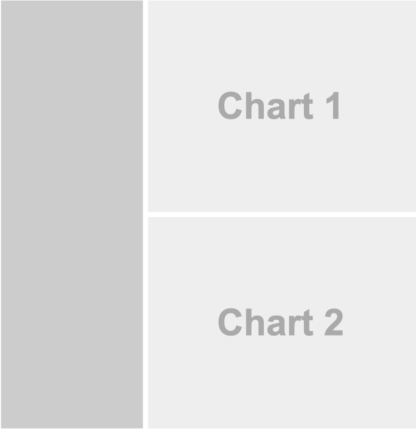
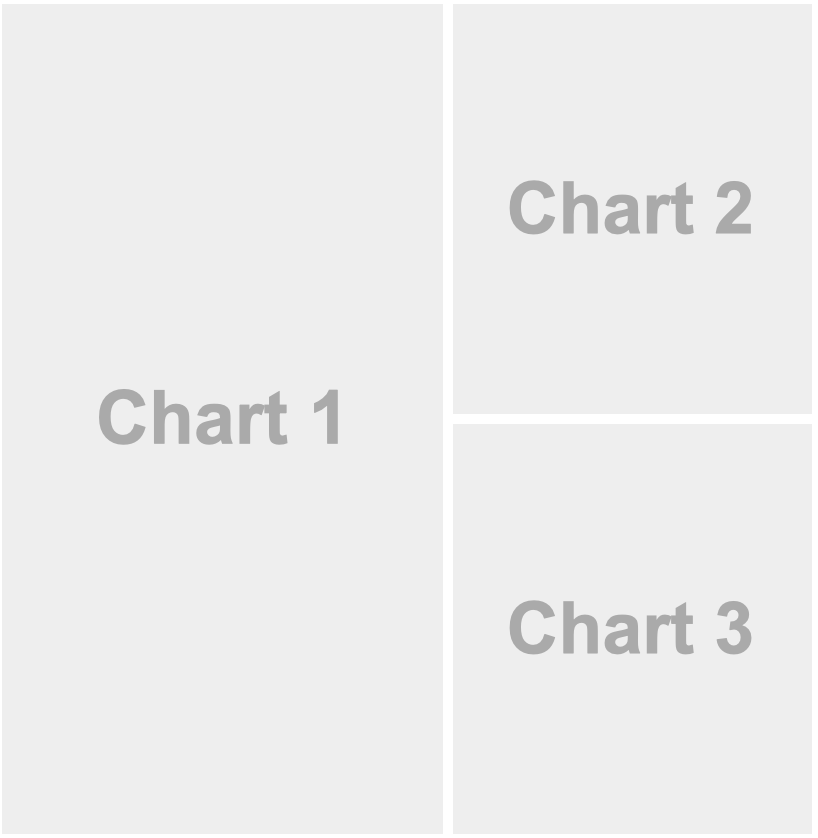

## Créditos de la Presentación

::: callout-important
Esta presentación fue desarrollada por la Dra. Mine Çetinkaya-Rundel en la Duke University para el curso STA 313 del período Primavera-2024, al cual puede acceder en el enlace <https://vizdata.org>
:::

# Quarto Dashboards

Un nuevo formato de salida para crear fácilmente Dashboard a partir de archivos `.qmd`

##   {.no-line background-image="images/clase23/dashboards/dashing-through-snow.png" background-size="contain"}

##   {.no-line background-image="images/clase23/dashboards/customer-churn.png" background-size="contain"}

##   {.no-line background-image="images/clase23/dashboards/mynorfolk.png" background-size="contain"}

##   {.no-line background-image="images/clase23/dashboards/earthquakes.png" background-size="contain"}

##   {.no-line background-image="images/clase23/dashboards/model-card.png" background-size="contain"}

##   {.no-line background-image="images/clase23/dashboards/shiny-penguins.png" background-size="contain"}

##   {.no-line background-image="images/clase23/dashboards/gapminder.png" background-size="contain"}

## .qmd ➝ Dashboard

``` {.markdown code-line-numbers="|3"}
---
title: "Cruzando la nieve ❄️"
format: dashboard
---

# el contenido va aquí...
```

## Componentes del Dashboard

::: incremental
1.  **Barra de navegación y páginas** --- Icono, título y autor junto con enlaces a subpáginas (si se define más de una página).

2.  **Barras laterales, filas y columnas, y conjuntos de pestañas** --- Filas y columnas usando encabezados markdown (con atributos opcionales para controlar la altura, el ancho, etc.). Barras laterales para entradas interactivas. Conjuntos de pestañas para dividir aún más el contenido.

3.  **Tarjetas (Gráficos, Tablas, Cuadros de valores, Contenido)** --- Las tarjetas son contenedores para las salidas de celda y el texto markdown de forma libre. El contenido de las tarjetas normalmente se asigna a los *chunks*.
:::

## Barra de navegación y páginas


::: {style="margin-top: 0.7em;"}
``` markdown
---
title: "Pingüinos de Palmer"
author: "Análisis de Cobblepot"
format:
  dashboard:
    logo: images/clase23/penguins.png
    nav-buttons: [linkedin, twitter, github]
---

# Bills

# Flippers

# Data
```
:::

## Barras laterales: Nivel de página

::::: columns
::: column
```` {.markdown style="margin-top: 45px;"}
---
title: "Barra lateral"
format: dashboard
---

# Página 1

## {.sidebar}

```{{r}}
```

## Column

```{{r}}
```

```{{r}}
```
````
:::

::: {.column .fragment}

:::
:::::

## Barras laterales: Global

::::: columns
::: column
```` {.markdown style="margin-top: 45px;"}
---
title: "Barra lateral global"
format: dashboard
---

# {.sidebar}

Contenido de la barra lateral (ej. entradas)

# Plot

```{{r}}
```

# Data

```{{r}}
```
````
:::

::: {.column .fragment}
{width="80%"}
:::
:::::

## Diseño: Filas

::::: columns
::: {.column style="margin-top: 65px;"}
```` markdown
---
title: "Focal (Superior)"
format: dashboard
---

## Row {height=70%}

```{{r}}
```

## Row {height=30%}

```{{r}}
```

```{{r}}
```
````
:::

::: {.column .fragment}
{width="90%"}
:::
:::::

##   {.no-line background-image="images/clase23/dashboards/customer-churn.png" background-size="contain"}

## Diseño: Columnas

::::: columns
::: {.column style="margin-top: 40px;"}
```` markdown
---
title: "Focal (Superior)"
format:
  dashboard:
    orientation: columns
---

## Column {width=60%}

```{{r}}
```

## Column {width=40%}

```{{r}}
```

```{{python}}
```
````
:::

::: {.column .fragment}

:::
:::::

##   {.no-line background-image="images/clase23/dashboards/housing-market.png" background-size="contain"}

## Conjunto de pestañas (tabsets)

::::: columns
::: {.column style="margin-top: 45px;"}
```` markdown
---
title: "Pingüinos de Palmer"
format: dashboard
---

## Row

```{{r}}
```

## Row {.tabset}

```{{r}}
#| title: Gráfico 2
```

```{{r}}
#| title: Gráfico 3
```
````
:::

::: {.column .fragment}
{width="87%"}
:::
:::::

##   {.no-line background-image="images/clase23/dashboards/mynorfolk.png" background-size="contain"}

## Gráficos

Cada fragmento de código crea una tarjeta y puede llevar un título

::::: columns
::: {.column .fragment .smaller}
```` r
```{{r}}
#| title: PIB y esperanza de vida
library(gapminder)
library(tidyverse)
ggplot(gapminder, aes(x = gdpPercap, y = lifeExp, color = continent)) +
  geom_point()
```
````
:::

::: {.column .fragment}
{width="85%"}
:::
:::::

## Tablas

Cada fragmento de código crea una tarjeta, no es necesario que tenga un título

::::: columns
::: {.column .fragment .smaller}
```` r
```{r}
library(gapminder)
library(tidyverse)
library(gt)
gapminder |>
  group_by(continent, year) |>
  summarize(mean_lifeExp = round(mean(lifeExp), 1)) |>
  pivot_wider(names_from = continent, values_from = mean_lifeExp) |>
  gt()
```
````
:::

::: {.column .fragment}
{width="85%"}
:::
:::::

## Otras características

-   Contenido de texto

-   Cuadros de valores

-   Tarjetas expandibles

## Deploy del Dashboard

¡Los Dashboard suelen ser simplemente páginas HTML estáticas, por lo que se pueden implementar en cualquier servidor o host web!

## Dashboard interactivos

<https://quarto.org/docs/dashboards/interactivity/shiny-r>

-   Para la exploración interactiva, algunos Dashboard pueden beneficiarse de un backend R en vivo

-   Para hacer esto con los Dashboard de Quarto, agregue componentes interactivos de [Shiny](https://shiny.posit.co)

-   ¡Implemente con o sin un servidor!

## Dashboard de Quarto, ¡pero con Python!

<https://github.com/mine-cetinkaya-rundel/dashing-through-snow>

-   R:
    -   Dashboard: <https://mine.quarto.pub/dashing-through-snow-r>
    -   Código: <https://github.com/mine-cetinkaya-rundel/dashing-through-snow/blob/main/snowdash-r.qmd>
-   Python:
    -   Dashboard: <https://mine.quarto.pub/dashing-through-snow-py>
    -   Código: <https://github.com/mine-cetinkaya-rundel/dashing-through-snow/blob/main/snowdash-py.qmd>

## Cards Compatibles

<https://www.htmlwidgets.org/showcase_leaflet.html>

```{=html}
<iframe width="1000" height="400" src="https://www.htmlwidgets.org/showcase_leaflet.html" frameborder="1" style="background:white;"></iframe>
```

## CrossTalk

<https://rstudio.github.io/crosstalk/>

```{=html}
<iframe width="1000" height="400" src="https://rstudio.github.io/crosstalk/" frameborder="1" style="background:white;"></iframe>
```

## Aprende más

<https://quarto.org/docs/dashboards>

```{=html}
<iframe width="1000" height="400" src="https://quarto.org/docs/dashboards" frameborder="1" style="background:white;"></iframe>
```
