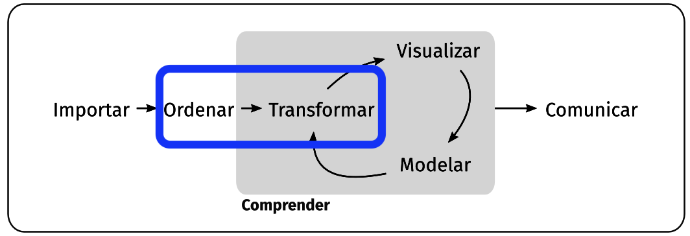
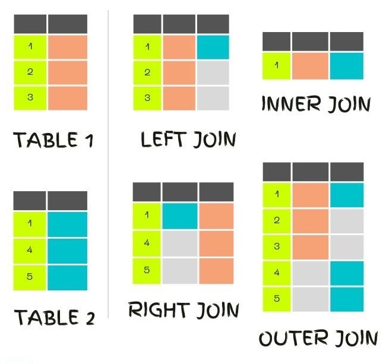

## Objetivo

Conocer distintos métodos para juntar data frames por elementos coincidentes en al menos un atributo.

## Ciclo

{fig-align="center"}

## Introducción a los Joins

Los **joins** son operaciones fundamentales en el manejo de datos que permiten combinar dos o más data frames basados en una o más columnas comunes. En R, puedes utilizar la función `dplyr::join()` para realizar diferentes tipos de joins.

## Tipos de Joins

1.  **Inner Join**: Devuelve solo las filas que tienen coincidencias en ambos data frames.
2.  **Left Join**: Devuelve todas las filas del primer data frame y las filas coincidentes del segundo data frame. Si no hay coincidencia, se rellenan con `NA`.

## Tipos de Joins- cont.

3.  **Right Join**: Devuelve todas las filas del segundo data frame y las filas coincidentes del primer data frame. Si no hay coincidencia, se rellenan con `NA`.
4.  **Full Join**: Devuelve todas las filas de ambos data frames. Si no hay coincidencia, se rellenan con `NA`.

## Explicación Visual

{fig-align="center"}

## Ejemplos Prácticos -Crear DF 1

```{r}
# Cargar la librería dplyr 
library(dplyr)

# Data frame de países con su población

df_paises <- data.frame ( pais = c("España", "Francia", 
                                   "Alemania", "Italia"), 
                          poblacion = c(47.3, 65.2, 83.1, 60.4) )

df_paises

# Mostrar los data frames
```

## Crear DF 2

```{r}
# Data frame de países con su PIB per cápita

df_economia <- data.frame( pais = c("España", "Alemania",
                                    "Italia", "Portugal"),
                           pib_per_capita = c(29500, 37800, 31600, 24000) )

df_economia
```

## Inner Join

```{r}
# Realizar un inner join
inner_join(df_paises, 
           df_economia,
           by = "pais")
```

**Explicación** : Este join devuelve solo las filas que tienen coincidencias en ambos data frames. En este caso, los países "España", "Alemania" e "Italia".

## Left Join

```{r}
# Realizar un left join
left_join(df_paises, 
          df_economia,
          by = "pais")
```

**Explicación**: Este join devuelve todas las filas del primer data frame (df_paises) y las filas coincidentes del segundo data frame (df_economia). Si no hay coincidencia, se rellenan con NA. En este caso, el país "Francia" no tiene una correspondencia en el segundo data frame.

## Right Join

```{r}
# Realizar un right join
right_join(df_paises, 
           df_economia, 
           by = "pais")
```

**Explicación** : Este join devuelve todas las filas del segundo data frame (df_economia) y las filas coincidentes del primer data frame (df_paises). Si no hay coincidencia, se rellenan con NA. En este caso, el país "Portugal" no tiene una correspondencia en el primer data frame.

## Full Join

```{r}
full_join(df_paises, 
          df_economia, 
          by = c('pais'))
```

**Explicación** : Este join devuelve todas las filas de ambos data frames. Si no hay coincidencia, se rellenan con **`NA`**. En este caso, los países "Francia" y "Portugal" no tienen una correspondencia en el otro data frame.

## Nombre Clave No coincidente

### Cambiar df_economia

```{r}
df_economia2 <- data.frame( Pais = c("España", "Alemania",
                                    "Italia", "Portugal"),
                           pib_per_capita = c(29500, 37800, 31600, 24000) )


```

## Aplicar `by`

```{r}
left_join(df_paises,
          df_economia2,
          by = c('pais'= 'Pais'))
```
