```{r}
#| echo: false
#| eval: false
library(tidyverse)
library(rvest)
datos_goo_respuesta <- readRDS('data_in/datos_goo_respuesta.rds')
```

## Objetivo

Realizar consultas a distintas API's y procesar los datos obtenidos.

## Ciclo

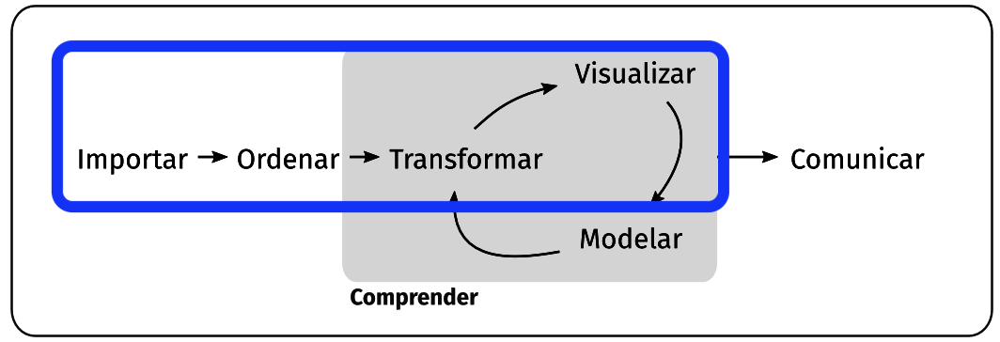{width="700"}

## Definición API´s

Las APIs (Application Programming Interfaces) son conjuntos de reglas y protocolos que permiten a diferentes aplicaciones comunicarse entre sí. En términos simples, una API es un intermediario que permite que dos programas se comuniquen sin necesidad de entender cómo están construidos internamente = *vamos a ponernos de acuerdo*

#### API REST **(Representational State Transfer)**

Es un estilo adoptado para diseñar servicios web, el cual se sustenta en el protocolo HTTP. Su objetivo principal es proporcionar una interfaz sencilla y eficiente para la comunicación entre diferentes sistemas o aplicaciones, permitiendo que puedan intercambiar datos de manera estándar.

## ¿Cómo Funcionan?

1.  **Identificar la API** : Encuentra una API que proporcione los datos que necesitas.

2.  **Obtener credenciales (si es necesario)** : Algunas APIs requieren claves de acceso o tokens para autenticar tus solicitudes.

3.  **Realizar una solicitud HTTP** : Utiliza métodos como GET, POST, etc., para enviar solicitudes a la API.

4.  **Procesar la respuesta** : La API devolverá los datos en un formato como JSON o XML, que se deben procesar.

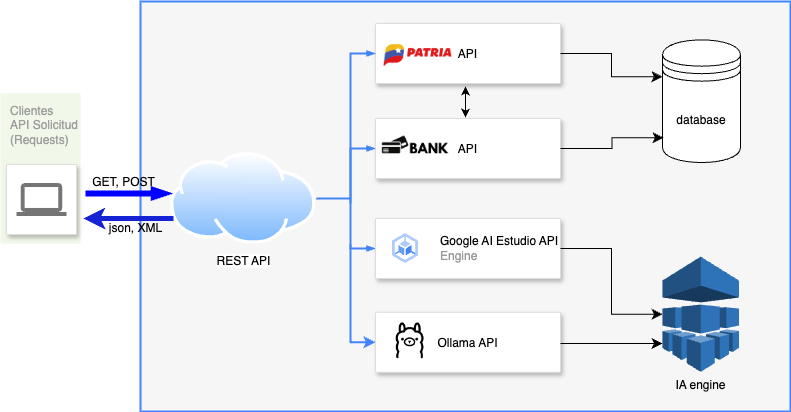

## Métodos

-   **GET** :

    -   Se utiliza para solicitar datos del servidor.

    -   Los parámetros se envían en la URL.

    -   Es idempotente (realizar múltiples solicitudes tiene el mismo efecto que una sola).

    -   No es seguro para enviar datos sensibles.

-   **POST** :

    -   Se utiliza para enviar datos al servidor, como crear o actualizar recursos.

    -   Los parámetros se envían en el cuerpo de la solicitud.

    -   No es idempotente (cada solicitud puede tener un efecto diferente).

    -   Es más seguro para enviar datos sensibles.

## Ejemplos de API:

1.  **Spotify**:
    -   **Descripción**: Proporciona acceso a bibliotecas de música, listas de reproducción, artistas y más.
2.  **OpenWeatherMap**:
    -   **Descripción**: Ofrece datos meteorológicos en tiempo real, pronósticos y estadísticas históricas.
3.  **Google Maps**:
    -   **Descripción**: Proporciona información geográfica, rutas, lugares de interés y más.
4.  **GitHub**:
    -   **Descripción**: Permite acceder a repositorios, issues, pull requests y otros datos relacionados con el código fuente.
5.  **Yelp**:
    -   **Descripción**: Ofrece información sobre negocios locales, reseñas, calificaciones y más.

## JSON

**JSON (JavaScript Object Notation)** es un formato ligero de intercambio de datos que es fácil para humanos leer y escribir, y fácil para las computadoras de generar y analizar. Los datos generalmente están en estructuras anidadas

## JSON 1: datos tabulares

::::: columns
::: {.column width="50%"}
```         
  "empleados": [
    {
      "nombre": "Juan",
      "edad": 30,
      "departamento": {
        "nombre": "Ventas",
        "ubicacion": "Edificio A"
      }
    },
    {
      "nombre": "Ana",
      "edad": 25,
      "departamento": {
        "nombre": "Marketing",
        "ubicacion": "Edificio B"
      }
    }
  ]
}
```
:::

::: {.column width="50%"}
```{r}
library(jsonlite)
fromJSON('{
  "empleados": [
    {
      "nombre": "Juan",
      "edad": 30,
      "departamento": {
        "nombre": "Ventas",
        "ubicacion": "Edificio A"
      }
    },
    {
      "nombre": "Ana",
      "edad": 25,
      "departamento": {
        "nombre": "Marketing",
        "ubicacion": "Edificio B"
      }
    }
  ]
}')

```
:::
:::::

## JSON 2: datos no tabulares

::::: columns
::: {.column width="50%"}
```         
  "libro": {
    "titulo": "1984",
    "autor": "George Orwell",
    "publicado": 1949,
    "generos": ["Dystopian", "Political Fiction"],
    "reseña": {
      "puntuacion": 4.5,
      "comentario": "Una visión profunda de un futuro distópico."
    }
  }
}
```
:::

::: {.column width="50%"}
```{r}
fromJSON('{
  "libro": {
    "titulo": "1984",
    "autor": "George Orwell",
    "publicado": 1949,
    "generos": ["Dystopian", "Political Fiction"],
    "reseña": {
      "puntuacion": 4.5,
      "comentario": "Una visión profunda de un futuro distópico."
    }
  }
}')
```
:::
:::::

## Paquete HTTR2

Es un cliente HTTP completo que proporciona una API moderna y canalizable para trabajar con APIs web. Se basa en {curl} para proporcionar características como objetos de solicitud explícitos, herramientas integradas de limitación de velocidad y reintento, soporte completo de OAuth y manejo seguro de secretos y credenciales.

HTTR2 permite los métodos de solicitudes GET, POST, PUT, DELETE 

Si la descarga arroja un error de timeout es necesario ejecutar en consola `options(timeout=numeroensegundos)`

## Inspección JSON

Usar función `View`

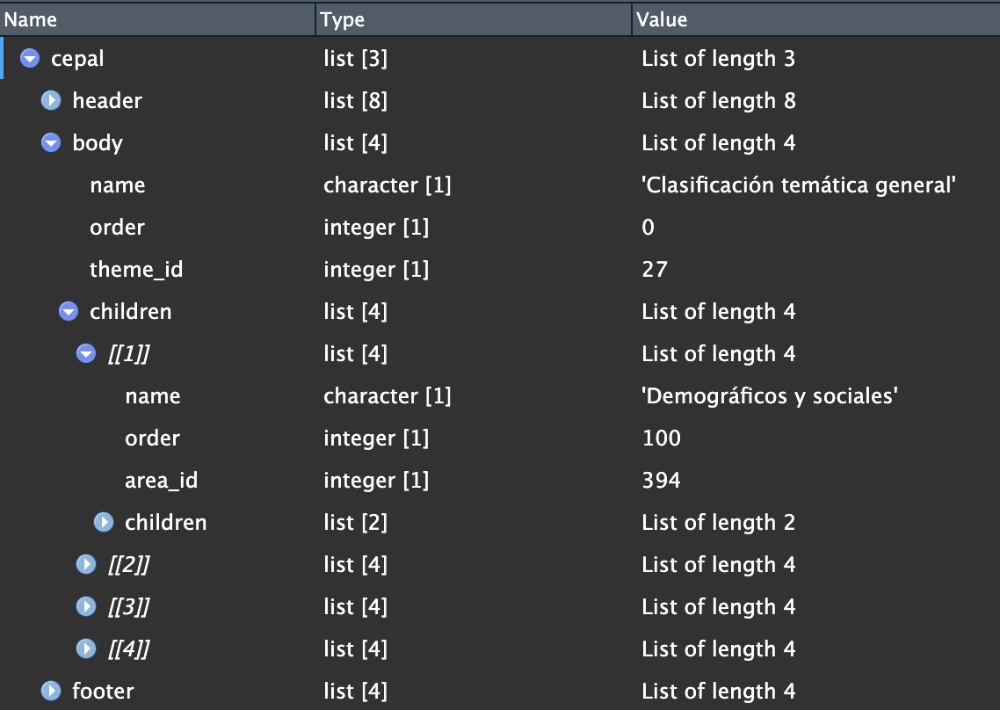{width="700"}

# Caso 1: Patria Datos Covid Venezuela

Cifras COVID Venezuela disponibles en <https://covid19.patria.org.ve/estadisticas-venezuela/>

Url api: <https://covid19.patria.org.ve/api-covid-19-venezuela/>

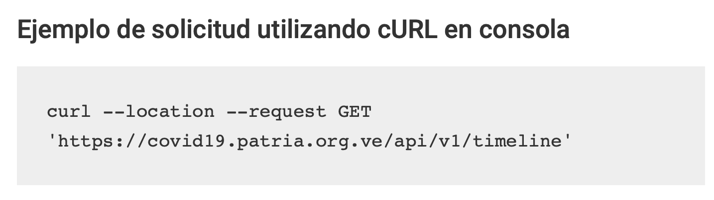{width="400"}

## Caso 1: request

```{r}
#| echo: true
library(httr2)
library(jsonlite)
library(dplyr)
req_cepal <- request("https://covid19.patria.org.ve/api/v1/timeline")

req_cepal
```

## Caso 1: definición método

### GET

```{r}
#| echo: true
#| eval: false
req_cepal |> 
  req_method("GET")
```

### revisión consulta

```{r}
#| echo: true
#| eval: false
req_cepal |> 
  req_dry_run()
```

## Caso 1: realizar request

```{r}
#| echo: true
#| eval: false
respuesta_cepal <- req_perform(req_cepal)

# posterior a consulta
respuesta_cepal |> 
  resp_status_desc()

respuesta_cepal |> 
  resp_content_type()

#str(respuesta_cepal) más info
```

## Caso 1: procesar datos del request

```{r}
#| echo: true
#| eval: false
datos_cepal <- respuesta_cepal$body%>%
  rawToChar()%>%
  fromJSON()

class(datos_cepal)  
str(datos_cepal)
```

## Caso 1: View de datos

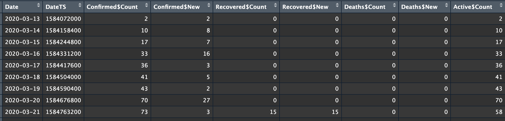{fig-align="center" width="800"}

más info de plotly en el [enlace](https://plotly.com/r/)

# Caso 2: Buscador Empleo

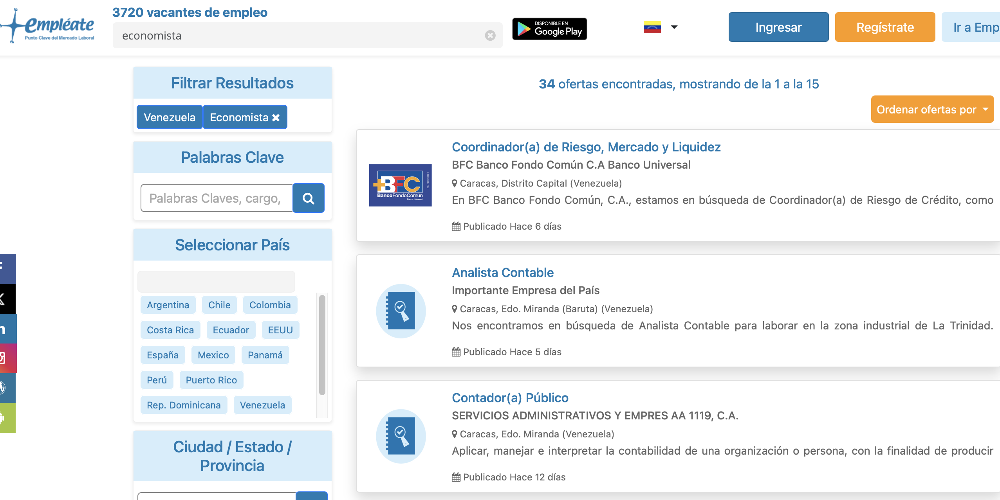{fig-align="center" width="700"}

## Caso 2: Realizar Consulta

Se añaden headers que pide la API para entregar resultados

```{r}
url_emplea <- 'https://www.empleate.com/venezuela/ofertas/empleos_encontrados/1/trabaios-en-venezuela-busqueda-por-economista'

req_emplea <- request(url_emplea)|>
  req_method("GET")|> 
  req_headers( Accept= "*/*",
               `Accept-Language`= "es,es-ES;q=0.9,en-US;q=0.8,en;q=0.7,gl;q=0.6",
               `User-Agent`= "Mozilla/5.0 (Macintosh; Intel Mac OS X 10_15_7) AppleWebKit/537.36 (KHTML, like Gecko) Chrome/130.0.0.0 Safari/537.36")|>
  req_perform()

req_emplea
```

## Caso 3: inspección respuesta

```{r}
req_emplea|> 
  resp_content_type()

datos_html <- req_emplea$body|>
  rawToChar()

substr(datos_html,201000,201600)

rvest::read_html(datos_html)
```

# Caso 3 Dolar Monitor

Extraer datos de API de monitor dólar

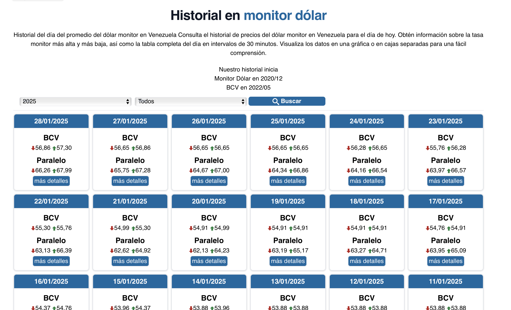{fig-align="center" width="800" height="400"}

## Caso 3: realizar `request`

Esta petición necesita llevar headers

```{r}
#| echo: true
#| eval: false
#| code-line-numbers: "3,4"


req_MonDol <- request('https://api.monitordolarvenezuela.com/historico')|>
  req_method("GET")|> 
  req_headers(Origin= "https://monitordolarvenezuela.com",
              Referer= "https://monitordolarvenezuela.com/") |>
  req_perform()

req_MonDol
```

## Caso 3: analizar respuesta

1.  tipo de contenido:

    ```{r}
    #| echo: true

    req_MonDol|> 
      resp_content_type()
    ```

2.  Extraer datos de respuesta y extraer del json

    ```{r}
    #| echo: true

    datos_MonDol <- req_MonDol$body|>
      rawToChar()|>
      fromJSON()
    ```

3.  Consultar clase y nombres de la respuesta

    ```{r}
    #| echo: true

    class(datos_MonDol)
    names(datos_MonDol)
    # str(datos_MonDol) para más info
    ```

## Caso 3: extraer df con datos

Es necesario hacer limpieza en las fechas, en los valores de caracteres a numéricos, redondear

```{r}
#| echo: true

df_MonDol <- datos_MonDol$result|>
  as_tibble()|>
  mutate(fecha= as.Date(fecha,format='%d/%m/%Y')) |>
  arrange(fecha) %>%
  mutate(across(all_of(c('MdvMin','MdvMax',
                         'BcvMin','BcvMax')), 
                as.numeric),
         across(all_of(c('MdvMin','MdvMax',
                         'BcvMin','BcvMax')), ~round(.x, 2)))

head(df_MonDol)
```

## Caso 3: representación gráfica

::::: columns
::: {.column width="50%"}
```{r}
#| echo: true
#| eval: false
library(apexcharter)
apex(data = df_MonDol, 
     mapping = aes(x = fecha, 
                   ymin = MdvMin,
                   ymax= MdvMax),
     type = "rangeArea",
     serie_name = '$ Monitor',
     synchronize = "df_MonDol")|>
  ax_colors(c( "#ff595e"))

apex(data = df_MonDol, 
     mapping = aes(x = fecha, 
                   ymin = BcvMin,
                   ymax= MdvMax),
     type = "rangeArea",
     serie_name = '$ BCV',
     synchronize = "df_MonDol") |>
  ax_colors( '#1982c4')
```
:::

::: {.column width="50%"}
```{r}
#| echo: false


library(apexcharter)
apex(data = df_MonDol, 
     mapping = aes(x = fecha, 
                   ymin = MdvMin,
                   ymax= MdvMax),
     type = "rangeArea",
     serie_name = '$ Monitor',
     synchronize = "df_MonDol")|>
  ax_colors(c( "#ff595e"))

apex(data = df_MonDol, 
     mapping = aes(x = fecha, 
                   ymin = BcvMin,
                   ymax= MdvMax),
     type = "rangeArea",
     serie_name = '$ Monitor',
     synchronize = "df_MonDol") |>
  ax_colors( '#1982c4')
```
:::
:::::

# Caso 4: Consulta LLM 1, API Google AI Studio

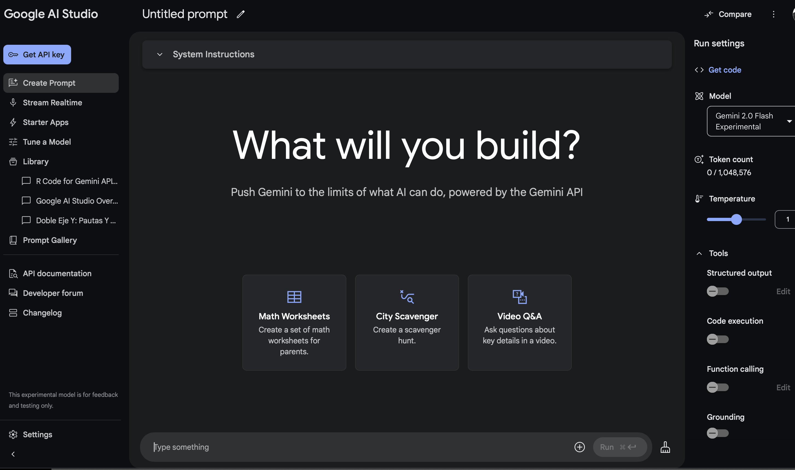{fig-align="center" width="800"}

## Caso 4: obtener datos

::::: columns
::: {.column width="50%"}
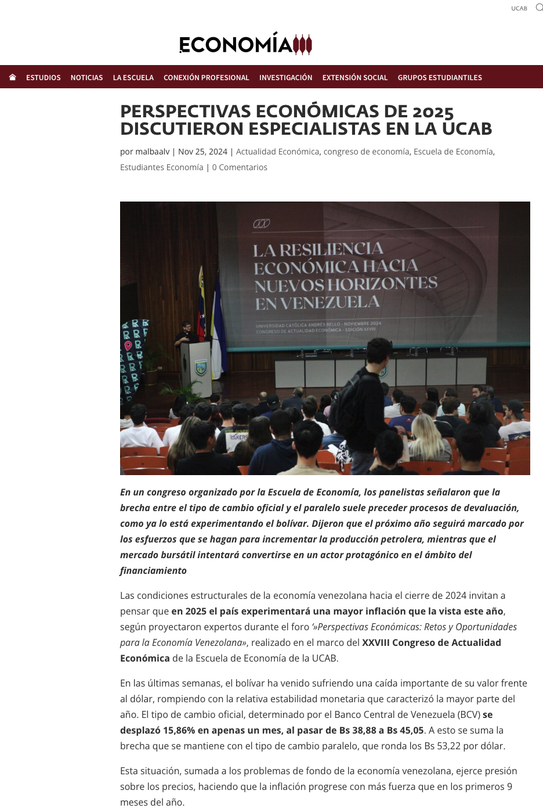{fig-align="left" width="400"}
:::

::: {.column width="50%"}
```{r}
#| echo: true


library(rvest)
dato_texto_ucab <- read_html('https://economia.ucab.edu.ve/perspectivas-economicas-de-2025-discutieron-especialistas-en-la-ucab/')|>
  html_nodes('p')|>
  html_text()|>
  paste(collapse = '. ')%>%
  str_squish()

# inspección texto descargado
substr(dato_texto_ucab, 100, 1400)  

```
:::
:::::

## Caso 4: definir prompt consulta

Eres un experto en análisis de noticias económicas. Vas a extraer en formato json las ideas principales expuestas en el texto {idea_principal_nombre: descripcion} del texto delimitado por triple asterisco. Texto: \*\*\* ....... \*\*\*. Recuerda solo extraer el valor y no añadir información adicional.

```{r}
#| echo: true


# definir el prompt
prompt <- 'Eres un experto en análisis de noticias económicas. Vas a extraer en formato json las ideas principales expuestas en el texto {idea_principal_nombre: descripcion} del texto delimitado por triple asterisco. Texto: ***'

post_texto <- '***.  Recuerda solo extraer el valor y no añadir información adicional. '

dato_texto_prompt_gooaistudio <- paste(prompt,
                                       dato_texto_ucab,
                                       post_texto)
```

## Caso 4: API Google AI Studio

Conectarse desde `R` a esta API que pide KEY y `body` en el request

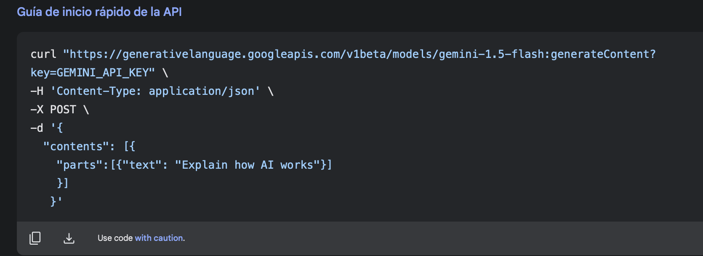

## Caso 4: crear request

Cambiar API key

```{r}
#| echo: true
#| eval: false


gooai_studio_url <- 'https://generativelanguage.googleapis.com/v1beta/models/gemini-1.5-flash:generateContent'
                
api_key <- ''

llm_resultado_google <- request(gooai_studio_url) %>%
  req_headers("Content-Type" = "application/json") %>%
  req_body_json(
    list(
      contents = list(
        list(
          parts = list(
            list(text = dato_texto_prompt_gooaistudio)
          )
        )
      )
    )
  ) %>% 
  req_url_query(key = api_key) %>% 
  req_method("POST")|>
  req_perform()

```

## Caso 4: procesar datos request

```{r}
#| echo: true
#| eval: false

library(stringr)

datos_goo_respuesta <- llm_resultado_google$body |>
  rawToChar() |>
  fromJSON()%>%
  .$candidates %>%
  .$content%>%
  .$parts%>%
  .[[1]]%>%
  str_squish(.)%>%
  str_remove_all(.,'```json | ```')%>%
  fromJSON()
```

## Caso 4: Analizar resultados

```{r}
#|eval: true
#|echo: false


datos_goo_respuesta
```

# Caso 5: Consulta LLM 2, Ollama local network

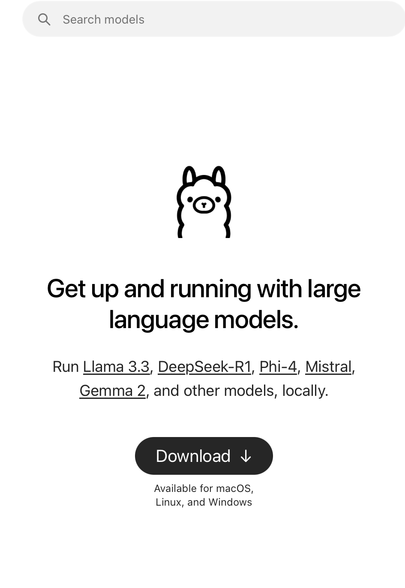{fig-align="center" width="800"}

## Caso 5: obtener datos

::::: columns
::: {.column width="50%"}
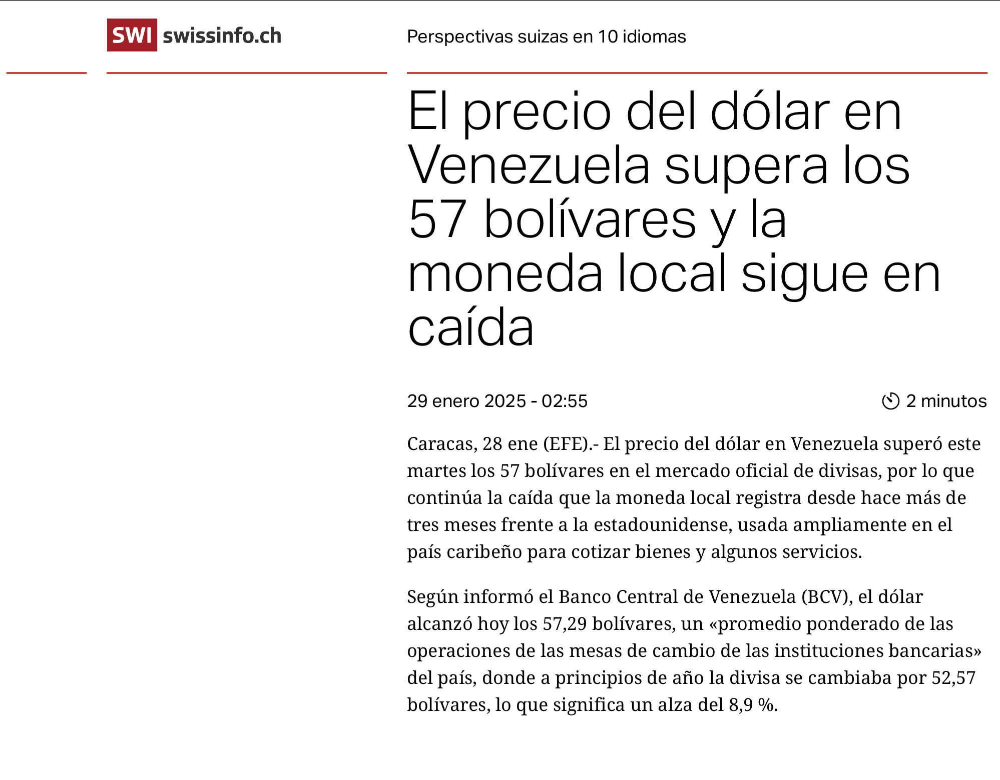{fig-align="left"}
:::

::: {.column width="50%"}
```{r}
#| echo: true

library(rvest)
library(stringr)
dato_texto <- read_html('https://www.swissinfo.ch/spa/el-precio-del-dólar-en-venezuela-supera-los-57-bolívares-y-la-moneda-local-sigue-en-caída/88794237')|>
  html_nodes('p')|>
  html_text()|>
  paste(collapse = '. ')%>%
  str_squish()
substr(dato_texto, 200, 400)  


```
:::
:::::

## Caso 5: crear prompt

::::: columns
::: {.column width="50%"}
Prompt: vas a extraer en formato json el valor del dolar del texto delimitado por triple asterisco. Texto: \*\*\* .... \*\*\*. Recuerda solo extraer el valor y no añadir información adicional.
:::

::: {.column width="50%"}
```{r}
#| echo: true

prompt <- 'vas a extraer en formato json el valor del dolar del texto delimitado por triple asterisco. Texto: ***'
  
post_texto <- '***.  Recuerda solo extraer el valor y no añadir información adicional. '

dato_texto_prompt <- paste(prompt,
                           dato_texto,
                           post_texto)
```
:::
:::::

## Caso 5: crear request

-   Cambiar url por el de la IP donde está la API en la red local

-   Se pasan distintos argumentos en el body del request: modelo, prompt, temperatura del llm, etc

```{r}
#| echo: true


url_ollama <- 'http://localhost:11434' # modificar url por dirección ip host

endpoint <- paste0(url_ollama, '/api/generate')

llm_resultado <- request(endpoint)|>
  req_method("POST")|> 
  req_body_json(list(  model='llama3.2:1b',
                       prompt = dato_texto_prompt,
                       raw=FALSE,
                       format = "json",
                       options=list(
                         temperature= 0.1),
                       stream = FALSE,
                       keep_alive='3m'))|>
  req_perform()|>
  resp_body_json()
```

## Caso 5: procesar request

Los datos hay que extraerlos del JSON

```{r}
#| echo: true

fromJSON(llm_resultado$response)|>
  as_tibble()
```

# Caso 6: Consulta API Cepal

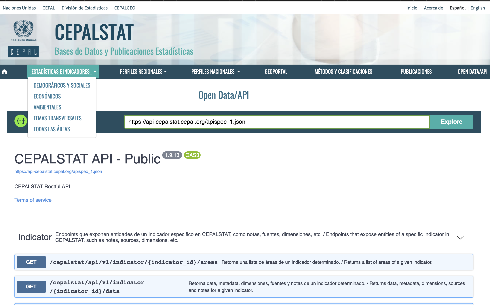{fig-align="center" width="800"}

<https://statistics.cepal.org/portal/cepalstat/open-data.html?lang=es>

## Obtener Clasificador Temático

```{r}
#| eval: false
#| echo: true


datos_cepal <- request("https://api-cepalstat.cepal.org/cepalstat/api/v1/thematic-tree?lang=es&format=json")|>
  req_headers("Accept" = "application/json")|>
  req_perform()|>
  resp_body_json()

```
