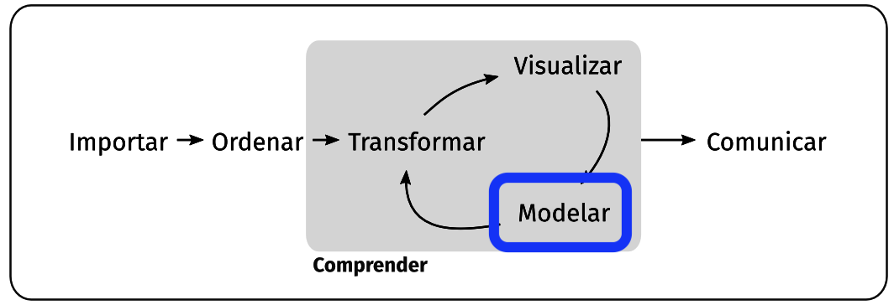

Todo el contenido de esta presentación está basado en el capítulo "Modelar" de R para Ciencia de Datos de Hadley Wickham.

## Objetivo

Adquirir nociones básicas sobre modelado y cómo aplicarlos en R

{width="600"}
