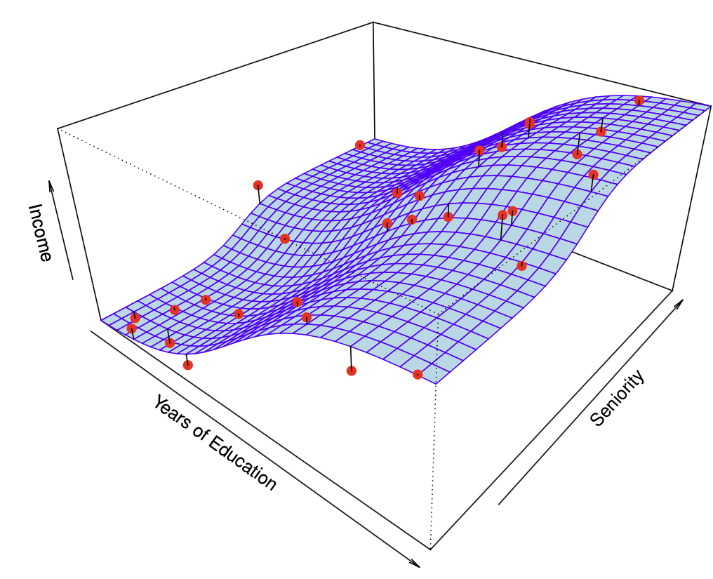
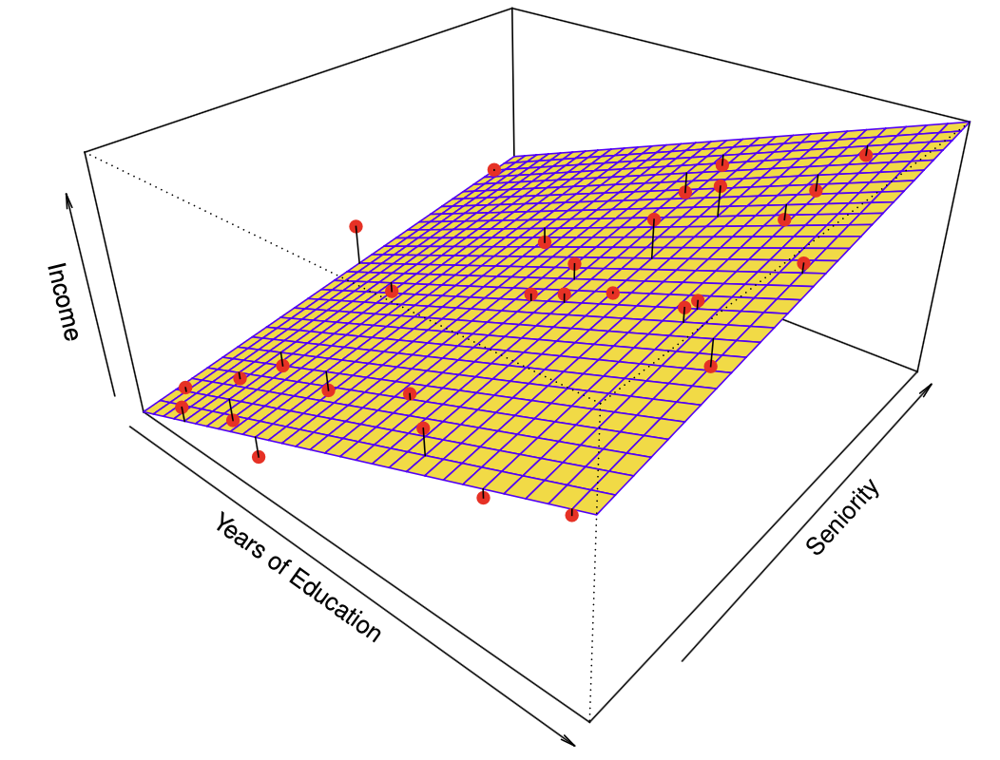
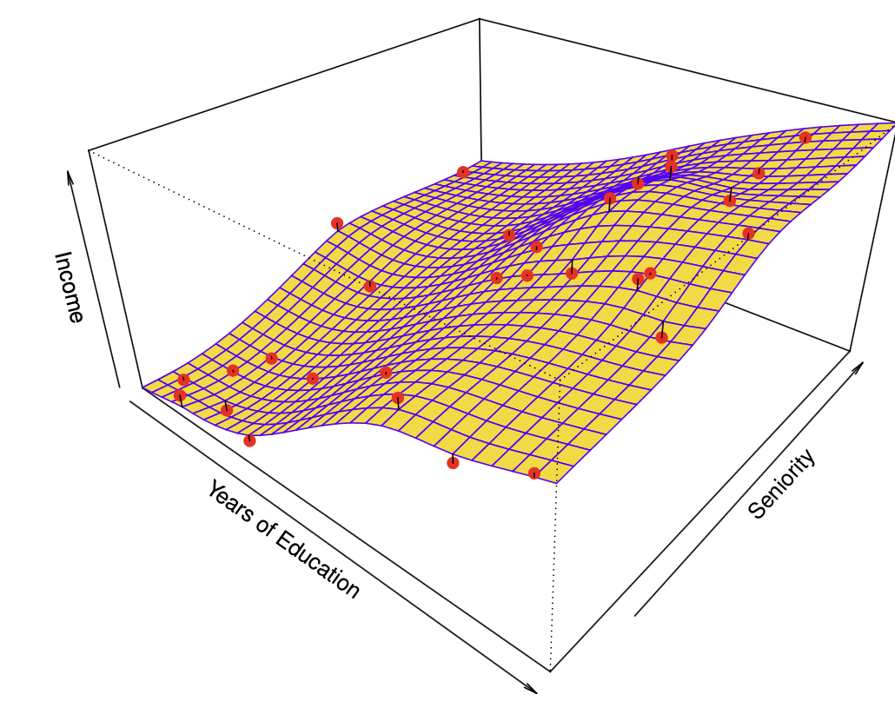
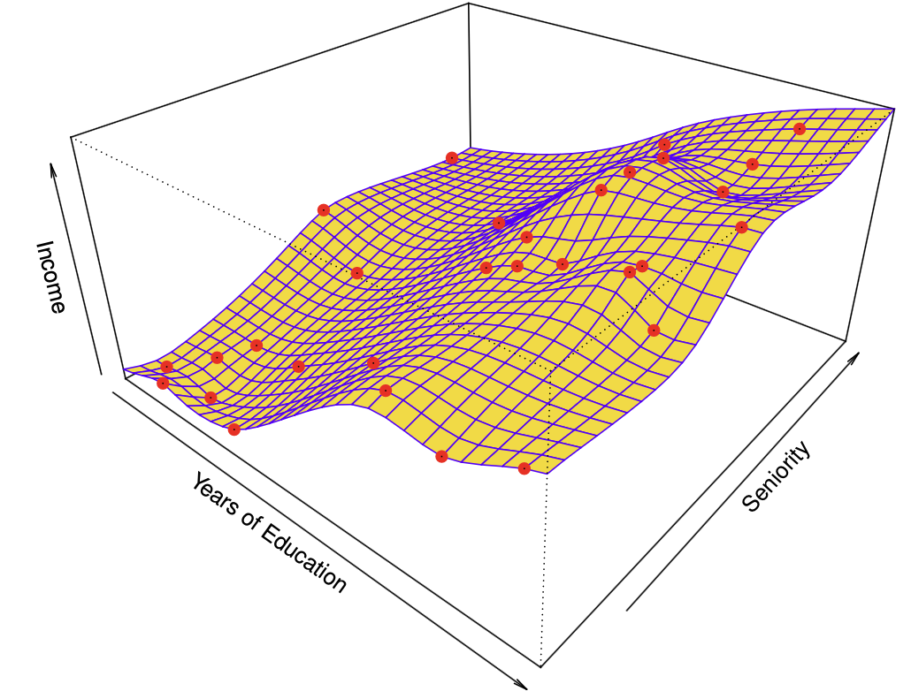
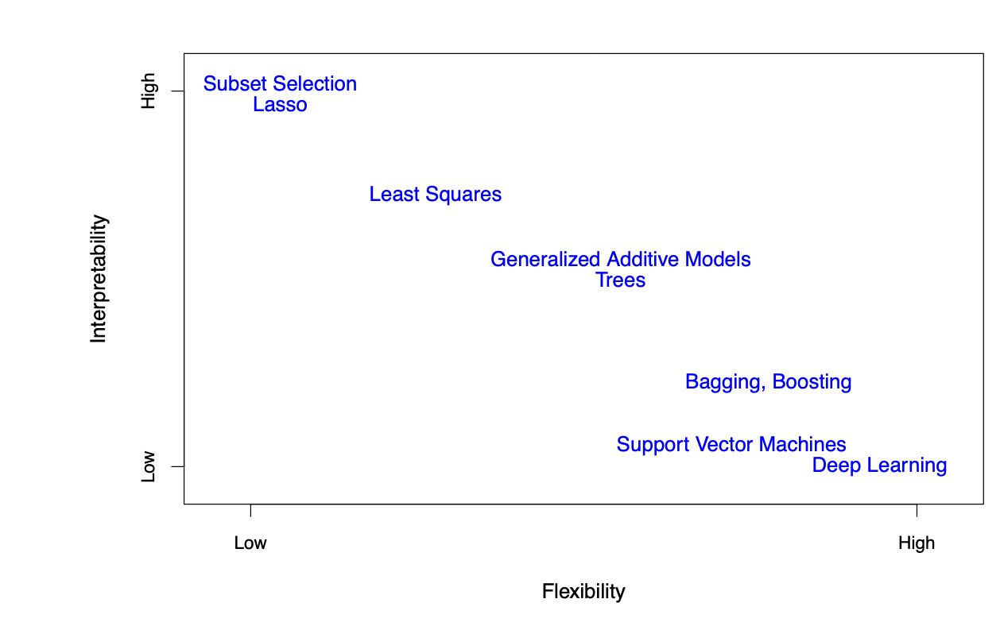
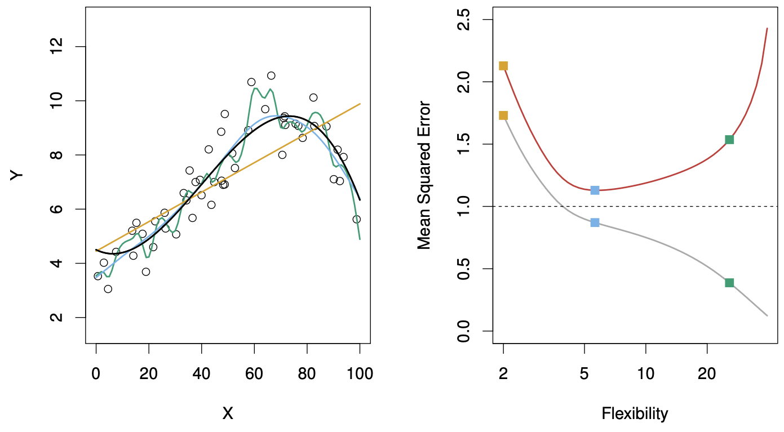
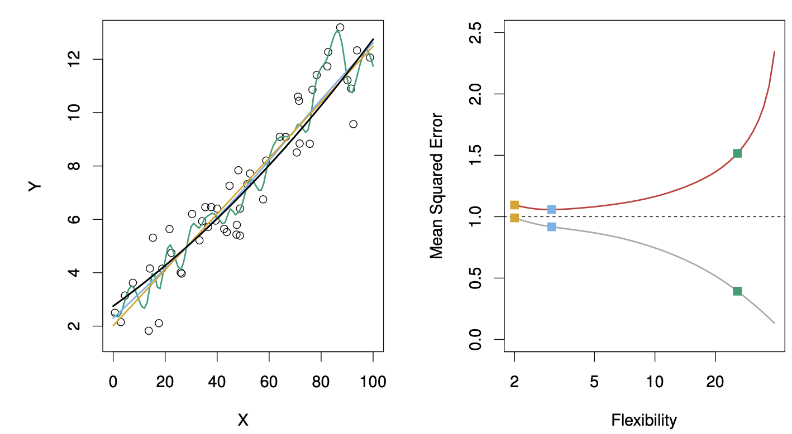
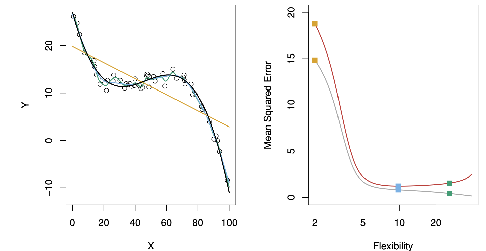
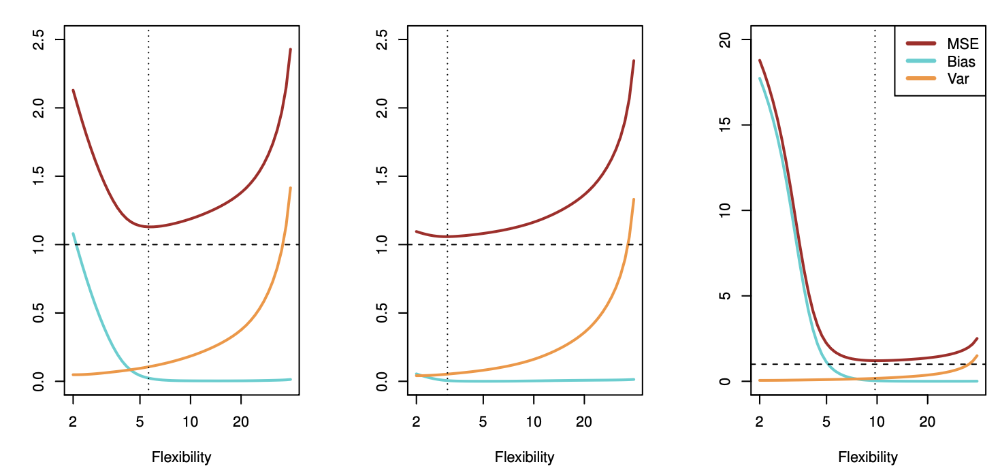

## 1 Función verdadera {.xsmall}

{fig-align="center"}

El gráfico muestra los ingresos en función de los años de educación y la antigüedad en el conjunto de datos de Ingresos. La superficie azul representa la verdadera relación subyacente entre los ingresos, los años de educación y la antigüedad, la cual se conoce gracias a que los datos son simulados. Los puntos rojos indican los valores observados de estas cantidades para 30 individuos.

## 2 Ajuste por RL {.xsmall}

{fig-align="center" width="400"}

Un modelo lineal ajustado por mínimos cuadrados a los datos de ingresos. Las observaciones se muestran en rojo y el plano amarillo indica el ajuste por mínimos cuadrados a los datos.

## 3 Ajuste aproximado por splines {.xsmall}

{fig-align="center" width="400"}

Un ajuste de splines de placa delgada y suave a los datos de ingresos se muestra en amarillo; las observaciones se muestran en rojo.

## 4 Ajuste Perfecto {.xsmall}

{fig-align="center" width="400"}

Ajuste aproximado de spline de placa delgada a los datos de ingresos. Este ajuste no genera errores en los datos de entrenamiento.

## 5 Interpretabilidad Vs. Flexibilidad

{fig-align="center" width="700"}

## 6 Ajustes {.xsmall}

{fig-align="center" width="500"}

Izquierda: Datos simulados de f, mostrados en negro. Se muestran tres estimaciones de la tarifa: la línea de regresión lineal (curva naranja) y dos ajustes de spline de suavizado (curvas azul y verde). Derecha: MSE de entrenamiento (curva gris), MSE de test (curva roja) y MSE de prueba mínimo posible para todos los métodos (línea discontinua). Los cuadrados representan los MSE de entrenamiento y prueba para los tres ajustes mostrados en el panel izquierdo.

## 7 Ajustes 2 {.xsmall}

{fig-align="center" width="500"}

Utilizando una f verdadera diferente, mucho más cercana a la linealidad. En este contexto, la regresión lineal proporciona un ajuste muy adecuado a los datos.

## 8 Ajustes 3 {.xsmall}

{fig-align="center" width="500"}

Utilizando una f diferente que dista mucho de ser lineal. En este contexto, la regresión lineal proporciona un ajuste muy deficiente a los datos.

## 9 Bias - Variance Trade Off {.xsmall}

{fig-align="center"}

Sesgo al cuadrado (curva azul), varianza (curva naranja), Var(e) (línea discontinua) y MSE de prueba (curva roja) para los tres conjuntos de datos. La línea punteada vertical indica el nivel de flexibilidad correspondiente al MSE de prueba más bajo.

## 10 Bias - Variance Trade Off

La relación entre sesgo, varianza y el MSE del conjunto de prueba, se denomina compensación sesgo-varianza. Un buen rendimiento del conjunto de prueba de un método de aprendizaje estadístico requiere una varianza baja, así como un sesgo cuadrático bajo. Esto se denomina compensación porque es fácil obtener un método con un sesgo extremadamente bajo pero una varianza alta (por ejemplo, dibujando una curva que recorra cada observación de entrenamiento) o un método con una varianza muy baja pero un sesgo alto (ajustando una línea horizontal a los datos). El reto radica en encontrar un método para el cual tanto la varianza como el sesgo cuadrático sean bajos.

## Bibliografía.

Todas las imágenes y conceptos fueron extraídos del Libro Introduction to Statistical Learning With R. Wittet et. all, 2022.
