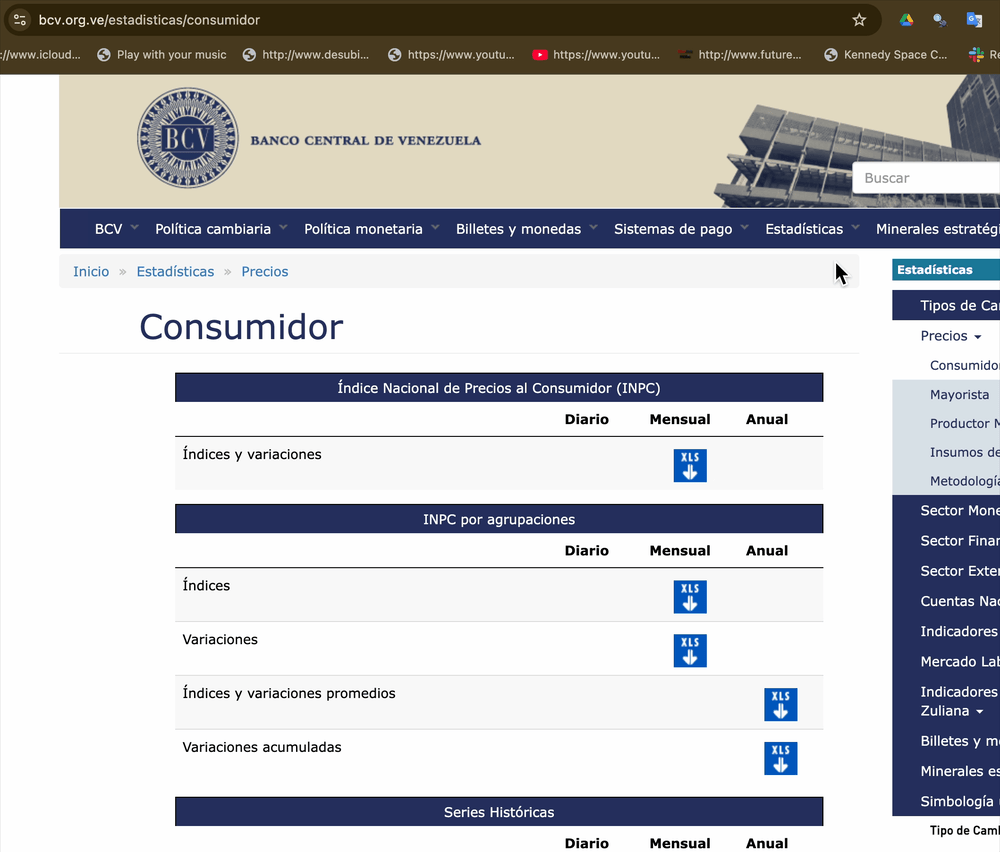
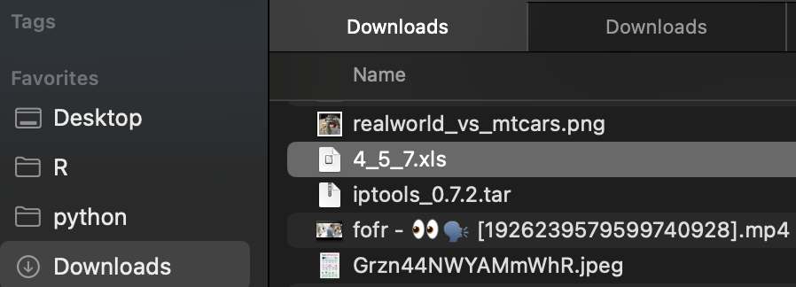
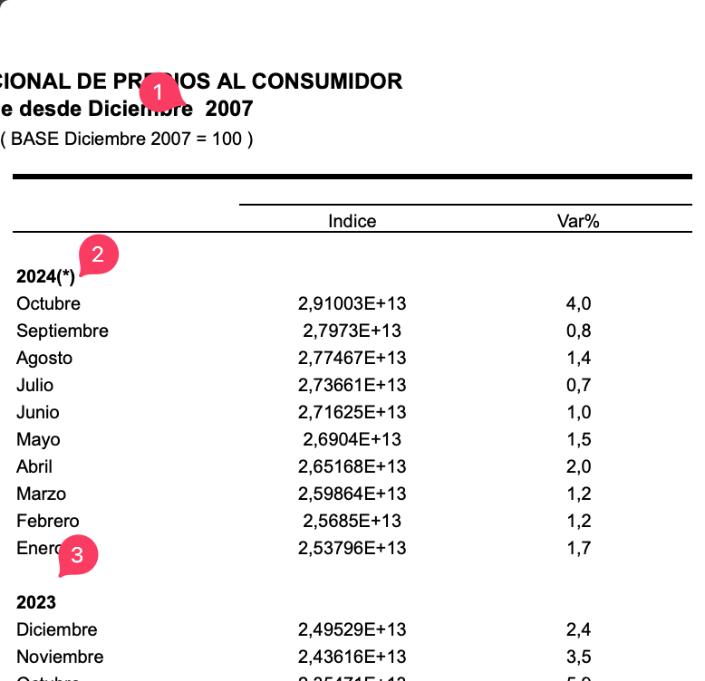
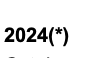
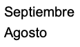
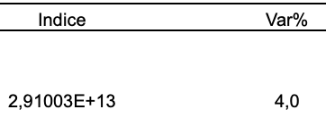
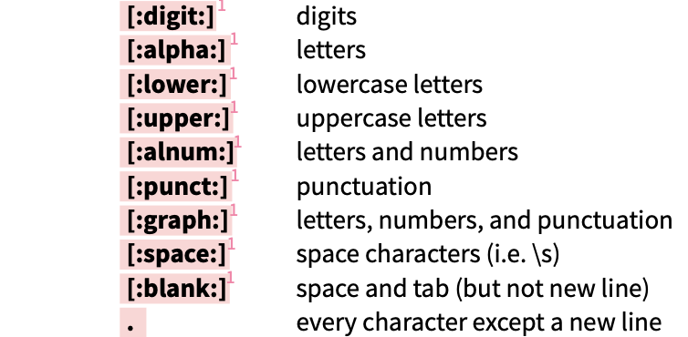
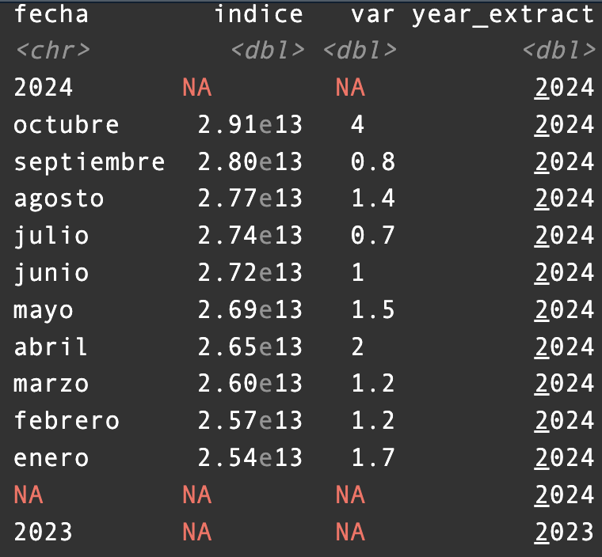
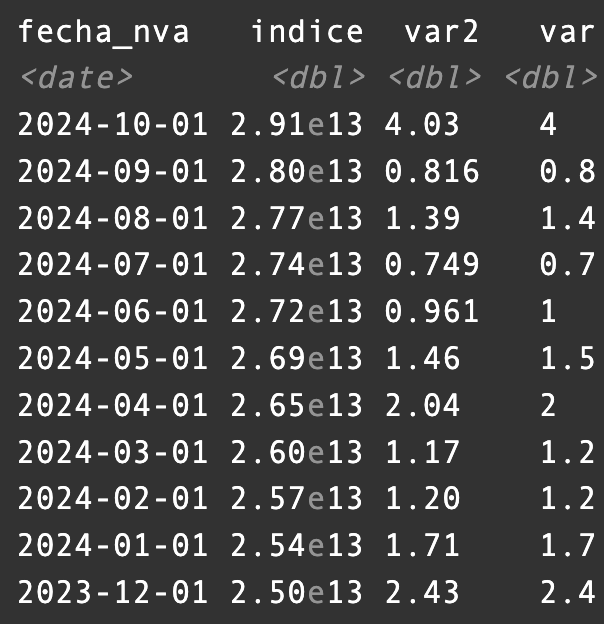

## Fuente de los Datos {background-color="#2a9d8f"}

{fig-align="center"}

## Descarga Opciones {background-color="#e9c46a"}

:::::: columns
::: {.column width="50%" font-size:30px="" style="color:white"}
Manualmente

{fig-align="center" width="350"}
:::

:::: {.column width="50%" style="color:white"}
Dentro de Ambiente R

::: {style="font-size:18px"}
`download.file( 'https://www.bcv.org.ve/sites/default/files/precios_consumidor/4_5_7_0.xls', 'taller_datosBCV/INPC.xls')`
:::
::::
::::::

## ¿Cómo Importarlo en R? 🤔 {background-color="#778da9"}

::: panel-tabset
## Problema a Enfrentar

{fig-align="center" width="517"}

## Opciones

1.  delimitar rango, definir clases de valores columnas

2.  [importar todo y limpiar a gusto]{fonf-size:26px=""}✅✅✅✅✅✅
:::

## 1 era Iteración: Textos y Números {background-color="#023e8a"}

::: panel-tabset
## &!·\$%&(

{fig-align="center"}

[stringr cheat sheet](https://rstudio.github.io/cheatsheets/strings.pdf)

## Mayus

{fig-align="center"}

## as.numeric

{fig-align="center"}
:::

## 2da Iteración: aislar año del mes {background-color="#0077b6"}

-   número y string en columna

-   Estrategia: Usar Patrón

    -   ¿Patrón? aparición de **número** en **primera posición** de la string en la columna

    -   `inicio: ^`

    -   `número: [:digit:]`

    -   {width="300"}

## 3era iteración: rellenar los NA {background-color="#00b4d8"}

crear "toy examples" para insumo en consulta a LLM

::::: columns
::: {.column width="50%"}
```{r}
#| echo: true
#| eval: true

df_toy_bad <- data.frame(a=c(2024, NA, NA, 2023, NA, NA, 2022),
                     b= c(1:7))
df_toy_bad
```
:::

::: {.column width="50%"}
```{r}
#| echo: true
#| eval: true


df_toy_correct <- data.frame(a=c(2024, 2024, 2024, 2023, 2023, 2023, 2022),
                         b= c(1:7))
df_toy_correct
```
:::
:::::

## Consulta LLM víaGoogle AI Studio {background-color="#90e0ef"}

<https://aistudio.google.com/prompts/new_chat>

#### prompt (contexto ➕ lo que quiero ➕ ejemplo):

1.  **Contexto**: Estoy programando en R usando dplyr y

2.  **Lo que quiero:** necesito rellenar los valores de una data frame en una columna que son NA con el valor que le precede en la columna.

3.  **Ejemplo:** Acá coloco como lo tengo y como quiero que quede [`df_toy_bad <- data.frame(a=c(2024, NA, NA, 2023, NA, NA, 2022), b= c(1:7))`]{color:orange="" style="font-size: 16px"}y [`df_toy_correct <- data.frame(a=c(2024, 2024, 2024, 2023, 2023, 2023, 2022), b= c(1:7))`]{color:orange="" style="font-size: 16px"}

4.  página web de insumo: <https://dplyr.tidyverse.org>

## 4ta, 5ta, 6ta iteración: data cleansing {background-color="#00b4d8"}

::: panel-tabset
## Datos

{width="500"}

## Pasos

-   `filter`: filtrar NA's

-   `match` meses letras a número mes

-   `lead`: cálculo manual del índice valor fila siguiente entre valor fila actual

-   `as_date` : string a formato fecha
:::

## Resultado Final {background-color="#780000"}

{fig-align="center"}

## Código {background-color="#ffb703"}

::: panel-tabset
## I Descarga, Importar

```{r}
#| echo: true
#| eval: false
#
download.file('https://www.bcv.org.ve/sites/default/files/precios_consumidor/4_5_7_0.xls','taller_datosBCV/INPC.xls')

INPC <- read_excel('taller_datosBCV/INPC.xls')%>%
  slice(-1:-6)

# Nombres a columnas
names(INPC) <- c('fecha','indice','var')

meses_es <- c("enero", "febrero", "marzo", 
              "abril", "mayo", "junio",
              "julio", "agosto", "septiembre", 
              "octubre", "noviembre", "diciembre")
```

## II Transformar

```{r}
#| echo: true
#| eval: false

INPC%>%
  mutate(fecha= str_remove_all(fecha,'[:punct:]'),
         fecha= str_to_lower(fecha),
         indice= as.numeric(indice),
         var= as.numeric(var))%>%
  mutate(year_extract= ifelse(str_detect(fecha,'^[:digit:]'),fecha,NA ))%>%
  mutate(year_extract= as.numeric(year_extract))%>%
  fill(year_extract, .direction = "down")%>%
  filter(!is.na(indice))%>%
  mutate(num_mes= match(fecha, meses_es),
         var2= (indice/lead(indice)-1)*100,
         fecha_nva=paste0(year_extract,'-',num_mes,'-01'),
         fecha_nva=as_date(fecha_nva))%>%
  select( fecha_nva, indice, var2, var)

```
:::

## Apoyo Prompt {background-color="#3a0ca3"}

::: callout-tip
Estoy programando en R usando dplyr y necesito rellenar los valores de una data frame en una columna que son NA con el valor que le precede en la columna. Acá coloco como lo tengo y como quiero que quede

\`df_toy_bad \<- data.frame(a=c(2024, NA, NA, 2023, NA, NA, 2022),\
b= c(1:7))

df_toy_correct \<- data.frame(a=c(2024, 2024, 2024, 2023, 2023, 2023, 2022),\
b= c(1:7))\`
:::

usar \` al inicio y final de los códigos para indicarle al llm que es código lo que se está referenciando dentro del prompt
