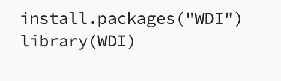
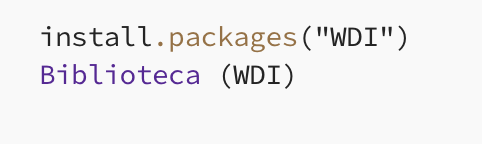

**Instrucciones:**

1.  **Lectura y Exploración Inicial:**

    -   Lee detenidamente el siguiente artículo que introduce la obtención de datos mediante R de las bases de datos del Banco Mundial: <https://medium.com/data-and-beyond/a-dive-into-economic-data-using-world-bank-databases-in-r-39e6536f6dbd>.

    -   **Importante:** Utiliza un traductor de páginas si lo necesitas, pero asegúrate de **no traducir las secciones de código** para evitar errores.

        Ejemplo:

        ✅ Código Original

        {width="250"}

        ❌ Código con autotraductor

        {width="250"}

    -   **(Opcional):** Si el artículo te resulta útil o interesante, considera dejar un aplauso para apoyar y estimular al autor.

2.  **Selección de Indicador del Banco Mundial:**

    -   Navega por el sitio web del Banco Mundial (<https://data.worldbank.org/>) e identifica una **etiqueta (indicador)** de datos económicos que sea de tu interés, basándote en los conceptos introducidos en el artículo anterior.

3.  **Implementación en R:**

    -   Crea un script de R y realiza los siguientes pasos:

        1.  **Descarga de Datos:** Descarga los datos correspondientes al indicador seleccionado utilizando las funciones mencionadas en el artículo. Asigna los datos descargados a una variable con un nombre descriptivo (ejemplo: `df_pib_percapita`).

        2.  **Tabla Resumen Inicial:** Genera una tabla resumen (estadísticas descriptivas básicas) para la variable de interés en el conjunto de datos.

        3.  **Filtrado por Mercosur:** Crea un nuevo data frame que contenga únicamente los datos de los países miembros del Mercosur .

        4.  **Tabla Resumen para Mercosur:** Genera una tabla resumen para la misma variable de interés, pero esta vez solo para el subconjunto de datos de los países del Mercosur.

        5.  **Ordenamiento:** Ordena el data frame del Mercosur según los valores de la variable seleccionada.

        6.  **Identificación de Valores Extremos:** Obtén los valores mínimo y máximo de la variable en el data frame del Mercosur y extrae el nombre del país correspondiente a cada uno de estos valores.

        7.  **Crear Variables de Resultados:** Asigna los valores mínimo y máximo obtenidos (junto con el nombre del país) a variables separadas.

        8.  **Filtrado para Venezuela:** repite los pasos 3, 4 ,5 ,6 y 7 para Venezuela.

        9.  Crear Data Frame Combinada: crear una nueva df combinando los valores de Mercosur y Venezuela.

-   **Entregable:** El script de R con los pasos implementados y las variables que almacenan los valores extremos identificados.

-   Cada uno de los puntos anteriores con cada requerimiento, debe ser señalado en el script mediante un comentario. Tener presente la legibilidad y claridad que debe tener el script para que sea comprensible para quien lo lee.

-   No deben existir líneas sin el formato necesario, bien sea con el formato de comentarios, con el de líneas ejecutables o que estén en blanco.

-   Los códigos anteriores deben programarse en un script con la extensión `.R`. El nombre del script a remitir será el siguiente `tarea_3_ci.R`. El valor "ci" debe ser el de su cédula de identidad sin puntos u otro signo.

-   La tarea debe ser remitida al correo del curso antes de la medianoche del 8 de mayo de 2025.
