Este es un tutorial con los pasos a seguir para instalar el lenguaje {width="20" height="20"} y el software de entorno de desarrollo intregrado que se llama {width="57"} .

Es necesario que siga al pie de la letra estos pasos, principalmente para que primero sea instalado el lenguaje R y luego RStudio.

### Instalación R

1.  Descargue el archivo que contiene R en su última versión desde el siguiente enlace. Si anteriormente ha instalado R, igualmente se recomienda descargar la última versión. Enlace: <https://cran.r-project.org/bin/windows/base/>

2.  Abrir archivo descargado, que debe tener un nombre similar a "R-4.4.3-win.exe". [Nota]{style="color:red"}: Preste atención a que no seleccione el archivo descargado de RStudio.

    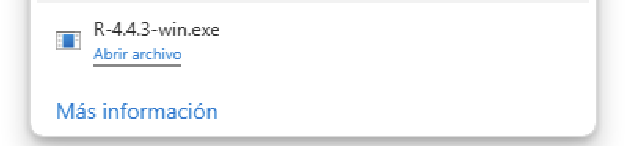{width="300"}

3.  Seleccionar idioma de instalación "español" y hacer click en "aceptar":

    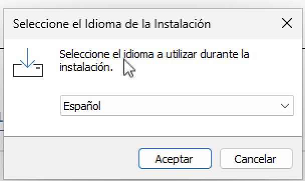{width="300"}

4.  Dar click en "Siguiente" referente a aceptar los términos de la licencia de instalación:

    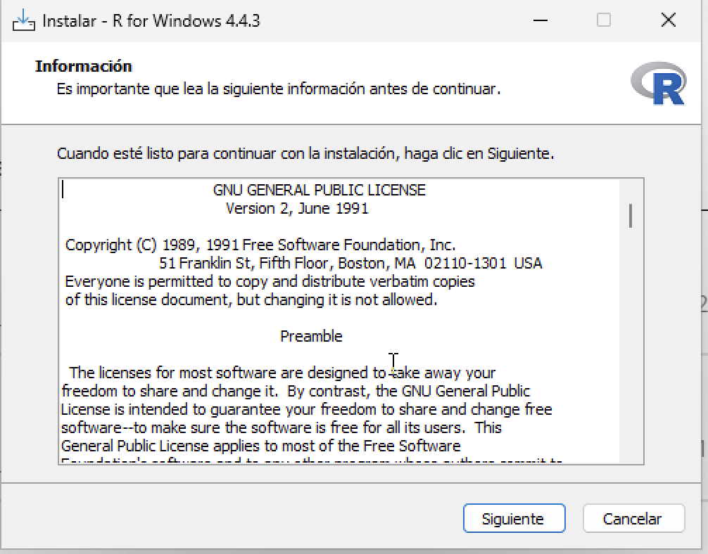{width="300"}

5.  Dar click en "Siguiente" en la ruta de instalación predeterminada, la cual generalmente es "Program Files" o "Archivos de Programa":

    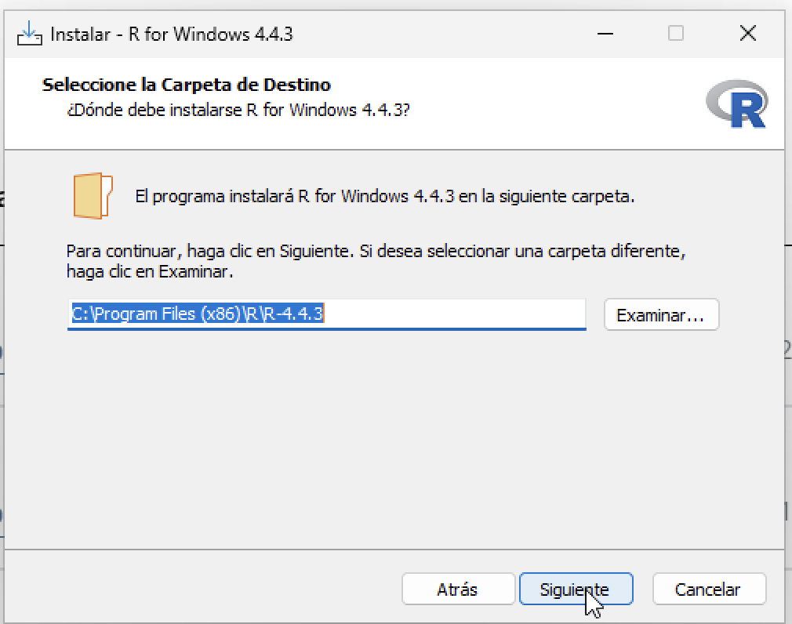{width="300"}

6.  Verificar que estén seleccionados los tres componentes mostrados en la imágen y dar click en "Siguiente":

    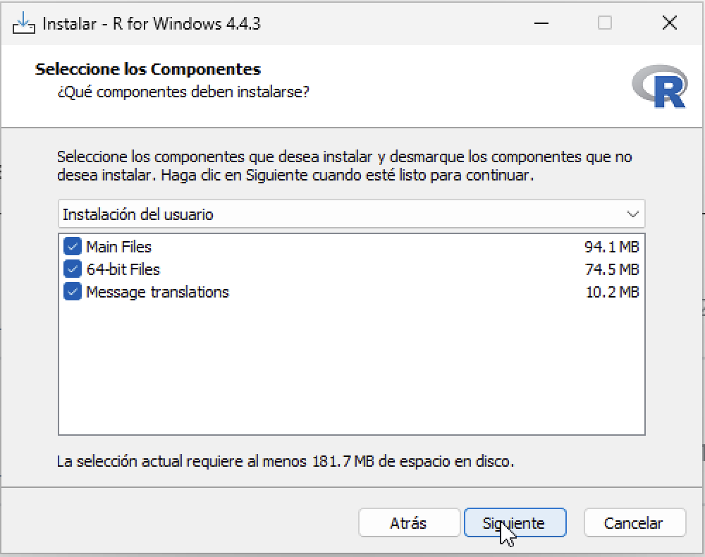{width="300"}

7.  Seleccionar "No" (seleccionada por defecto) en opciones de configuración, y hacer click en "Siguiente":

    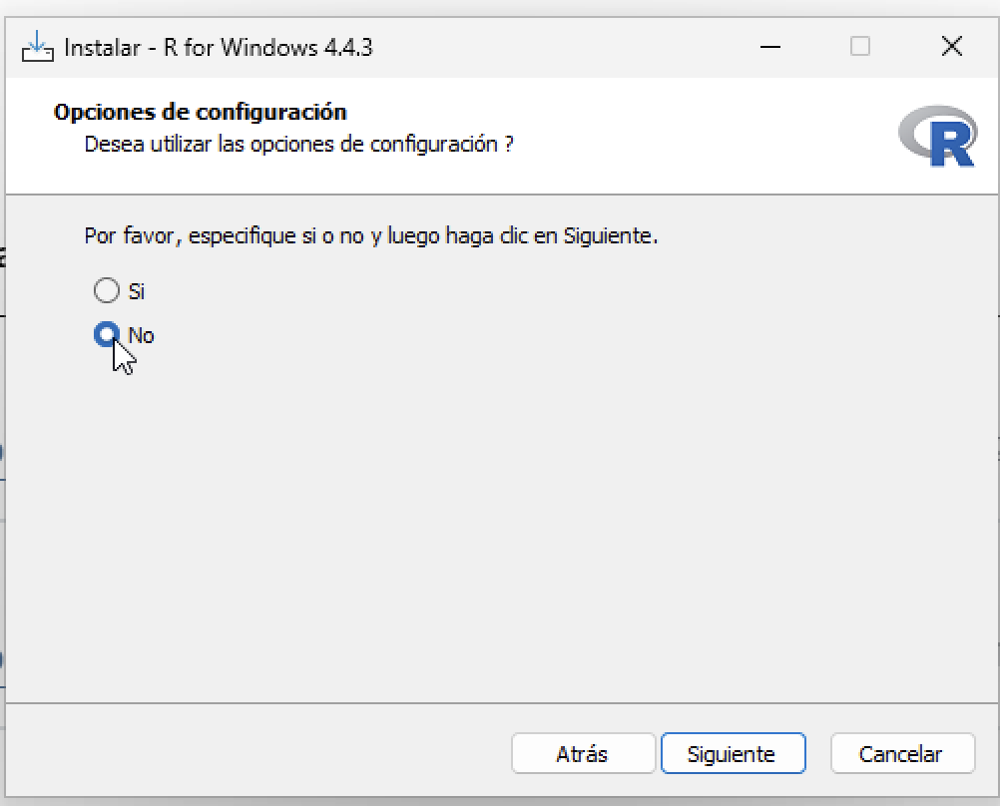{width="300"}

8.  En "Seleccione la Carpeta del Menú de Inicio", dejar los valores que muestra por defecto y hacer click en "Siguiente":

    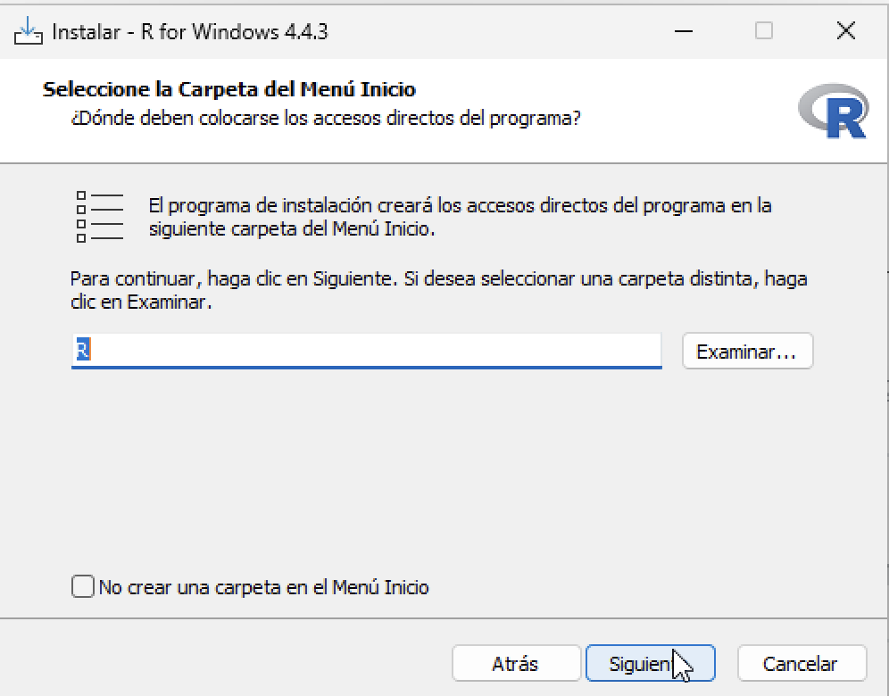{width="300"}

9.  Esperar a que se instalen los archivos - dependencias:

    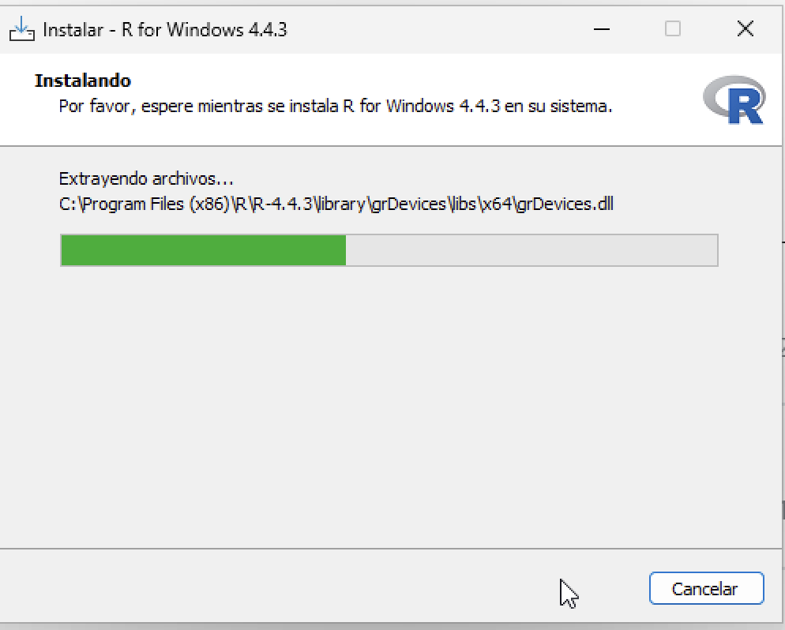{width="300"}

10. Una vez finalizada la instalación aparecerá esta pantalla. Verificar que no indique que se ha generado un error. En caso de aparecer algún mensaje o advertencia de que pudo ocurrir un error al hacer la instalación, es necesario que haga una captura de pantalla y la comparta con el instructor-profesor del curso. En caso de no mostrar error, hacer click en "Finalizar" :

    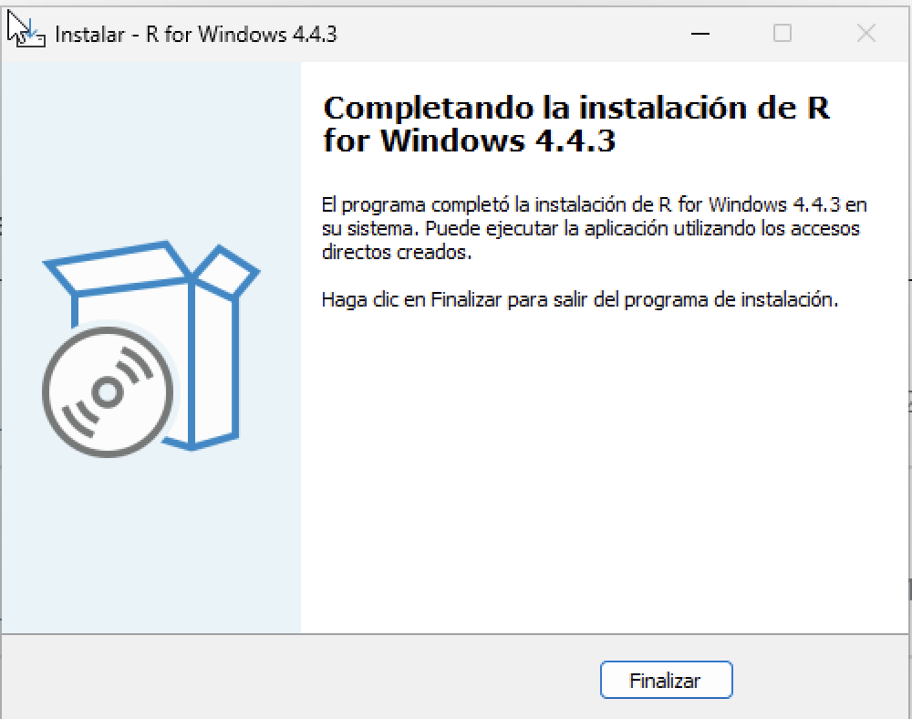{width="300"}

## 

### Instalación RStudio:

RStudio es el entorno de desarrollo integrado que se usará para dar soporte a la generación y desarrollo de códigos en R. Estos son los pasos a seguir para instalarlo:

1.  Ir a la página <https://posit.co/download/rstudio-desktop/> y descargar la opción correspondiente a su sistema operativo. En caso de windows 10 u 11:

    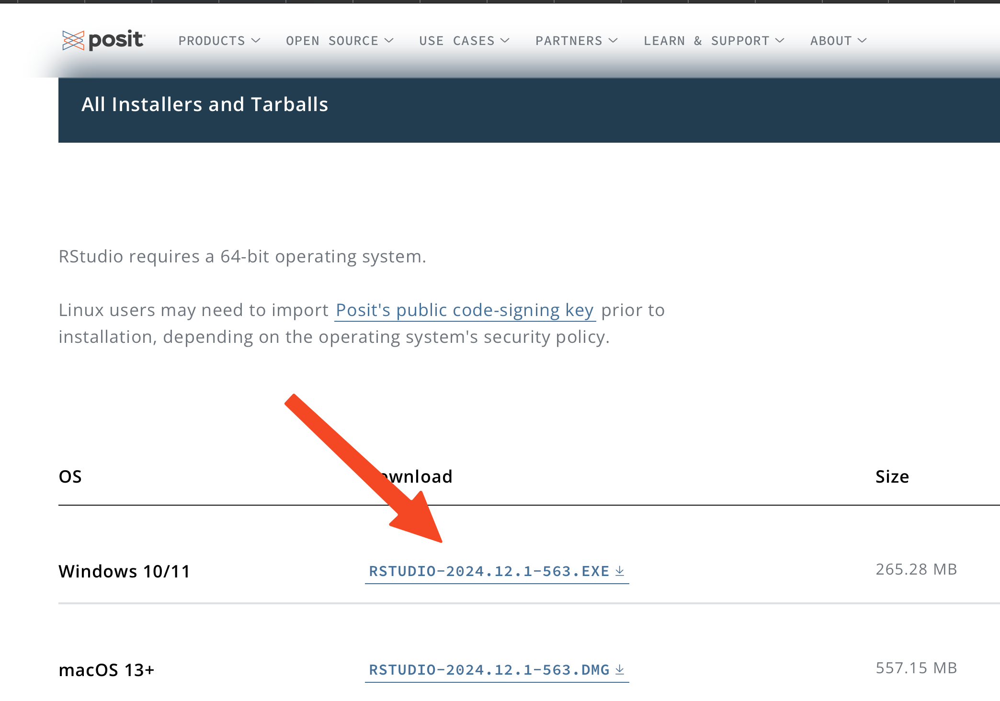{width="300"}

2.  Hacer click en "Siguiente" al aparecer el asistente de instalación:

    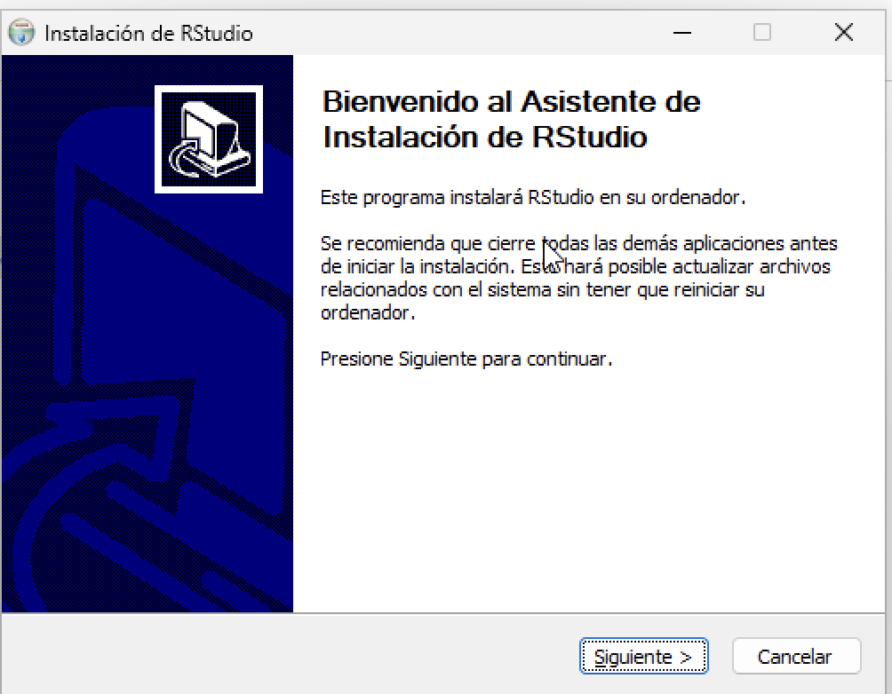{width="300"}

3.  Dar "Siguiente" en la ruta de instalación predeterminada, la cual generalmente es "Program Files" o "Archivos de Programa":

    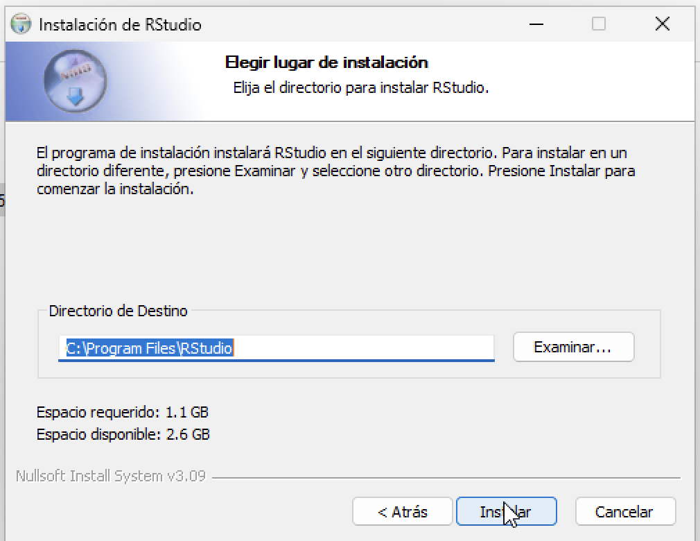{width="300"}

4.  Una vez finalizada la instalación aparecerá esta pantalla. Verificar que no indique que se ha generado un error. En caso de aparecer algún mensaje o advertencia de que pudo ocurrir un error al hacer la instalación, es necesario que haga una captura de pantalla y la comparta con el instructor-profesor del curso. En caso de no mostrar error, hacer click en "Terminar" :

    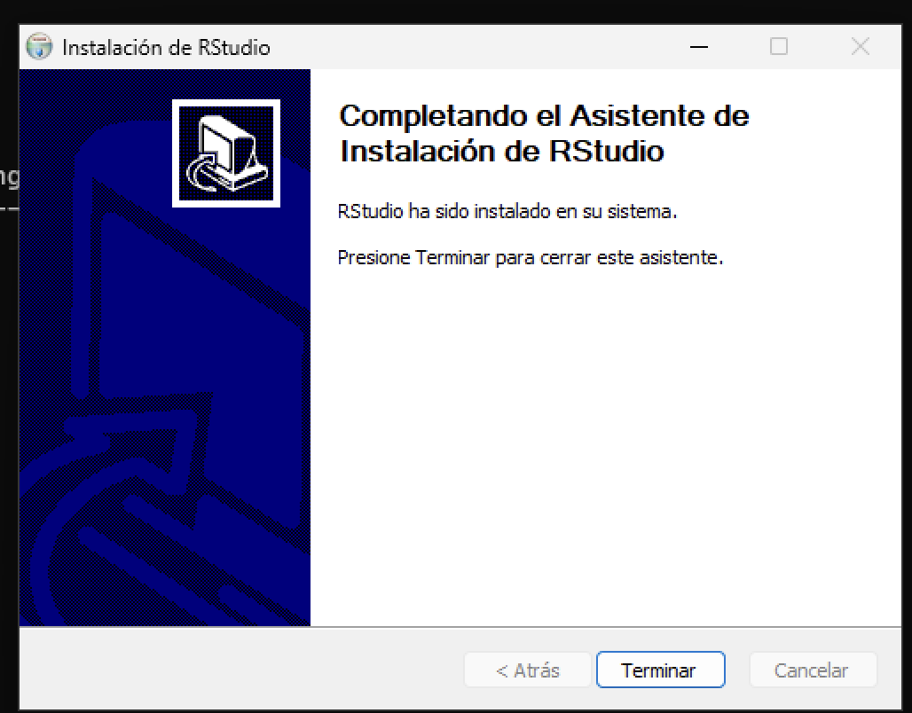{width="300"}

5.  Para verificar que se instaló correctamente RStudio vaya a su "Escritorio" o a "Programas", busque el ícono de RStudio, similar al que se muestra en la siguiente imagen y abra el programa.

    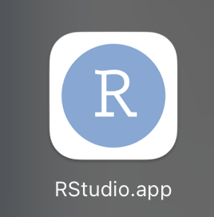{width="200"}
