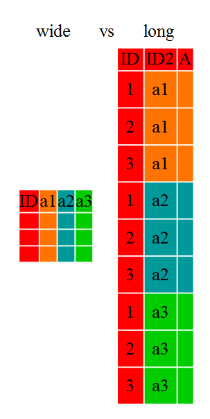
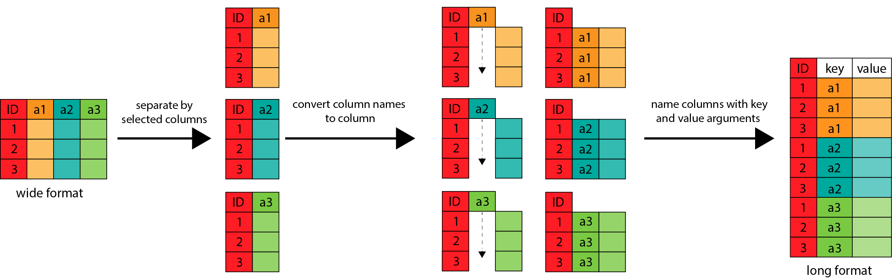

## Formatos de Datos Long y Wide

-   **Formato Ancho (Wide):** En este formato, cada columna representa una variable diferente y cada fila representa un caso o observación, por ejemplo un lugar o un paciente. Tendrás múltiples variables de observación, que contienen el mismo tipo de datos, para cada tema. Estas observaciones pueden ser repetidas a lo largo del tiempo, o puede ser la observación de múltiples variables (o una mezcla de ambos). Para algunas aplicaciones, es preferible el formato "ancho". Sin embargo, muchas de las funciones de `R` han sido diseñadas para datos de formato "largo".

    Para los humanos, el formato "ancho" es a menudo más intuitivo ya que podemos ver más de los datos en la pantalla debido a su forma. Sin embargo, el formato "largo" es más legible para las máquinas y está más cerca al formateo de las bases de datos. Las variables de ID en nuestras data frames son similares a los campos en una base de datos y las variables observadas son como los valores de la base de datos.

-   **Formato Largo (Long):** En este formato, todas las variables están en una sola columna, y cada fila representa una combinación única de caso y variable. El formato "largo" es donde:

    -   cada columna es una variable

    -   cada fila es una observación

    En el formato "largo", generalmente tienes una columna para la variable observada y las otras columnas son variables de ID.

### Explicación Gráfica:

#### Formatos Wide y Long



#### Proceso de Conversión de Wide a Long

```         
pivot_longer(cols = starts_with("a"),
             names_to = "key",
             values_to = "value")
```

{width="800"}

Material complementario: en la página <https://swcarpentry.github.io/r-novice-gapminder-es/14-tidyr.html> hay informaciones complementarias sobre estos formatos.

### De dplyr a tidyr

Para trabajar con estas estructuras de datos y poder convertirlas de un formato long a widder o viceversa, es necesario incorporar en nuestra caja de herramientas el paquete `tidyr` que también se encuentra incluido en la suite tidyverse.

### Creando Tibbles

Primero, vamos a crear algunos ejemplos de tibbles en R utilizando el paquete `dplyr` y `tidyverse`.

```{r}
library(tidyverse)

# Crear un tibble ancho (wide)
datos_ancho <- tribble(
  ~nombre, ~edad_2015, ~edad_2016, ~edad_2017,
  "Juan",   20,         21,         22,
  "Ana",    23,         24,         25
)


datos_ancho


# Crear un tibble largo (long)
datos_largo <- tribble(
  ~nombre, ~año, ~edad,
  "Juan",   2015, 20,
  "Juan",   2016, 21,
  "Juan",   2017, 22,
  "Ana",    2015, 23,
  "Ana",    2016, 24,
  "Ana",    2017, 25
)

datos_largo
```

### Cambiando de Wide a Long

Para transformar un tibble ancho en largo, se utiliza la función `pivot_longer()` del paquete `tidyr`.

```{r}
# Convertir datos_ancho a datos_largo
datos_largo <- datos_ancho %>%
  pivot_longer(cols = starts_with("edad"),
               names_to = "año",
               values_to = "edad")

datos_largo
```

### Cambiando de Long a Wide

Para transformar un tibble largo en ancho, se utiliza la función `pivot_wider()` del paquete `tidyr`.

```{r}
# Convertir datos_largo a datos_ancho
datos_ancho <- datos_largo %>%
  pivot_wider(names_from = año,
               values_from = edad)

datos_ancho
```

### Explicación de las Funciones

-   **pivot_longer()**: Esta función se utiliza para convertir un tibble ancho en largo. Los argumentos principales son:
    -   `cols`: Especifica qué columnas se deben convertir a formato largo.
    -   `names_to`: Define el nombre de la nueva columna que contendrá los nombres originales de las columnas.
    -   `values_to`: Define el nombre de la nueva columna que contendrá los valores.
-   **pivot_wider()**: Esta función se utiliza para convertir un tibble largo en ancho. Los argumentos principales son:
    -   `names_from`: Especifica qué columna contiene los nombres de las nuevas columnas.
    -   `values_from`: Especifica qué columna contiene los valores que se asignarán a las nuevas columnas.

### Ventajas y Uso

-   **Formato Ancho (Wide):**
    -   Ventaja: Facilita visualizar y comparar múltiples variables en una sola tabla.
    -   Uso: Útil cuando se necesita comparar fácilmente distintos valores de la misma variable para diferentes casos.
-   **Formato Largo (Long):**
    -   Ventaja: Permite realizar análisis estadísticos más complejos, como modelos de series temporales o análisís longitudinales.
    -   Uso: Útil cuando se necesita realizar operaciones que requieren agrupar datos por una variable y luego aplicar funciones a los valores correspondientes.

### Ejemplo Práctico

Supongamos que tienes un conjunto de datos sobre las ventas de diferentes productos en varios meses. Quieres analizar cómo ha evolucionado la venta de cada producto a lo largo del tiempo.

```{r}
# Datos ancho (ejemplo)
ventas_ancho <- tribble(
  ~producto, ~enero, ~febrero, ~marzo,
  "A",        100,    200,      150,
  "B",        120,    220,      180
)

ventas_ancho

# Convertir a formato largo
ventas_largo <- ventas_ancho %>%
  pivot_longer(cols = starts_with("enero"),
               names_to = "mes",
               values_to = "venta")

ventas_largo
```

Con el tibble en formato largo, puedes fácilmente calcular la tendencia de las ventas para cada producto utilizando funciones como `group_by()` y `summarize()`.

```{r}
# Calcular promedio de ventas por producto
promedio_ventas <- ventas_largo %>%
  group_by(producto) %>%
  summarize(promedio = mean(venta))

promedio_ventas
```

### Ejercicios Pivots Longer:

#### Simulación de Precios de Accciones

En formato wider esta sería la df:

```{r}
## Ejemplo promedio acciones

precio_acciones <- tibble(
  fecha = as.Date("2024-01-01") + 0:9,
  precio_x = rnorm(10, 0, 1),
  precio_y = rnorm(10, 0, 2),
  precio_z = rnorm(10, 0, 4)
)

precio_acciones

```

Anteriormente en `tidyr` la función usada para convertir los datos a formanto longer era `gather`

```{r}
# versión anterior con gather
precio_acciones %>% 
  gather("accion_nombe",
         "precio_accion",
         -fecha)

```

Precios de acciones en formato longer mediante el uso de `pivot_longer`

```{r}
# acciones pivot_longer
precio_acciones %>% 
  pivot_longer(cols = starts_with("precio"),
               names_to = "accion_nombre",
               values_to = "precio_accion")%>%
  print(n=23)

```

#### Ingresos Anuales según Religión o Creencia Practicada:

Información basada en una encuesta sobre religión/creencia e ingresos obtenidos

```{r}
# caso relig income
head(relig_income)

relig_income %>%
  pivot_longer(cols =!religion, 
               names_to = "income", 
               values_to = "count")
```

#### Cartelera de Éxitos Billoard:

```{r}
# caso éxitos Billboard
head(billboard)
dim(billboard)

billboard %>%
  pivot_longer(
    cols = starts_with("wk"),
    names_to = "week",
    # names_prefix = "wk",
    values_to = "rank",
    values_drop_na = TRUE
  )


```

Añadir prefijo a remover en la columna de destino

```{r}
## remover prefijos wk
billboard %>%
  pivot_longer(
    cols = starts_with("wk"),
    names_to = "week",
    names_prefix = "wk",
    values_to = "rank",
    values_drop_na = TRUE
  )

```

#### Informe Mundial Tuberculosis:

Un subconjunto de datos del Informe Mundial sobre la Tuberculosis de la Organización Mundial de la Salud. que utiliza los códigos originales de la Organización Mundial de la Salud.

Inspección Datos Entrada

```{r}
# Caso WHO
names(who)
dim(who)
head(who[,1:10])
```

Convertir a formato longer

```{r}
who %>% 
  pivot_longer(
    cols = new_sp_m014:newrel_f65,
    names_to = c("diagnosis", "gender", "age"),
    names_pattern = "new_?(.*)_(.)(.*)",
    values_to = "count"
  )

```

Análisis patrón usado en `names_pattern`

```{r}
library(stringr) # ya está cargada en tidyverse
str_split("new_sp_m2534", "new_?(.*)_(.)(.*)")

# Hacer consultar a LLM sobre este patrón
cadena <- "new_user_123"
patron <- "new_?(.*)_(.)(.*)"

resultados <- str_match(cadena, patron)
resultados

```

### Ejercicios Pivots Widder:

#### Peces en Ríos

Información sobre los peces que nadan por un río: cada estación representa un monitor autónomo que registra si un pez marcado ha sido visto en ese lugar.

```{r}
######## pivot_wider()
head(fish_encounters, 8)

fish_encounters %>%
  pivot_wider(names_from = station, 
              values_from = seen)
```

### Análisis Gapminder

¿Cuál estructura (longer o widder) tiene el conjunto de datos Gapminder?

```{r}

library(gapminder)
head(gapminder)
```

### Consideraciones Finales

Entender los formatos de datos long y wide es crucial para trabajar eficazmente con datos en R. Dependiendo del análisis que quieras realizar, uno de estos formatos puede ser más apropiado que el otro. Afortunadamente, las funciones `pivot_longer()` y `pivot_wider()` facilitan la transición entre ambos formatos.
